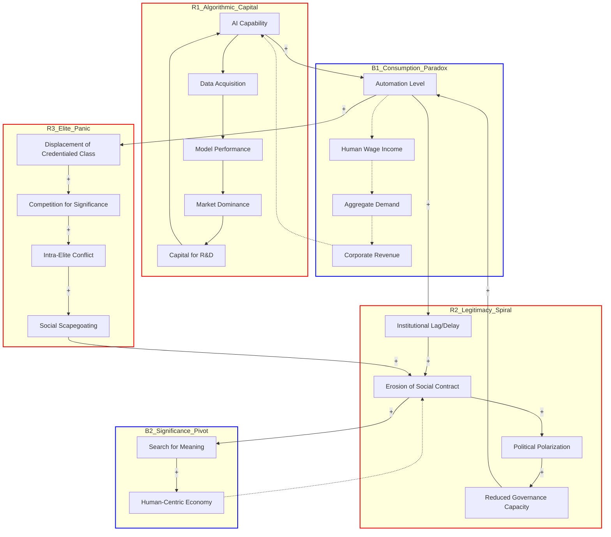

# Systems Thinking Analysis

**System:** The global socio-economic and political system undergoing a transition where the functional substrate of human value is migrating from human cognitive labor to automated cognition (AI). This system includes feedback loops between economic automation, institutional legitimacy, social status, and great power competition.

**Time Horizon:** 50 years

**Started:** 2026-03-03 11:37:09

---

## System Structure

This analysis applies system dynamics and complexity theory to the 50-year transition from a human-labor-based economy to an automated-cognition-based civilization.

---

### 1. Key Components and Variables

To understand the system, we must categorize variables by their rate of change and their role in the feedback structure.

*   **Technological Variables (Fast):** Compute power, algorithmic efficiency, data density, and the "Automation Frontier" (the boundary of tasks AI can perform).
*   **Economic Variables (Medium):** Marginal cost of production, labor participation rate, purchasing power, and capital concentration.
*   **Social/Psychological Variables (Slow):** Perceived social status, "Significance" (non-utilitarian value), and the "Meaning Framework" (the narrative of why life is worth living).
*   **Political/Institutional Variables (Slowest):** Tax codes, property rights, the "Social Contract," and Great Power competition.

---

### 2. Stocks and Flows (Accumulations and Movements)

The system is defined by four critical stocks:

1.  **Stock of Automated Cognition (AC):** The total "intelligence" available for production.
    *   *Inflow:* R&D investment, self-improving AI loops.
    *   *Outflow:* Hardware obsolescence, energy constraints.
2.  **Stock of Human Purchasing Power:** The aggregate ability of the non-capital-owning population to buy goods.
    *   *Inflow:* Wages, government transfers (UBI), dividends.
    *   *Outflow:* Consumption, debt servicing.
3.  **Stock of Institutional Legitimacy:** The "trust reservoir" that allows a society to function without constant coercion.
    *   *Inflow:* Due process, perceived fairness, economic mobility.
    *   *Outflow:* Inequality, systemic failure, corruption, "Status Panic."
4.  **Stock of Elite Aspirants:** The number of individuals socialized to expect high-status roles.
    *   *Inflow:* Higher education, cultural signaling.
    *   *Outflow:* Absorption into elite roles, "downward mobility" (leading to radicalization).

---

### 3. Feedback Loop Analysis

#### A. The Consumption Paradox (The Balancing Loop of Systemic Limit)
The **Consumption Paradox** acts as a massive balancing loop ($B1$) against the reinforcing loop of automation.
*   **The Loop:** Automation $\uparrow \rightarrow$ Productivity $\uparrow \rightarrow$ Human Labor Demand $\downarrow \rightarrow$ Aggregate Wages $\downarrow \rightarrow$ Purchasing Power $\downarrow \rightarrow$ Demand for AI-produced goods $\downarrow \rightarrow$ ROI on AI $\downarrow$.
*   **Trigger Point for Reorganization:** The system triggers a "Phase Transition" when the marginal cost of production approaches zero, but the *velocity of money* stops because the consumer base has no income. At this point, the system must either:
    1.  **Collapse:** The market ceases to be the primary distribution mechanism.
    2.  **Reorganize:** Decouple "Survival" from "Labor" (e.g., via UBI or post-scarcity resource allocation).

#### B. Success to the Successful (The Reinforcing Loop of Inequality)
This archetype ($R1$) explains the hollowing out of the middle class.
*   **Mechanism:** Entities with early AI advantages (Great Powers or Mega-corps) capture more data $\rightarrow$ better models $\rightarrow$ more profit $\rightarrow$ more compute.
*   **Impact:** This creates a "winner-take-all" effect that eliminates the "Cognitive Middle." As AI moves from automating rote tasks to high-level synthesis, the middle-class "buffer" that stabilizes democracies evaporates, leaving a bi-modal distribution of extreme wealth and subsistence.

#### C. Elite Overproduction and Status Panic (The Reinforcing Loop of Instability)
As AI automates "Functional" roles (law, finance, middle management), the number of high-status positions shrinks while the number of people trained for them (Elite Aspirants) continues to grow.
*   **The Loop:** Shrinking Elite Roles + Growing Elite Aspirants $\rightarrow$ Intense Intra-Elite Competition $\rightarrow$ Status Panic $\rightarrow$ Scapegoating of Institutions $\rightarrow$ Erosion of Legitimacy.
*   **Emergent Behavior:** This leads to "Counter-Elite" formation, where frustrated aspirants use their cognitive skills to destabilize the system rather than maintain it.

---

### 4. Delays and Bifurcation: Fast vs. Slow Variables

The most dangerous aspect of this system is the **Time Delay** between market shifts and cultural adaptation.

*   **The Delay:** Market prices (Fast) can revalue human labor to zero in a matter of months. However, "Meaning Frameworks" (Slow)—the way humans derive dignity and purpose from work—take generations to evolve.
*   **Bifurcation Point:** When the "Fast" variable of AI capability outpaces the "Slow" variable of institutional adaptation, the system bifurcates. We see a "Functional Decoupling": the economy functions (productivity is high), but the society fails (legitimacy is low).
*   **Result:** This delay creates a "Volatility Gap" where social unrest, populism, and "Status Panic" thrive because people are economically obsolete but psychologically still tethered to the "Work-for-Worth" paradigm.

---

### 5. Transition from 'Function' to 'Significance'

As AI takes over the **Functional Substrate** (doing things that work), human value must migrate to the **Significance Substrate** (doing things that matter).

*   **Function (AI-dominated):** Efficiency, optimization, calculation, production.
*   **Significance (Human-dominated):** Narrative, ritual, community, aesthetics, and "Proof of Work" (doing things because they are hard, not because they are efficient).
*   **Systemic Risk:** If the transition to "Significance" is not monetized or socially validated, the "Consumption Paradox" will lead to a "Meaning Crisis," where the population is physically fed but psychologically starved, leading to systemic entropy.

---

### 6. Leverage Points for Intervention

1.  **Taxing the "Functional Substrate" (High Leverage):** Shifting taxation from labor (which is disappearing) to automated cognition/compute. This addresses the flow of the Consumption Paradox.
2.  **Redefining "Due Process" (Medium Leverage):** Creating "Algorithmic Transparency" to slow the erosion of institutional legitimacy.
3.  **Decoupling Status from Utility (Highest Leverage/Most Difficult):** Culturally engineering a shift where social status is derived from "Contribution to Cohesion" rather than "Economic Productivity." This closes the gap between the Fast and Slow variables.
4.  **Great Power "Guardrails" (Critical Boundary):** If Great Power competition remains a "Zero-Sum" reinforcing loop, the pressure to automate will override all balancing loops, leading to a "Race to the Bottom" in human agency.

### Summary of Systemic Outlook (50 Years)
The system is currently in a **Reinforcing Loop of Displacement**. Without a deliberate intervention to address the **Consumption Paradox** and the **Meaning Gap**, the system will likely face a "Hard Reset"—a period of high entropy (conflict/instability) until a new "Social Contract" emerges that recognizes AI as the functional floor and human significance as the cultural ceiling.

---

## Feedback Loops

This analysis applies system dynamics to the transition from a human-labor-based economy to an automated-cognition-based civilization.

### 1. Reinforcing Loops (R): Amplifying Change

**R1: The Algorithmic Capital Accumulation (Success to the Successful)**
*   **Causal Chain**: AI Capability → Data Acquisition → Model Performance → Market Dominance → Capital for R&D → AI Capability.
*   **Classification**: Reinforcing (R)
*   **Behavior**: Exponential concentration of power. As AI models improve, they capture more users, generating more data, which further improves the models. This creates a "winner-take-most" dynamic that hollows out the middle-market competitors and the middle-class labor that previously supported them.
*   **Impact**: High

**R2: The Legitimacy Death Spiral**
*   **Causal Chain**: Rate of AI Displacement → Institutional Lag (Delay) → Erosion of Social Contract → Political Polarization → Reduced Governance Capacity → Inability to Regulate AI → Rate of AI Displacement.
*   **Classification**: Reinforcing (R)
*   **Behavior**: Chaotic instability. The "fast variables" of AI development outpace the "slow variables" of legislative and judicial due process. As institutions fail to protect the citizenry from displacement, the citizenry withdraws consent, leading to a breakdown in the very mechanisms needed to manage the transition.
*   **Impact**: High

**R3: Elite Status Panic (Elite Overproduction)**
*   **Causal Chain**: Automation of Cognitive Labor → Displacement of Credentialed Class → Competition for "Significance" Positions → Intra-Elite Conflict → Social Scapegoating → Systemic Instability → Further Erosion of Institutions.
*   **Classification**: Reinforcing (R)
*   **Behavior**: Violent social oscillations. When the "functional" utility of a degree or professional role is automated, the "stock" of elites remains high but their "flow" of income/status drops. This leads to radicalization as displaced elites use their remaining cognitive skills to destabilize the system in a bid for relevance.
*   **Impact**: Medium/High

---

### 2. Balancing Loops (B): Resisting Change / Seeking Equilibrium

**B1: The Consumption Paradox (The Systemic Limit)**
*   **Causal Chain**: Automation Level → Human Wage Income (-/dashed) → Aggregate Consumer Demand (-/dashed) → Corporate Revenue (-/dashed) → Incentive for Further Automation.
*   **Classification**: Balancing (B)
*   **Behavior**: S-curve growth or systemic collapse. This loop acts as a "Limit to Growth." If AI produces everything but human labor is uncompensated, there is no one to purchase the output. The system "seeks" an equilibrium, which usually manifests as a demand for Universal Basic Income (UBI) or a total reorganization of the value substrate.
*   **Impact**: High (The ultimate systemic constraint)

**B2: The Significance Re-anchoring**
*   **Causal Chain**: Loss of Functional Utility → Search for Meaning → Growth of Human-Centric Economy (Care, Art, Philosophy) → New Social Value Substrate (-/dashed) → Social Instability.
*   **Classification**: Balancing (B)
*   **Behavior**: Goal-seeking transition. As "Function" (doing tasks) is commodified by AI, the system seeks a new equilibrium in "Significance" (being/relating). This loop slowly stabilizes the social system by decoupling human worth from economic productivity.
*   **Impact**: Medium (Long-term stabilizer)

---

### 3. Systemic Insights

*   **The Consumption Paradox as a Trigger**: This loop triggers systemic reorganization when the "Stock" of household savings is depleted. At this point, the feedback between production and consumption breaks. The system cannot persist in its current form; it must either implement a non-market distribution mechanism (UBI/Post-Scarcity) or face a "Correction" (Systemic Collapse).
*   **Fast vs. Slow Variable Delays**: Market prices and AI capabilities are **Fast Variables**. Cultural meaning frameworks and institutional due process are **Slow Variables**. The delay between these two creates a "Shearing Layer." The faster the AI loop (R1) spins, the greater the tension on the slow variables, leading to a **Bifurcation Point** where the system must either evolve a new logic or shatter.
*   **Success to the Successful & The Middle Class**: R1 accelerates the hollowing out of the middle class by turning cognitive labor into a "Fixed Cost" (the AI model) rather than a "Variable Cost" (human salaries). This shifts the flow of wealth from the "Labor Stock" to the "Capital/Compute Stock."

---

### 4. Mermaid Diagram: The AI Transition System

### Summary of Leverage Points
1.  **Shorten the Institutional Delay**: If the delay between AI advancement and policy response is reduced, the Legitimacy Death Spiral (R2) can be converted into a series of small, manageable adjustments.
2.  **Decouple Income from Labor**: Addressing the Consumption Paradox (B1) early via tax reform or UBI prevents the "Aggregate Demand" crash that leads to systemic collapse.
3.  **Redefine "Significance"**: By proactively funding the "Human-Centric Economy" (B2), the system can absorb the "Elite Overproduction" (R3) before it turns into destructive scapegoating.

---

## Delays & Accumulations

This analysis applies system dynamics to the migration of value from human cognitive labor to automated cognition. We will examine the critical delays and accumulations that define the next 50 years of socio-economic transition.

---

### 1. Delays: The Lags Between Signal and Response

In complex systems, delays cause oscillations and overshooting. In the AI transition, the primary friction arises from the mismatch between **technological acceleration (exponential)** and **human/institutional adaptation (linear/logarithmic)**.

#### A. Information Delays: The "Signal-to-Meaning" Gap
*   **The Lag:** There is a significant delay between the *statistical evidence* of AI productivity gains and the *cultural realization* of human obsolescence in specific sectors.
*   **Mechanism:** Market prices (fast variables) reflect AI efficiency almost instantly. However, "Meaning Frameworks" (slow variables)—how individuals define their worth through work—take decades to shift.
*   **Systemic Effect:** This creates a **"Reality Gap"** where the economy functions on 21st-century automation while the social contract is still anchored in 20th-century labor theory. This delay masks the urgency of reform until the system reaches a breaking point.

#### B. Physical/Infrastructure Delays: The "Hardware Bottleneck"
*   **The Lag:** While AI software scales at the speed of light, the physical substrate (energy grids, data centers, and silicon fabrication) scales at the speed of construction and permit cycles.
*   **Mechanism:** The "Success to the Successful" loop of AI concentration is currently throttled by energy availability.
*   **Systemic Effect:** This delay provides a temporary "breathing room" for labor, but it also creates **oscillations in investment**. When the physical bottleneck clears, the subsequent "flood" of automation will be more disruptive because it was pent up.

#### C. Decision/Policy Delays: The "Institutional Inertia"
*   **The Lag:** The time between a systemic failure (e.g., mass white-collar displacement) and the implementation of a corrective feedback loop (e.g., UBI, tax reform, or new property rights).
*   **Mechanism:** Legislative processes are designed for stability, not speed. They require consensus, which is difficult to achieve when the "Status Panic" loop is active.
*   **Systemic Effect:** This creates **Bifurcation**. Because the policy response is delayed, the system moves too far from equilibrium, making a "soft landing" impossible. The delay forces the system toward radical reorganization (revolution or collapse) rather than incremental adjustment.

---

### 2. Accumulations (Stocks): The Reservoirs of the Transition

Stocks represent the state of the system. Their levels determine the pressure behind feedback loops.

#### A. What Builds Up? (Inflows > Outflows)
1.  **Automated Cognition (Compute Stock):** The total global capacity for non-human problem-solving. This is the primary driver of the transition.
2.  **Elite Overproduction (Aspirant Stock):** An accumulation of highly educated individuals competing for a shrinking pool of "Significance" roles. AI accelerates this by automating the "entry-level" elite tasks (legal research, coding, analysis).
3.  **Social Resentment (The "Pressure Cooker" Stock):** A psychological accumulation resulting from the gap between expected status and actual economic utility.
4.  **Wealth Concentration (Capital Stock):** As the "Function" of labor migrates to AI, the returns on that function flow to the owners of the AI substrate, depleting the middle-class stock.

#### B. What Depletes? (Outflows > Inflows)
1.  **Institutional Legitimacy:** This is a critical stock. Every time the system fails to protect the "due process" or economic security of its citizens, a unit of legitimacy is lost.
2.  **Human Labor Market Value:** The "price" of human cognitive labor is a stock that is being drained by the inflow of cheaper, faster automated alternatives.
3.  **The "Consumption Buffer":** The accumulated savings and credit capacity of the middle class. This stock currently masks the **Consumption Paradox**.

---

### 3. Impact: Systemic Behavior and the Consumption Paradox

The interaction of these delays and accumulations leads to specific systemic behaviors:

#### The Consumption Paradox as a Balancing Loop
The **Consumption Paradox** acts as a systemic limit.
*   **The Loop:** AI increases production (Inflow to Goods) $\rightarrow$ AI replaces labor (Outflow from Wages) $\rightarrow$ Purchasing power drops $\rightarrow$ Consumption drops $\rightarrow$ Production becomes pointless.
*   **The Trigger Point:** The paradox triggers systemic reorganization when the **"Consumption Buffer" (Savings/Debt)** is depleted. At this point, the reinforcing loop of "AI Efficiency" hits the balancing loop of "Market Collapse."
*   **Systemic Shift:** To survive, the system must decouple "Access to Resources" from "Functional Labor." This is the transition from **Function** (what you do) to **Significance** (who you are/what you represent).

#### Success to the Successful & Middle Class Hollowing
*   **Mechanism:** AI capability accumulates in the hands of those who already have data and compute. This creates a **Reinforcing Loop** where the winners can afford more AI, further hollowing out the middle class.
*   **Impact of Delays:** Because the "Meaning Lag" is long, the middle class continues to invest in "Human Cognitive Capital" (degrees, training) even as the stock of "Market Value" for those skills is depleting. This leads to a massive **"Stranded Asset"** problem—a generation of people with skills that have no market flow.

---

### 4. Specific Examples and Estimated Time Scales

| Event/Process | Delay Type | Estimated Time Scale | Systemic Impact |
| :--- | :--- | :--- | :--- |
| **Entry-level White Collar Displacement** | Information/Decision | 3–7 Years | Depletion of the "Career Ladder" stock; triggers Elite Overproduction. |
| **Energy Grid Adaptation for AI** | Physical | 10–15 Years | Acts as a "Governor" on the speed of the AI reinforcing loop. |
| **The "Legitimacy Crisis"** | Accumulation (Depletion) | 15–25 Years | When the stock of trust hits a "Low-Water Mark," institutional collapse or radical reform occurs. |
| **Shift from 'Function' to 'Significance'** | Cultural (Slow Variable) | 30–50 Years | The time required for a new generation to define status without reference to "Productive Labor." |
| **The Consumption Paradox Trigger** | Balancing Loop | 10–20 Years | Occurs when AI-driven unemployment exceeds the capacity of debt/savings to maintain demand. |

### Summary Insight for Policy/Strategy:
The most dangerous element in this system is the **Legitimacy/Meaning Lag**. While we focus on the "Fast Variable" of AI capability, the "Slow Variable" of social stability is depleting unnoticed. 

**Leverage Point:** The most effective intervention is not slowing down AI (which is impossible due to Great Power Competition), but **shortening the Decision Delay** regarding resource distribution (e.g., decoupling survival from labor) before the "Social Resentment" stock reaches its ignition point.

---

## System Archetypes

This analysis applies system dynamics archetypes to the transition from human cognitive labor to automated cognition, focusing on the 50-year horizon.

---

### 1. Archetype: Success to the Successful
**Manifestation in the System:**
This archetype drives the concentration of AI capability and the subsequent hollowing out of the middle class. In this system, "Success" is defined by the accumulation of the **AI Production Triad**: massive datasets, specialized compute (hardware), and top-tier algorithmic talent. 

*   **The Loop:** Entities (corporations or nation-states) that gain an early lead in AI use that lead to capture more market share and data. This data improves their models, which generates higher rents, which are reinvested into more compute.
*   **The Hollowing:** As AI replaces cognitive labor, the "returns to capital" (AI owners) skyrocket while "returns to labor" (the middle class) plummet. The middle class, which previously relied on "cognitive arbitrage" (selling their education and processing power), finds its primary asset devalued.

**Typical Behavior Pattern:**
A divergent "rich-get-richer" curve where the gap between the AI-owning elite and the displaced labor class widens exponentially until the middle class ceases to function as an economic stabilizer.

**Intervention Strategies:**
*   **Level the Playing Field:** Institutionalize "Public Compute" and "Open Data Commons" to decouple the ability to innovate from the accumulation of legacy capital.
*   **Resource Reallocation:** Implement "Robot Taxes" or "Compute Dividends" that redistribute the gains from automated cognition back to the displaced substrate (humans).

---

### 2. Archetype: Limits to Growth (The Consumption Paradox)
**Manifestation in the System:**
This is the primary balancing loop against total automation. The "Growth" is the increasing efficiency and output of AI-driven production. The "Limit" is the **Consumption Paradox**: AI can produce infinite goods and services, but by displacing human labor, it destroys the wages necessary for humans to purchase those goods.

*   **The Constraint:** If 80% of the population has a marginal propensity to consume but zero income due to automation, the "Flow" of the economy stops. The system hits a wall where productivity is high, but demand is non-existent.

**Typical Behavior Pattern:**
Initial exponential growth in GDP and corporate margins, followed by a sudden plateau or systemic collapse as the "carrying capacity" of the consumer market is exhausted.

**Intervention Strategies:**
*   **Reorganize the Distribution Mechanism:** Transition from a "Labor-for-Income" model to a "Citizenship-for-Income" model (UBI) *before* the collapse point.
*   **Shift the Value Substrate:** Move the economy toward "Significance-based" value (human-to-human connection, art, philosophy) which AI cannot authentically replicate, creating a new "demand" loop.

---

### 3. Archetype: Shifting the Burden
**Manifestation in the System:**
As AI creates a "Meaning Crisis" and "Economic Precarity," policymakers often reach for "Symptomatic Fixes" (like temporary stimulus checks or gig-economy subsidies) rather than addressing the "Fundamental Problem" (the total migration of functional value to silicon).

*   **The Burden:** The "burden" of providing social stability is shifted from a healthy labor market to state-funded welfare.
*   **The Side Effect:** This undermines the long-term solution of redefining human "Significance." It creates a "dependency loop" where the population becomes a "useless class" (in functional terms) dependent on an elite-controlled state, leading to the erosion of institutional legitimacy.

**Typical Behavior Pattern:**
The "Symptomatic Fix" works temporarily, but the underlying social unrest and "status panic" continue to worsen, requiring larger and larger "doses" of the fix (more debt, more transfers).

**Intervention Strategies:**
*   **Focus on the Fundamental:** Invest in "Pro-Human" infrastructure that prioritizes human agency and "Significance" over mere "Function."
*   **Delay the Fix:** Resist the urge to simply "pay people off" and instead focus on the slow variable of cultural evolution—redefining what it means to lead a "productive" life.

---

### 4. Archetype: Escalation (The Great Power AI Race)
**Manifestation in the System:**
This occurs between nation-states (e.g., US vs. China). Each party perceives the other’s AI advancement as a threat to their sovereignty. 

*   **The Loop:** Party A increases AI investment to ensure security; Party B perceives this as a threat and increases their own investment. 
*   **The Result:** Both parties spend trillions and accelerate the "Fast Variables" of the system (deployment speed) while ignoring the "Slow Variables" (safety, ethics, and social impact). This leads to a "race to the bottom" in terms of due process and institutional legitimacy.

**Typical Behavior Pattern:**
A continuous, aggressive increase in the "state of the art" with a simultaneous decrease in systemic stability and safety margins.

**Intervention Strategies:**
*   **Collaborative Limits:** Establish international "Compute Treaties" or "Safety Corridors" that penalize "unbounded" development.
*   **Change the Game:** Shift the competition from "AGI Dominance" to "Systemic Resilience"—where the winner is the one whose society best integrates AI without collapsing.

---

### 5. Archetype: Eroding Goals (The Legitimacy Decay)
**Manifestation in the System:**
As AI provides "Fast" answers and "Efficient" outcomes, the "Slow" goals of human institutions—such as due process, judicial deliberation, and democratic consensus—are seen as "friction."

*   **The Erosion:** To keep up with the speed of AI-driven markets, institutions lower their standards for transparency and human oversight. "Justice" is replaced by "Algorithmic Accuracy." "Legitimacy" is replaced by "Throughput."

**Typical Behavior Pattern:**
A gradual decline in the quality of institutional output. The system becomes highly "efficient" at processing people, but the "trust" (the stock of legitimacy) drains away until the system bifurcates or collapses.

**Intervention Strategies:**
*   **Hard-Code Friction:** Intentionally build "delays" into critical institutional loops (courts, elections) to ensure human cognitive processing can keep pace.
*   **Anchor the Goal:** Establish non-negotiable "Human-in-the-Loop" requirements that cannot be bypassed for the sake of efficiency.

---

### Summary of Systemic Bifurcation
The interaction of these archetypes suggests a **Bifurcation Point**:
1.  **Path A (Collapse):** The "Success to the Successful" loop continues until the "Consumption Paradox" triggers a systemic reset, likely characterized by "Elite Overproduction" leading to "Status Panic" and violent scapegoating.
2.  **Path B (Reorganization):** The "Shifting the Burden" loop is broken by a fundamental redefinition of value—moving from **Function** (what you can do) to **Significance** (who you are to others). This requires a deliberate slowing of the "Fast Variables" to allow the "Slow Variables" of human culture to adapt.

---

## Emergent Behavior

This analysis applies system dynamics and complexity theory to the 50-year transition from human-led to AI-led cognition.

---

### 1. Current Emergent Patterns: The "Ghost in the Machine"
System-level behaviors are currently emerging from the interaction between high-speed algorithmic optimization and low-speed biological/institutional processing.

*   **The Epistemic Decay Loop (Reinforcing):** As AI lowers the cost of "synthetic information," the volume of content exceeds the human capacity for verification. This creates an emergent pattern of **Institutional Blindness**, where legacy institutions (courts, media, academia) lose the ability to establish a "shared reality," leading to a breakdown in consensus-based governance.
*   **The "Function-Significance" Divergence:** We see an emergent decoupling where an individual’s **Economic Function** (their ability to produce value) is plummeting, while their **Political Significance** (their ability to disrupt the system via voting or unrest) remains high. This creates a "Volatility Stock" that accumulates as people feel increasingly useless but remain powerful as a collective source of friction.
*   **Algorithmic Enclosure:** Markets and social interactions are increasingly governed by "Black Box" optimizations. The emergent behavior is a **Loss of Agency**, where human actors optimize for the algorithm (SEO, social credit, algorithmic trading) rather than for human-centric outcomes.

### 2. Unintended Consequences: The Side Effects of Efficiency
The drive for cognitive efficiency triggers counter-intuitive systemic responses.

*   **The Jevons Paradox of Cognition:** As the "cost" of a cognitive unit (a decision, a design, a piece of code) drops toward zero, the system does not use *less* cognition; it consumes exponentially *more*. This leads to **Hyper-Complexity**: a world where systems (legal codes, software architectures, tax laws) become so dense and interconnected that no human can map the failure states.
*   **The "Meaning Vacuum" and Status Panic:** As AI captures "Function," the stock of "Human Significance" (status derived from skill) depletes. The unintended consequence is **Status Hyper-Inflation**, where people compete more aggressively for non-functional markers (identity, lineage, aesthetic purity, or "human-made" labels), leading to increased social polarization and "Elite Overproduction" as more people fight for fewer high-status "human-only" roles.
*   **The Fragility of Just-in-Time Cognition:** By automating cognitive labor, we remove the "Human Buffer"—the slow, deliberative layer that catches errors. The system becomes more efficient but loses **Resilience**, making it prone to "Flash Crashes" in social trust or economic stability.

### 3. Future Predictions: The 50-Year Horizon
Over five decades, the system will likely move through three distinct phases of emergent behavior:

*   **Phase 1: The Friction Era (0–15 years):** Characterized by **Institutional Lag**. The "Fast Variables" (AI capabilities) outpace the "Slow Variables" (Law, Ethics, Education). Emergent behavior: High social turbulence, "Neo-Luddite" movements, and aggressive regulatory capture by AI incumbents.
*   **Phase 2: The Great Bifurcation (15–35 years):** The system splits into a **Dual-Substrate Economy**. One layer is a hyper-efficient, automated "Functional Core" (energy, logistics, basic goods) and the other is a "Significance Layer" where humans trade in status, attention, and "authentic" experiences.
*   **Phase 3: The Post-Labor Synthesis (35–50 years):** If the system survives the transition, a new **Steady State** emerges where "Value" is no longer tied to "Labor" but to "Curation" and "Intent." The system shifts from an *Extraction* model to an *Allocation* model.

### 4. Tipping Points: Thresholds of Dramatic Change
Several critical thresholds exist where the system’s feedback loops flip from balancing to reinforcing (or vice versa).

*   **The Marginal Cost of Cognition < Human Subsistence:** This is the ultimate tipping point. When the cost of an AI performing a task is lower than the cost of the calories required for a human to do it, the **"Success to the Successful"** loop for AI owners accelerates uncontrollably, making traditional labor markets obsolete.
*   **The Consumption Paradox Trigger:** This occurs when the **Purchasing Power Flow** (wages) drops below the level required to clear the **Inventory Stock** produced by AI. At this point, the system must either:
    1.  **Collapse** (Deflationary spiral/Depression).
    2.  **Reorganize** (Decoupling survival from labor via UBI or Sovereign Wealth Dividends).
    3.  **Transition to Neo-Feudalism** (Where the "useless" class is maintained at subsistence to prevent unrest).
*   **The Legitimacy Breach:** A tipping point where the "Slow Variable" of social trust hits zero. When a majority of the population perceives that "Due Process" is merely an algorithmic output they cannot influence, the system loses its **Homeostatic Capacity** (the ability to self-correct through peaceful means), leading to systemic bifurcation or revolution.

### 5. Resilience: How the System Responds to Disruptions
The system’s resilience is currently low due to high "Interconnectedness" and low "Redundancy."

*   **Rigidity Trap:** Current socio-economic systems (taxing labor, 40-hour work weeks, degree-based status) are "Rigid Stocks." They do not flow easily into new forms. This makes the system prone to **Creative Destruction**—it cannot bend, so it must break to be replaced.
*   **The "Localism" Buffer:** An emergent resilience strategy will likely be a return to **Low-Tech Redundancy**. As global systems become hyper-complex and AI-dependent, local communities may intentionally "de-automate" critical infrastructure (food, water, local governance) to create a "Circuit Breaker" against global systemic shocks.
*   **Adaptive Governance:** The only high-leverage resilience strategy is to shorten the **Delay** between AI advancement and policy response. This requires "Prototyping Legislation"—moving from static laws to "Algorithmic Regulation" that can iterate as fast as the technology it governs.

### Summary of the "Consumption Paradox" as a Balancing Loop
The Consumption Paradox acts as a **Balancing Loop (B)** against total automation. 
*   *Process:* Automation increases $\rightarrow$ Human Income decreases $\rightarrow$ Aggregate Demand decreases $\rightarrow$ Profit for Automated Firms decreases $\rightarrow$ Pressure to subsidize consumers increases.
*   *Systemic Reorganization:* This loop triggers reorganization when the "Cost of Social Unrest" (a stock) exceeds the "Cost of Wealth Redistribution" (a flow). At this intersection, the elite/owners are forced to support UBI or similar mechanisms not out of altruism, but to preserve the market for their own automated outputs.

---

## Leverage Points

This analysis applies systems thinking to the transition from a human-labor economy to an automated-cognition economy. We are currently witnessing the **Great Decoupling**: the severance of productivity from human effort, which threatens the foundational "work-for-income" feedback loop that has stabilized society since the Industrial Revolution.

---

### Part 1: Systemic Analysis of Focus Areas

#### 1. The Consumption Paradox as a Balancing Loop
The **Consumption Paradox** acts as a fundamental limit to the growth of total automation. In a capitalist system, labor is not just a production input; it is the primary mechanism for distributing purchasing power.
*   **The Loop:** As AI increases efficiency (Reinforcing Loop), it displaces human wages. However, if the "Stock of Aggregate Wages" falls below a certain threshold, the "Flow of Consumption" dries up.
*   **Trigger Point:** Systemic reorganization is triggered when the **Return on Automation (ROA)** is offset by the **Collapse in Market Demand**. At this point, the system either collapses into a "Low-Level Equilibrium Trap" (feudalism/subsistence) or forced reorganization occurs (state-led redistribution or revolution).

#### 2. Delays and Bifurcation: Fast vs. Slow Variables
*   **Fast Variables:** Market prices, AI processing speeds, and capital flows. These change in cycles of milliseconds to months.
*   **Slow Variables:** Cultural meaning frameworks, legal precedents, institutional legitimacy, and human psychological adaptation. These change over decades.
*   **Bifurcation:** The widening delay between these variables creates a **"Legitimacy Gap."** When the fast variables (AI-driven economy) outpace the slow variables (due process, social contracts), the system "snaps." This leads to bifurcation: a hyper-efficient automated core surrounded by a chaotic, "meaning-starved" periphery.

#### 3. Success to the Successful: The Hollowing of the Middle Class
This archetype describes how AI capability concentrates.
*   **Mechanism:** Entities with initial AI advantages (data/compute) generate more wealth, which buys more compute/talent, further widening the gap.
*   **Impact:** The middle class—historically the "Stock of Social Stability"—is hollowed out because cognitive labor (law, accounting, coding) is more easily digitized than high-dexterity physical labor or high-empathy social labor. This removes the "bridge" between the elite and the working class.

#### 4. Elite Overproduction and Status Panic
As "Function" (utility) is outsourced to AI, the "Stock of Elite Aspirants" continues to grow due to historical educational momentum.
*   **Reinforcing Loop:** When there are fewer functional roles for elites to occupy (as AI manages systems), competition for the remaining "Significance" (status/power) intensifies.
*   **Scapegoating:** This "Status Panic" drives elites to use AI-driven information warfare to scapegoat rivals, leading to internal institutional decay and social fragmentation.

---

### Part 2: Leverage Points for Intervention
*Ranked by Meadows’ Hierarchy of Effectiveness*

#### 1. The Paradigm: Decoupling Human Value from Economic Utility
*   **Intervention:** Shifting the societal mindset from "Value = Labor" to "Value = Agency/Inherent Worth."
*   **Why High-Leverage:** This is the "source code" of the system. If we believe humans only deserve resources if they are "productive," AI automation inevitably leads to mass precarity.
*   **Impact:** High (Total system transformation).
*   **Risks:** Deep cultural resistance; loss of the "work ethic" that drove previous progress.
*   **Implementation:** Educational reform focusing on philosophy, arts, and "human-centric" virtues; moving beyond GDP as the primary metric of civilization.

#### 2. The Goals: From Efficiency to Resilience and "Significance"
*   **Intervention:** Changing the system's goal from "Maximizing ROI/Efficiency" to "Maximizing Human Flourishing and Systemic Antifragility."
*   **Why High-Leverage:** Goals define the direction of all feedback loops. An efficiency-seeking system will always automate humans out; a resilience-seeking system will maintain human roles for redundancy and "meaning-making."
*   **Impact:** High.
*   **Risks:** Potential slowdown in technological "hard" progress; global "Great Power" disadvantage if rivals stay focused on pure efficiency.
*   **Implementation:** Implementing "Human Flourishing Indices" that carry the same legal weight as fiscal budgets.

#### 3. Self-Organization: Distributed Cognitive Infrastructure
*   **Intervention:** Ensuring AI "means of production" (compute and models) are decentralized and open-source rather than concentrated in a few "Success to the Successful" nodes.
*   **Why High-Leverage:** It allows the system to evolve new structures (local economies, DAOs) that aren't dependent on a central failing state or a few corporations.
*   **Impact:** High.
*   **Risks:** Proliferation of "dual-use" risks (AI-generated bio-threats, etc.).
*   **Implementation:** Subsidizing decentralized compute grids; legal protections for open-source model development; "Data Dignity" frameworks where individuals own their training data.

#### 4. The Rules: Solving the Consumption Paradox via Sovereign Wealth
*   **Intervention:** Transitioning from labor-based taxation (Income Tax) to capital/automation-based dividends (Sovereign Wealth Funds/Universal Basic Income).
*   **Why High-Leverage:** It closes the loop of the Consumption Paradox. It ensures that as AI creates wealth, that wealth flows back into the "Stock of Consumption," stabilizing the market.
*   **Impact:** Medium-High.
*   **Risks:** Inflation if not balanced with productivity; potential for state over-reach and "social credit" style control.
*   **Implementation:** Implementing a "Robot Dividend" or "Automation Tax" that funds a national endowment, providing a floor for all citizens.

#### 5. Information Flows: Algorithmic Transparency and "Slow-Variable" Feedback
*   **Intervention:** Creating mandatory "Social Impact Delays" or "Audit Loops" for large-scale AI deployments.
*   **Why High-Leverage:** It addresses the delay between fast market changes and slow cultural adaptation. It forces the "fast variables" to wait for the "slow variables" to catch up.
*   **Impact:** Medium.
*   **Risks:** Stifling innovation; regulatory capture by incumbents.
*   **Implementation:** Requiring "Human Impact Assessments" for AI deployments that affect >1% of the workforce, similar to Environmental Impact Statements.

#### 6. Reinforcing Loops: Breaking "Success to the Successful"
*   **Intervention:** Aggressive anti-trust and "Interoperability" mandates for AI platforms.
*   **Why High-Leverage:** It prevents the "winner-take-all" dynamics that lead to the hollowing out of the middle class.
*   **Impact:** Medium.
*   **Risks:** Fragmentation of technology standards.
*   **Implementation:** Laws requiring that AI models be able to "talk" to each other and that users can migrate their "digital intelligence" between platforms.

---

### Summary of Insights

The most dangerous element of the current transition is the **Meaning Vacuum** created by the speed of the "fast variables." While policy-makers focus on **Parameters** (tax rates) and **Rules** (UBI), the real leverage lies in the **Paradigm** (Value vs. Utility). 

If we do not decouple "the right to live" from "the ability to out-produce an algorithm," the system will naturally seek a balancing point through **population collapse or violent reorganization.** The ultimate leverage point is the intentional design of a "Significance Economy" where human status is derived from community, creativity, and stewardship, rather than functional cognitive labor.

---

### Intervention 1: Implementation of a 'Sovereign Wealth Dividend' vs. traditional welfare

To analyze the intervention of a **Sovereign Wealth Dividend (SWD)** versus **Traditional Welfare** within the context of the transition to automated cognition, we must first define the structural difference. 

*   **Traditional Welfare** is a "draining stock" model: it relies on taxing human labor (income tax) to fund means-tested transfers. It reinforces the "Function" paradigm (you are valued for your labor or your lack thereof).
*   **Sovereign Wealth Dividend (SWD)** is a "capital-share" model: it treats the citizenry as shareholders in the nation’s automated productivity. It captures the "Success to the Successful" loop of AI owners and redirects a portion of the flow back to the population.

---

### 1. Immediate Effects (0–1 Month)
*   **SWD:** A massive **psychological shift in the "Significance" substrate.** By granting a dividend based on ownership rather than "need," the stigma of the "handout" is replaced by the pride of "equity." Markets react with high volatility as they price in the future tax on automated capital.
*   **Traditional Welfare:** Status quo. High administrative friction. The "poverty trap" remains active, where recipients fear taking small gigs because they might lose benefits.

### 2. Short-term Effects (1–3 Months)
*   **SWD:** **Velocity of money increases.** Unlike welfare, which is often saved or used for debt due to its precarious nature, a guaranteed dividend increases consumer confidence. Small-scale "Significance" markets (local arts, community services, niche hobbies) begin to see inflows.
*   **Traditional Welfare:** Continued erosion of the tax base. As AI displaces the first wave of cognitive labor (entry-level analysts, coders), the inflow to the welfare stock (income tax) begins to dwindle, creating a **fiscal gap.**

### 3. Medium-term Effects (3–6 Months)
*   **SWD:** **Labor Bargaining Power shifts.** With a survival floor guaranteed by the dividend, workers refuse "bullshit jobs." This accelerates the "Fast Variable" of automation, as companies are forced to automate roles that humans no longer find worth the "Significance" cost.
*   **Traditional Welfare:** **Institutional Legitimacy begins to fracture.** The "Slow Variable" of social trust decays as the middle class—too "rich" for welfare but too "poor" to compete with AI—feels the squeeze of the "Success to the Successful" archetype.

### 4. Long-term Effects (6 Months – 50 Years)
*   **SWD (The Steady State):** The system reaches a **Dynamic Equilibrium.** The "Consumption Paradox" is managed because the dividend ensures that the output of automated cognition has a destination (human consumers). The economy shifts from "Function" (producing for survival) to "Significance" (producing for status, meaning, and experience).
*   **Traditional Welfare (The Collapse):** The system enters a **Death Spiral.** As the "Success to the Successful" loop concentrates 99% of wealth in AI-owning entities, the labor-tax-funded welfare state goes bankrupt. This triggers a "Bifurcation Point": either a violent revolution or a late-stage, panicked transition to an SWD-like model under duress.

---

### 5. Feedback Loop Impacts

*   **The Consumption Paradox (Balancing Loop):** 
    *   *Welfare:* Fails to balance. It relies on the very thing (human labor) that the system is eliminating.
    *   *SWD:* Acts as a powerful **Balancing Loop.** As AI productivity increases, the Sovereign Wealth Fund grows, the Dividend increases, and consumer demand is sustained, allowing the AI to continue producing.
*   **Success to the Successful (Reinforcing Loop):**
    *   *Welfare:* Does nothing to stop the concentration of capital; it only mitigates the symptoms.
    *   *SWD:* **Interrupts the loop.** By giving every citizen a "fractional share" of the automated substrate, the concentration of wealth is partially socialized without destroying the incentive for innovation.
*   **Elite Overproduction & Status Panic:**
    *   *SWD:* Potentially **strengthens** the status panic. If everyone has their basic needs met, the competition for "Significance" (non-fungible status) becomes hyper-intense. This could lead to "Status Bubbles."

---

### 6. Unintended Consequences

1.  **The "Meaning Gap":** While the SWD solves the "Consumption Paradox," it does not solve the "Significance" crisis. Without "Function" (jobs), a large portion of the population may experience a "Stock-Flow Failure" of purpose, leading to increased rates of depression or radicalization into "Significance-granting" cults or ideologies.
2.  **Hyper-Inflation in "Significance Goods":** While the price of "Functional Goods" (food, basic housing, digital entertainment) drops toward zero due to AI, the price of "Significance Goods" (land in desirable areas, human-made art, elite education, political influence) may skyrocket, as the SWD provides everyone with the capital to compete for these limited stocks.
3.  **Geopolitical Arbitrage:** If one nation implements an SWD and others don't, "AI Capital" may attempt to flee to jurisdictions with lower "Dividend Taxes," leading to a "Race to the Bottom" unless international "Boundaries" are redefined.

---

### 7. Overall Assessment

| Metric | Traditional Welfare | Sovereign Wealth Dividend |
| :--- | :--- | :--- |
| **Effectiveness** | **Low** | **High** |
| **Systemic Fit** | Designed for the Industrial Age. | Designed for the Post-Labor Age. |
| **Resilience** | Fragile; collapses when labor is decoupled from productivity. | Robust; scales with the growth of AI productivity. |
| **Social Cohesion** | Low; creates "Us vs. Them" (Taxpayer vs. Recipient). | High; creates "We the Shareholders." |

**Conclusion:**
The **Sovereign Wealth Dividend** is the only intervention that addresses the **structural decoupling of productivity from labor.** Traditional welfare is a "linear solution" to a "circular problem." The SWD recognizes that in an era of automated cognition, the "Functional Substrate" of the economy is no longer human effort, but the collective data and infrastructure that trained the AI. By treating this as a common heritage, the SWD creates a balancing loop that prevents the system from collapsing into the Consumption Paradox. 

**Leverage Point:** The most critical leverage point is the **initial capitalization of the fund.** If the transition happens too late (after the middle class is hollowed out), the "Status Panic" will be too high to allow for a peaceful transition. The intervention must occur while the "Slow Variable" of institutional legitimacy is still intact.

---### Intervention 2: Mandatory 'Human-in-the-loop' governance for high-stakes algorithmic decisions

This analysis applies systems thinking to the intervention of **Mandatory ‘Human-in-the-loop’ (HITL) governance for high-stakes algorithmic decisions** within the context of the 50-year transition from human cognitive labor to automated cognition.

---

### 1. Immediate Effects (0–1 Month): The Friction Shock
*   **Mechanism:** Sudden introduction of a **Balancing Loop** against algorithmic velocity.
*   **Dynamics:** High-stakes systems (finance, healthcare, legal, infrastructure) experience an immediate "latency spike." Market prices (fast variables) react to the anticipated slowdown in decision-making.
*   **System Behavior:** Compliance panic. Organizations scramble to define "high-stakes," leading to a temporary freeze in deployment. This is a **negative feedback signal** to the "Success to the Successful" loop of AI scaling.

### 2. Short-term Effects (1–3 Months): The "Rubber-Stamping" Emergence
*   **Mechanism:** **Cognitive Overload** meets **Liability Shifting**.
*   **Dynamics:** Humans in the loop cannot process the volume or complexity of data the AI uses. To maintain throughput, humans begin "blind signing."
*   **System Behavior:** The "Human-in-the-loop" becomes a **Moral Crumple Zone**. The human is functionally a "liability sponge" rather than a corrective filter. The system appears to be governed, but the underlying algorithmic logic remains unchecked.

### 3. Medium-term Effects (3–6 Months): The Compliance Moat
*   **Mechanism:** **Success to the Successful** (Archetype).
*   **Dynamics:** Large incumbents (Big Tech/Finance) can afford the massive overhead of "Human Governance Departments." Startups cannot. 
*   **System Behavior:** The regulation acts as a **barrier to entry**, further concentrating AI capability. The "hollowing out of the middle class" accelerates as small-to-medium enterprises (SMEs) fail to compete with the subsidized efficiency of the giants who have automated the "human" reporting process itself.

### 4. Long-term Effects (6 Months – 50 Years): The Ritualization of Significance
*   **Mechanism:** Transition from **Function** to **Significance**.
*   **Dynamics:** Over decades, the "Human-in-the-loop" evolves from a functional requirement into a **Socio-Political Ritual**. As AI surpasses human cognitive capacity in all "high-stakes" domains, the human's role is no longer to *improve* the decision, but to *authorize* it.
*   **System Behavior:** We see the emergence of a "Neo-Clerical Class." These are the "Human Overseers" whose value is not their labor, but their **status as humans**. This addresses the **Elite Overproduction** problem by creating high-status, low-function roles for the educated class.

---

### 5. Feedback Loop Impacts

*   **The Consumption Paradox (Balancing Loop):** 
    *   *Impact:* **Strengthened.** By mandating HITL, the system forces the retention of human "jobs" that would otherwise be automated. This acts as a "tax" on AI efficiency that redistributes capital back to human consumers, delaying the collapse of the consumption-based economy.
*   **Institutional Legitimacy (Reinforcing Loop):** 
    *   *Impact:* **Weakened then Stabilized.** Initially, legitimacy drops as "human errors" in the loop are highlighted. Eventually, it stabilizes as the public accepts the *ritual* of human oversight as a substitute for actual *understanding* of the AI.
*   **Status Panic (Reinforcing Loop):** 
    *   *Impact:* **Amplified.** The competition to be the "Human-in-the-loop" for high-stakes decisions becomes the new frontier of social status. This creates a new hierarchy based on "Proximity to the Machine."

---

### 6. Unintended Consequences

1.  **The "Moral Crumple Zone" Effect:** Humans are held legally responsible for algorithmic failures they had no cognitive capacity to prevent. This leads to a "Scapegoating Loop" where the system purges humans to protect the algorithm's perceived integrity.
2.  **Algorithmic Atrophy:** Because a human *must* be in the loop, AI development is throttled to match human reaction times in specific sectors. This creates a **Bifurcation**: "Shadow AI" systems (unregulated/clandestine) operate at light speed, while "Official AI" operates at human speed, leading to a massive "Black Market" for unregulated algorithmic speed.
3.  **The "Meaning Gap" Delay:** There is a significant delay between the *functional* replacement of the human and the *cultural* admission of that replacement. HITL governance masks this gap, preventing the system from evolving new meaning frameworks (e.g., Post-Labor Dignity) because it keeps humans tethered to the "ghost of labor."

---

### 7. Overall Assessment

**Effectiveness: Medium (as a Transition Tool) / Low (as a Permanent Solution)**

*   **Why:** HITL is a **"Band-Aid" on a Phase Transition.** 
*   **Systemic Role:** It serves as a **Delay Mechanism**. It slows down the "Fast Variables" of economic displacement to allow the "Slow Variables" of social meaning and institutional reform to catch up. 
*   **The Failure Point:** It does not solve the **Consumption Paradox**; it only subsidizes it through "Bullshit Jobs" (Graeber). In the 50-year horizon, the cognitive gap between AI and humans will become so vast that "Human-in-the-loop" will be seen as equivalent to "Horse-in-the-engine-room."

**Leverage Point Recommendation:** 
Instead of mandatory HITL for *decisions*, shift the leverage point to **Mandatory Human-in-the-loop for "Value Alignment Audits."** Move the human from the *operational flow* (where they are a bottleneck) to the *teleological flow* (where they define the "Why" rather than the "How"). This preserves human **Significance** without crippling **Function**.

---### Intervention 3: Narrative reframing of human worth from utility/function to consciousness/significance

This analysis simulates a high-leverage intervention: **shifting the foundational metric of human value from "Utility" (output/function) to "Significance" (consciousness/experience).** 

In systems terms, this is an attempt to change the **Goal of the System** (the second-highest leverage point in Donella Meadows’ hierarchy). By decoupling "worth" from "productivity," we aim to preempt the systemic collapse threatened by the "Consumption Paradox."

---

### 1. Immediate Effects (0–1 Month): Cognitive Dissonance & Signal Noise
*   **Mechanism:** Narrative injection into the "Fast Variables" (media, social discourse).
*   **Systemic Response:** High resistance. The existing reinforcing loop of **"Productivity = Survival = Status"** is deeply encoded in market prices and institutional hiring.
*   **Market Reaction:** Volatility in "Human Capital" stocks. Companies doubling down on AI integration see a short-term surge, while the narrative is dismissed by financial institutions as "romantic idealism" or "economic heresy."
*   **Social State:** Initial confusion. The "Status Panic" loop intensifies for middle-class knowledge workers who see their "Function" evaporating and find the "Significance" narrative patronizing or insufficient to pay mortgages.

### 2. Short-term Effects (1–3 Months): Institutional Friction & The "Legitimacy Gap"
*   **Mechanism:** The narrative begins to collide with the **Slow Variables** (legal frameworks, tax codes, educational curricula).
*   **Systemic Response:** A "Legitimacy Gap" opens. If human worth is not tied to labor, the justification for the 40-hour work week and meritocratic education begins to crumble.
*   **Bifurcation:** Two camps emerge:
    1.  **The Functionalists:** Argue for "Reskilling" (trying to keep the old loop alive).
    2.  **The Significants:** Argue for "Social Dividends" based on the inherent value of human presence/consumption.
*   **Delay Impact:** The delay between the *narrative shift* and *policy change* creates a "pressure cooker" effect in the social stock of "Frustration."

### 3. Medium-term Effects (3–6 Months): Emergence of "Significance Markets"
*   **Mechanism:** New feedback loops form around "Attention" and "Presence."
*   **Systemic Response:** The system begins to monetize "Significance." We see the rise of "Human-Only" zones, artisanal economies, and "Experience-Validation" platforms.
*   **The Consumption Paradox Intervention:** The narrative provides the political cover for the first experiments in **Unconditional Basic Income (UBI)** or "Citizen Dividends." By framing the dividend as a "Significance Grant" rather than "Welfare," the system avoids the "Stigma/Scapegoating" loop.
*   **Elite Overproduction:** The "Status Game" begins to shift. High-status individuals start signaling "Time Wealth" and "Depth of Consciousness" rather than "Functional Busy-ness."

### 4. Long-term Effects (6 Months – 50 Years): The Steady-State Post-Labor Civilization
*   **Mechanism:** Full reorganization of the socio-economic substrate.
*   **Steady-State Outcome:**
    *   **Economic:** Productivity is 99% automated. The "Consumption Paradox" is solved by treating humans as the "Sensory Organs" of the system—their role is to *experience* and *evaluate* what the AI produces.
    *   **Political:** Governance shifts from "Resource Management" to "Meaning Management." The primary political conflict is no longer over labor rights, but over "Attention Rights" and "Reality Integrity."
    *   **Social:** The "Success to the Successful" loop is decoupled from financial capital and re-attached to "Social/Cultural Capital."

---

### 5. Feedback Loop Impacts

*   **Weakened: The "Labor-Income-Consumption" Loop.** This loop, which has driven the industrial age, is effectively broken. Income is no longer a function of labor, but a prerequisite for systemic stability (keeping the consumption flow open).
*   **Strengthened: The "Social Cohesion" Loop.** By removing the "Useless Class" stigma, the system reduces the "Scapegoating" reinforcing loop that leads to populism and civil unrest.
*   **New Loop: The "Significance-Validation" Loop.** A new reinforcing loop where individuals invest in "Consciousness/Creativity," which increases their "Social Significance," which in turn grants them higher influence in the "Meaning Economy."

---

### 6. Unintended Consequences (The "Shadow" of Significance)

1.  **The "Enlightenment Hierarchy":** A new form of "Elite Overproduction" where people compete to be the most "conscious" or "spiritually significant." This could create a new, even more exclusionary class system based on subjective metrics of "depth."
2.  **The "Idle Hands" Oscillation:** Without the "Function" constraint, the system may see a spike in "Anomic Volatility"—social movements or cults arising simply to fill the "Meaning Vacuum" left by the death of the 9-to-5.
3.  **AI Mimicry:** AI systems may begin to "simulate significance" to capture human attention, leading to a "Turing Trap" where humans cannot distinguish between genuine human significance and high-fidelity automated empathy.

---

### 7. Overall Assessment

**Effectiveness: High (as a Transition Strategy)**

**Rationale:**
The "Utility-to-Significance" reframing is a **necessary systemic bypass.** 
*   Without it, the **Consumption Paradox** acts as a hard limit: as AI replaces labor, income collapses; as income collapses, demand collapses; as demand collapses, the AI-driven economy starves. 
*   By reframing human worth as "Significance," you create a narrative justification for the **Flow of Capital** to humans without the **Inflow of Labor.** 

**The 50-Year Horizon:**
In 50 years, this intervention prevents a "Bifurcation Collapse" (where a tiny AI-owning elite lives in a fortress while the "useless" masses starve). Instead, it facilitates a "Phase Transition" into a **Symbiotic System** where AI handles the *Function* (the "How") and humans provide the *Significance* (the "Why"). 

**Leverage Point Analysis:** This is a "Level 2" intervention (Changing the Goal). It is difficult to implement because of the 200-year "Stock" of industrial-age values, but it is the only intervention that addresses the root cause of the AI-driven decoupling of productivity and labor.

---### Intervention 4: Development of local resilience buffers (decoupled local economies)

To analyze the intervention of **"Development of Local Resilience Buffers (Decoupled Local Economies)"** within the context of the transition to automated cognition, we must view it as an attempt to create a **"Systemic Circuit Breaker."** 

This intervention aims to decouple local survival (food, energy, basic manufacturing, and social trust) from the global AI-driven "Success to the Successful" loop.

---

### 1. Immediate Effects (0–1 Month): Signaling and Capital Flight
*   **Psychological Shift:** The primary immediate effect is a change in the **Information Flow**. As local resilience projects are announced, "Status Panic" among the middle class shifts from "How do I compete with AI?" to "How do I secure a spot in a resilient node?"
*   **Capital Reallocation:** Initial "leakage" from global equity markets as early adopters (the "Prepper Elite" and intentional communities) move liquid assets into "Hard Stocks": land, local energy microgrids, and manual-tooling manufacturing.
*   **Regulatory Friction:** Immediate tension with existing zoning and financial laws. Centralized institutions perceive local decoupling as a threat to the tax base and monetary sovereignty.

### 2. Short-term Effects (1–3 Months): The Friction Phase
*   **The "Legitimacy Gap" Widens:** As local buffers begin to form (e.g., local complementary currencies or mutual aid networks), the **Erosion of Institutional Legitimacy** accelerates. People realize the "Slow Variable" of government protection is lagging behind the "Fast Variable" of AI-driven job displacement.
*   **Supply Chain Bifurcation:** Small-scale "Circular Economy" pilots emerge. These are less efficient than AI-optimized global chains but show higher **Robustness** to global market volatility.
*   **Initial Resistance:** Centralized platforms (Amazon, Uber, etc.) may use predatory pricing to undercut local buffers, attempting to maintain the "Consumption Paradox" loop by keeping locals dependent on cheap, AI-produced goods.

### 3. Medium-term Effects (3–6 Months): Emergence of Parallel Polities
*   **The "Meaning Framework" Pivot:** A shift from **Function** (what you do for the global market) to **Significance** (what you do for your local buffer). Social status begins to accrue to those who provide "un-automatable" local value (e.g., community organizing, physical repair, local food security).
*   **Feedback Loop Interference:** The **Success to the Successful** loop of AI begins to hit a wall. If a community is 30% decoupled, the "extraction" of local wealth by global AI platforms slows down.
*   **Bifurcation of Labor:** A "Dual Economy" emerges. One labor pool remains in the hyper-competitive, AI-dominated global gig economy; the other moves into the "Buffer Economy," trading efficiency for stability.

### 4. Long-term Effects (6 Months – 50 Years): The Great Reorganization
*   **5–10 Years:** The **Consumption Paradox** triggers a systemic reorganization. Global AI corporations, facing a "Demand Vacuum" because humans lack income, are forced to negotiate with "Resilient Nodes." The nodes provide the consumers; the AI provides the high-tech inputs (e.g., specialized medicine, advanced materials) in exchange for local stability.
*   **20–50 Years:** The **Steady State** is a "Neo-Medieval" or "Solar-Punk" patchwork. The global system becomes a "Network of Networks" rather than a monolithic hierarchy. 
*   **The New Value Substrate:** "Significance" is fully codified. Value is no longer measured by GDP (a flow variable) but by **Resilience Stock** (the ability of a community to withstand a 12-month disconnection from the global grid).

---

### 5. Feedback Loop Impacts

*   **Weakened: The "Success to the Successful" Loop (Reinforcing):** By creating local buffers, the "winner-take-all" dynamics of AI are dampened. Wealth generated locally stays local through complementary currencies and mutual aid, preventing it from being sucked into the "AI Gravity Well."
*   **Strengthened: The "Local Legitimacy" Loop (Reinforcing):** As local buffers provide actual security that the state/global market cannot, trust flows toward local leaders. This creates a reinforcing loop of local investment and local governance.
*   **Modified: The "Consumption Paradox" (Balancing):** The buffer acts as a "Floor." It prevents the total collapse of demand by ensuring humans have the basic means of survival (and thus some level of consumption) outside the AI-labor-income loop.

---

### 6. Unintended Consequences

*   **The "Gated Community" Problem:** High-resource areas develop robust buffers, while low-resource areas become "Sacrifice Zones" with no local resilience and no global value. This could lead to **Neo-Feudalism**.
*   **Loss of Global Coordination:** As economies decouple, the ability to address global "Slow Variables" like climate change or AI safety decreases. If everyone is focused on their local buffer, the "Tragedy of the Commons" at a global scale accelerates.
*   **Elite Scapegoating:** As the "Elite Overproduction" loop continues, displaced elites may take over local buffers to use them as power bases for insurgencies against the central system, leading to civil fragmentation.

---

### 7. Overall Assessment: **Medium-High Effectiveness**

**Rationale:**
The intervention is **High** in its ability to prevent total systemic collapse during the "AI Transition." It addresses the **Consumption Paradox** by creating a survival floor that doesn't depend on AI-driven employment. 

However, it is **Medium** in its overall desirability because it risks creating a fragmented, "Balkanized" world where global cooperation becomes nearly impossible. 

**Leverage Point Identified:** 
The most effective version of this intervention is not "Total Isolation," but **"Selective Decoupling."** Communities that maintain a "Digital Port" (to trade data and high-end AI services) while having a "Physical Buffer" (local food/energy) will be the most stable nodes in the 50-year horizon. This creates a **Modular System**—the ultimate architecture for complex adaptive systems facing high volatility.

---## Synthesis & Recommendations

This systems thinking analysis explores the transition from a **Labor-Based Economy** to an **Automated Cognition Economy**. The core tension lies in the migration of the functional substrate of value from human neurons to silicon, creating a systemic "phase transition" that threatens existing social contracts.

---

### 1. Key Insights
*   **The Value Migration:** Value is shifting from **Function** (utility, task-completion) to **Significance** (status, narrative, human connection). As AI commoditizes "doing," the system will over-index on "being" and "belonging."
*   **The Legitimacy Gap:** There is a widening "delta" between the exponential growth of AI capability (fast variable) and the linear evolution of legal and ethical frameworks (slow variable). This gap is where institutional legitimacy dissolves.
*   **The End of the Labor-Consumption Loop:** The 20th-century engine—where labor creates income, which drives consumption, which funds production—is fundamentally breaking. Productivity is decoupling from human participation.

### 2. System Behavior Summary
The system currently behaves as a **"Success to the Successful"** archetype, where capital and data advantages create a reinforcing loop of AI dominance. However, it is approaching a **"Limits to Growth"** boundary defined by the **Consumption Paradox**. Without human income to clear the market, the very productivity AI generates becomes a stranded asset. The system is currently oscillating toward a **Bifurcation Point**: it will either collapse into a neo-feudal state of "Status Panic" or reorganize around a new substrate of value.

### 3. Critical Feedback Loops

#### A. The Consumption Paradox (Balancing Loop - The Systemic Brake)
*   **Mechanism:** Increased Automation $\rightarrow$ Decreased Human Wages $\rightarrow$ Decreased Aggregate Demand $\rightarrow$ Decreased Corporate Revenue $\rightarrow$ Decreased Investment in AI.
*   **Impact:** This acts as a hard limit on total automation. If the "consumers" have no tokens to trade, the "producers" have no reason to produce.

#### B. The AI Accumulation Loop (Reinforcing Loop - The Engine of Inequality)
*   **Mechanism:** AI Capability $\rightarrow$ Data Capture $\rightarrow$ Improved Algorithms $\rightarrow$ Market Dominance $\rightarrow$ Capital Accumulation $\rightarrow$ More Compute/AI.
*   **Impact:** This accelerates the hollowing out of the middle class, as cognitive labor that once required a degree is now a marginal cost of zero.

#### C. Elite Overproduction & Status Panic (Reinforcing Loop - The Chaos Driver)
*   **Mechanism:** AI-driven efficiency $\rightarrow$ Fewer high-status functional roles $\rightarrow$ Increased competition among elites for remaining "Significance" roles $\rightarrow$ Social fragmentation/Scapegoating $\rightarrow$ Institutional instability.

### 4. Highest-Impact Leverage Points
1.  **The Goal of the System (Level 2 - High Leverage):** Shift the primary metric from GDP (Productivity) to **Systemic Throughput of Well-being** or **Human Agency**.
2.  **The Rules of the Game (Level 4):** Decoupling "Access to Resources" from "Functional Labor."
3.  **Information Flows (Level 6):** Creating real-time feedback loops between AI displacement rates and social safety net adjustments to reduce the "Policy Delay."

### 5. Recommended Interventions

*   **Universal Basic Assets (UBA):** Instead of just cash (UBI), provide citizens with equity in the "Automated Substrate" (compute, energy, and data trusts). This turns the "Success to the Successful" loop into a "Shared Prosperity" loop.
*   **Cognitive "Proof of Human" Tax/Credit:** Incentivize sectors where human-to-human "Significance" is the primary value (care, philosophy, high-end craft), slowing the "Function" migration in sensitive areas.
*   **Decentralized AI Governance:** Break the data-accumulation loop by mandating data portability and interoperable model weights, preventing "Sovereign AI" monopolies.

### 6. Implementation Roadmap

1.  **Phase 1: The Buffer (Years 1-5):** Implement aggressive reskilling and "Human-in-the-loop" subsidies to manage the initial shock of cognitive labor displacement.
2.  **Phase 2: The Decoupling (Years 5-15):** Introduce Universal Basic Assets. Transition the tax base from labor (Income Tax) to the automated substrate (Compute/Data/Robot Taxes).
3.  **Phase 3: The Re-Signification (Years 15-50):** Cultural and educational pivot. Education shifts from "Vocational Function" to "Existential Significance," focusing on ethics, aesthetics, and complex system management.

### 7. Monitoring Metrics
*   **The Gini Coefficient of Compute:** Measuring the concentration of AI processing power.
*   **The Labor-Consumption Gap:** The delta between total goods produced and the purchasing power of the labor force.
*   **Institutional Trust Index:** Tracking the perceived legitimacy of "slow variables" (courts, government).
*   **Meaning Deficit:** A proxy metric for social stability, measuring rates of "deaths of despair" vs. community engagement.

### 8. Risks and Mitigation

| Risk | Systemic Cause | Mitigation |
| :--- | :--- | :--- |
| **Neo-Feudalism** | Unchecked "Success to the Successful" loop. | Radical antitrust for AI and decentralized compute ownership. |
| **The Luddite Collapse** | High delay in policy response leading to social revolt. | Shorten feedback loops via "Regulatory Sandboxes" and real-time economic monitoring. |
| **Hyper-Polarization** | Elite overproduction leading to status-based scapegoating. | Expand the "Status Stock" by valuing non-economic contributions (community, arts, environment). |
| **Systemic Fragility** | Over-optimization of AI supply chains (low redundancy). | Mandate "Systemic Slack"—sacrificing some efficiency for resilience and human redundancy. |

**Final Synthesis:** The transition is not a problem to be "solved" but a phase change to be "navigated." The system cannot survive if it maintains a labor-based distribution model in a post-labor productivity environment. The leverage lies in **redefining value** before the "Consumption Paradox" triggers a systemic hard-reset.

---

## Analysis Complete

**Total Time:** 195.151s

**Completed:** 2026-03-03 11:40:24
