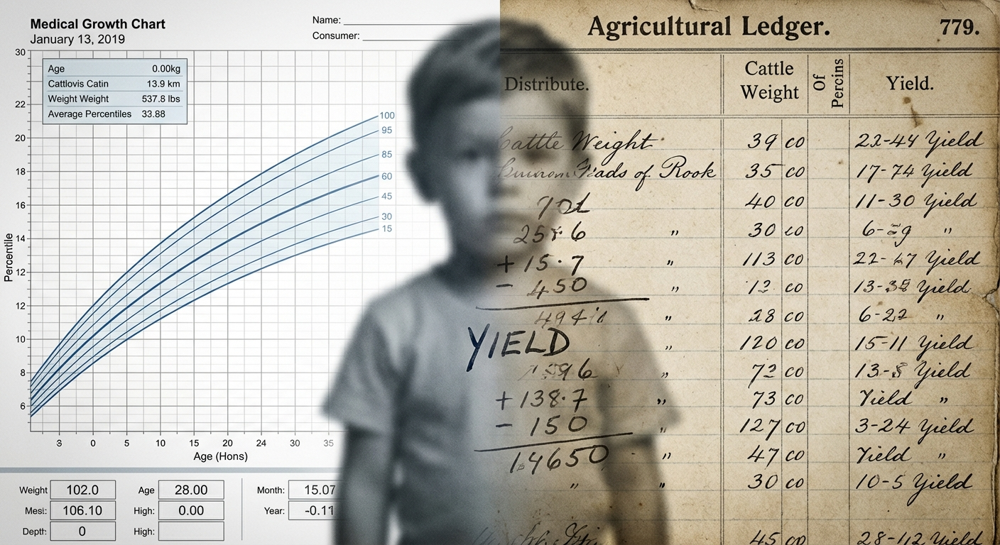
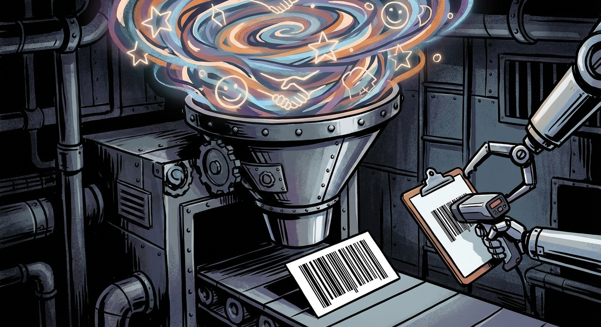
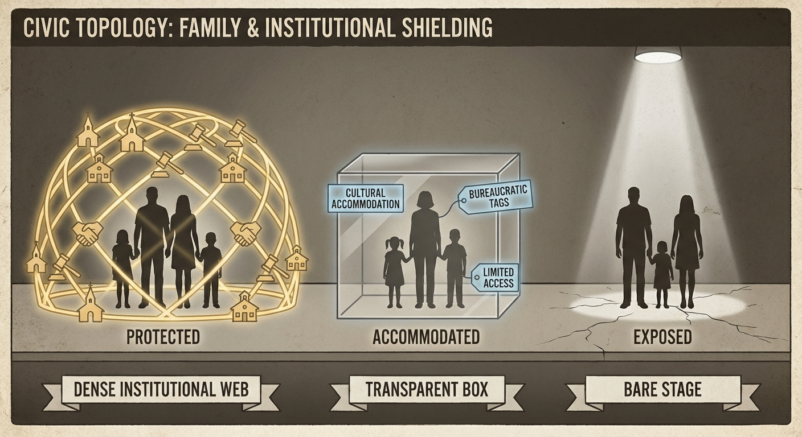
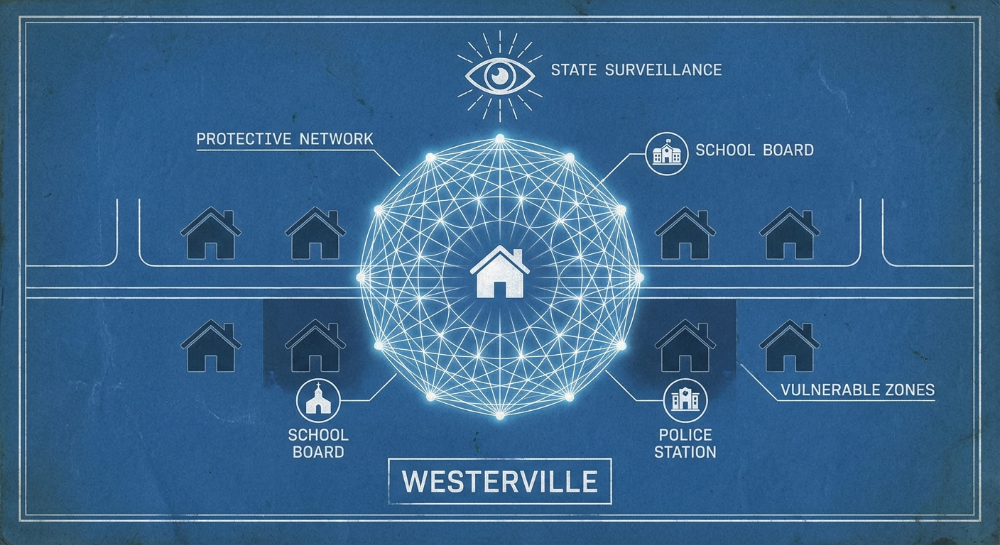

# Ohio Is Hell on Earth

*Selective enforcement, institutional illegibility, and the moral-reform machinery that never stopped running.*

*By Andrew Charneski*

---

## I. Are We Planning on Eating the Kids?

I sat in a pediatrician's office and watched a doctor frown at a growth chart — my daughter's growth chart — and I realized that the concern being performed had nothing to do with my child's health. She was growing. She was developing. She was hitting every milestone with the casual contempt for parental anxiety that healthy children specialize in. But the number on the chart, the *percentile*, had become a thing with its own gravity. It had detached from the child it was supposed to describe and become a metric that described *me*. My fitness. My competence. My suitability as a parent, as measured by the rate at which my daughter converted food into body mass.

That is livestock logic. A farmer evaluating whether a calf is gaining weight on schedule — not because the farmer loves the calf, but because the farmer has plans for the calf. The calf is being optimized for a purpose that is not the calf's own.

So I need to know. If the state of Ohio is going to use biometric proxies to evaluate whether I am raising my child correctly — if a percentile on a growth chart is going to be entered into a file, and that file is going to be reviewed by someone whose job title contains the word "services," and that someone is going to make a judgment about my household based on a number that my child's own body generated by the process of *being alive* — then I need to know what the plan is. What are we optimizing for? What is the target weight? And when she hits it, what happens?

This is not a rhetorical question. It is a diagnostic one. If you manage children like livestock — weigh them, chart them, evaluate their rate of conversion as though their bodies were production units — then you should be able to tell me what the production target is. Farmers can. Farmers will tell you exactly what a calf should weigh at six months and what happens to the calf that doesn't make weight. The state of Ohio will not tell me this, because the state of Ohio has not admitted to itself what it is doing. It has dressed the farmer's vocabulary in clinical white and called it *intervention*. But the logic is the same. The child is not the patient. The child is the *output*. And I am being graded on yield.

---

## II. The Metric as Weapon

James C. Scott described the first move of every modern state: make the population *legible*. Flatten the complexity of actual human life into categories the institution can read. Assign numbers. The numbers are not descriptions — they are handles. They give the state something to grip.

A growth chart is a handle. A school attendance record is a handle. A behavioral note written by a teacher who has known your child for six weeks is a handle. None of these things are your child. None of them capture the texture of a life being lived — the way she laughs when the dog does something stupid, the way she asks questions about black holes at bedtime, the way she holds your hand in a parking lot not because she is afraid but because she wants to. The handles do not know any of this. The handles know a number, and the number is either inside the acceptable range or outside it, and if it is outside it, the handle becomes a *lever*.

This is the thing about metrics that the people who design metrics never say out loud: a metric does not measure what it claims to measure. It measures what is *convenient* to measure. Weight is convenient. Height is convenient. Attendance is convenient. These things can be recorded by a person with a clipboard in under thirty seconds. What cannot be recorded in thirty seconds is whether a child is loved, whether a child is safe, whether a child is growing into the kind of person who will look back on her childhood and know she was seen. The things that matter are illegible to the state. So the state measures what it can see, and then it makes the catastrophic inferential leap: it assumes that what it can see is all there is.

The metric becomes a weapon the moment it is used not to help the child but to evaluate the parent. And in Ohio, that moment arrives early. It arrives in the pediatrician's office, where a percentile triggers a referral. It arrives in the school, where a behavioral note triggers a meeting. It arrives in the county office, where a file triggers a visit. At no point in this chain does anyone ask the question that medicine would ask: *Is this child suffering?* The chain asks a different question entirely: *Does this child's data conform to the expected pattern?* And if the answer is no, the chain does not investigate. It *builds a case*.

The metric is lazy. It is politically convenient. It can be cherry-picked to persecute any family an official chooses to target — usually based on whether that family belongs to the right church, or any church at all. The percentile looks objective. It carries the aura of science. But the decision to *pull the trigger* on that percentile is social. It is discretionary. And discretion, in a place like Ohio, flows along channels carved by a hundred and fifty years of moral-reform culture. The metric is the fig leaf. The judgment was already made.

---

## III. The Protected and the Exposed

Ohio does not treat all families equally. It does not even pretend to, once you watch long enough to see the pattern. What it does is sort — quietly, automatically, through a thousand small interactions that never announce themselves as policy but function with the consistency of one.

There are, roughly, three positions a family can occupy in the civic topology of a place like Westerville, Ohio. The first is *protected*. The second is *accommodated*. The third is *exposed*. The sorting has nothing to do with the quality of parenting in the household. It has everything to do with whether the institution recognizes the family's shape.

Church-aligned families are protected. This is the baseline, the default setting, the family structure the system was built to serve. A church family's problems are private. Their child's behavioral issues are "a phase." Their financial struggles are "a rough patch." When a church family interacts with the school, with the pediatrician, with the county — the interaction begins from a presumption of competence and good faith. Not because anyone has evaluated their competence. Because they are *legible*. They belong to a network that includes the people who sit on school boards, who staff the front desks of social service agencies, who coach the sports teams and organize the fundraisers. Their pastor knows the principal. Their small group leader works at the county office. They are embedded in a web of mutual recognition so dense that institutional scrutiny cannot reach them without first passing through layers of social insulation. The system does not protect them because it has determined they are good parents. The system protects them because it cannot see them clearly enough to do anything else. The web diffuses every signal.

Immigrant families occupy a different position — not protected, but *accommodated*. Their difference is expected. The system has categories for them: ESL programs, cultural liaison officers, translated forms, the entire bureaucratic apparatus of managed diversity. An immigrant family's divergence from the local norm is *legible as cultural*. When an immigrant household does something the system doesn't recognize — a dietary practice, a discipline approach, a family structure that doesn't map onto the nuclear template — the institution has a script for that. The script says: *this is cultural difference, and cultural difference is to be respected, or at least tolerated, or at minimum processed through the appropriate office*. The immigrant family is visible in a way that triggers accommodation rather than suspicion. Their difference has a *name* the system knows.

And then there is the third position. The secular local family. The family that is not embedded in a church network, not legible as culturally other, not protected by any of the scripts the system has written for handling deviation. This family is *from here* — which means the system expects to recognize it. And when it doesn't, when the shape is wrong, when there is no church affiliation to provide social insulation and no cultural category to provide explanatory cover, the system does not accommodate. It *scrutinizes*. The secular local family's difference is not read as culture. It is not read as diversity. It is read as *deficiency*. Something that should be normal and isn't. Something that requires explanation — and, in the absence of a satisfactory explanation, intervention.

This is the sorting mechanism, and it is important to understand that it is not a conspiracy. No one designed it in a conference room. It is *emergent* — the accumulated effect of who knows whom, who sits on which board, whose phone call gets returned, whose "concern" is taken seriously. It is culture operating as infrastructure. The church family is protected not by policy but by *density* — by the sheer number of institutional touchpoints occupied by people who recognize them as their own. The immigrant family is accommodated not by generosity but by *category* — by the existence of bureaucratic scripts written for their specific kind of difference. The secular local family is exposed not by malice but by *absence* — by the lack of any script, any buffer, any institutional vocabulary for a family that is local but does not conform. Their difference is not exotic enough to be protected. It is not networked enough to be insulated. It is just *wrong*, in the way that a word is wrong when it is spelled almost correctly but not quite — close enough to the expected form that the deviation registers as error rather than alternative.

The same behavior is interpreted differently depending on where you sit in this topology. A protected family's cluttered house is "lived-in." An exposed family's cluttered house is "concerning." A protected family's child having a meltdown at school is "having a rough day." An exposed family's child having a meltdown is "exhibiting behavioral patterns consistent with an unstable home environment." A protected family's father who raises his voice at a school meeting is "passionate about his kid's education." An exposed family's father who raises his voice is "aggressive," and the word goes into a file he will never see. The data is identical. The interpretation is not. And the interpretation is what goes into the file.

---

## IV. The Impossible Father

The American institutional apparatus has a robust, well-developed understanding of single motherhood. There are programs. There are presumptions. There are cultural scripts so deeply embedded that they operate below the level of conscious thought. A single mother is *expected*. Not celebrated, necessarily — the system still moralizes about her, still subjects her to its own forms of scrutiny — but she is *legible*. The intake form has a box for her. The caseworker has a protocol. The cultural narrative, however patronizing, at least *exists*: she is brave, or she is struggling, or she is doing her best. She is a category the system can process.

A single father is not a category. He is a *question*.

Not a question the system asks out loud. The question lives in the pause before the receptionist says "and is mom...?" It lives in the school form that lists "Mother/Guardian" on the first line and "Father/Guardian" on the second, as though the order were alphabetical rather than ontological. It lives in the pediatrician's office, where the questions directed at a father — *what does she eat, how much does she sleep, who watches her when you're at work* — carry a faint but unmistakable audit quality that they never carry when directed at a mother. The mother is assumed to *know*. The father is assumed to be *reporting what he has been able to observe*.

And beneath the question is an assumption so foundational that it almost never surfaces as a statement: *if a father has custody, something went wrong with the mother*. This is the only explanation the system can generate. Not that the father is competent. Not that the father chose this. Not that the family is structured this way because this is how it works best. The system cannot process paternal custody as a *primary condition*. It can only process it as a *secondary effect* — the residue of maternal catastrophe. The mother is dead, or the mother is addicted, or the mother is incarcerated, or the mother is so profoundly unfit that even a system built to default to her had to default elsewhere. The father's presence in the custodial role is, to the institution, not evidence of his capacity. It is evidence of her *absence*. And the absence demands a story, and the only stories the system knows are tragedies.

This means that the custodial single father enters every institutional interaction already *explained* — not by anything he has done, but by the narrative the system has silently constructed about why he is there at all. He is there because something is broken. His competence is not invisible because the system has evaluated it and found it lacking. His competence is invisible because the system *cannot see it*. It has no receptor for it. The category "father who is the primary, competent, chosen caretaker of his children" does not exist in the institutional vocabulary, and so the data that would confirm it — the packed lunches, the bedtime routines, the doctor's appointments kept, the homework supervised, the emotional labor performed daily and without witness — passes through the system like light through glass. It leaves no mark. What leaves a mark is the empty space where a mother should be. The system sees the gap and calls it a *case*.

The father is not a parent. He is a *situation*. Another animal in the pen whose papers don't match.

This is not gendered resentment. It is an institutional critique — one I can make with precision because I have been on both sides of the system's sorting. I have a decade of custody evaluations, psychological testing, supervised visitation reports, and parenting coordinator reviews. Every instrument came back clean. Every supervisor documented appropriate parenting. Every test showed no psychopathology, no abuse risk, no clinical concern. And the system's response to a decade of its own evidence was to add another layer of monitoring. The data said *competent father*. The architecture said *situation to be managed*. The architecture won every time.

The system's inability to see a competent father is not a bug — it is a *doctrine*. In the civic religion of the American family, the mother is the primary icon of the domestic altar. A father holding custody is a desecration of that icon, an anomaly that can only be explained by a fall. And the system, having decided that a fall occurred, begins looking for the crater — in the child's weight, in the child's behavior, in the child's beliefs, in anything that can be converted into evidence that the story it has already written is true.

---

## V. The Compound Illegibility

I am not writing about this from a policy desk. I am writing about it from inside.

I am an adoptive single father. My daughter came to me through family — an in-family adoption, the kind that is supposed to be the system's preferred outcome, the kind that every child welfare pamphlet celebrates as the gold standard of permanency. I am also the biological father of two sons who live with their mother, and I moved to Ohio — left everything, relocated my entire life — to be close enough to fight for time with them in a court system that treats paternal involvement as a request rather than a right. I did not come to Ohio because Ohio called to me. I came because my children were here, and the law required me to be in the same jurisdiction as the court that would decide whether I got to see them.

So here I am. A secular, single, adoptive father in Westerville, Ohio — a town whose institutional memory is moral reform and whose social infrastructure runs through churches I do not attend. Every axis of my family's existence is one the system handles poorly. Combined, they do not add up. They *multiply*. Compound illegibility. The system does not see a father who adopted his niece and moved across the country to be near his sons. The system sees a man with custody of a child and no mother in the picture, which means something went wrong. It sees a man fighting for access to two other children, which means something went wrong *twice*. It sees a household with no church affiliation in a community where church affiliation is the basic unit of social credibility. It does the math. The math says: *this family is a case*.

And then there is my daughter's school, where she has learned that believing in dinosaurs is a social liability.

I need to say that again, because it sounds like satire and it is not. My child — a bright, curious, scientifically literate kid who loves fossils and space and the kinds of questions that begin with *how* and *why* — has learned that expressing these interests out loud marks her as different in a way that other children have been taught to interpret as dangerous. Not annoying. Not weird. *Dangerous*. She believes in dinosaurs. She talks about evolution the way children talk about things they find genuinely exciting. And in the social ecosystem of a public school saturated by released-time religious instruction, this is not interpreted as curiosity. It is interpreted as a *signal* — a signal about her household, about her father, about what kind of family produces a child who thinks the earth is old and that bodies evolved and that the fossil record is more interesting than the book of Genesis.

The other children do not arrive at this interpretation on their own. They arrive at it because the institutional environment has taught them — not explicitly, not in a lesson plan, but through the sorting mechanism of who leaves for LifeWise and who stays behind, who belongs to the community of the faithful and who is *left over* — that a child who does not share their framework is not merely different. She is *unsaved*. And an unsaved child's ideas are not ideas. They are *symptoms*.

So my daughter's belief in dinosaurs becomes evidence of my parenting. My parenting becomes evidence of my worldview. My worldview becomes evidence of my fitness. And my fitness — already suspect because I am a single father, already illegible because I am secular, already unexplained because the system cannot generate a story about me that does not begin with maternal catastrophe — my fitness is now being evaluated through the theological lens of a community I do not belong to, using standards I did not agree to, by people who believe with perfect sincerity that they are protecting a child from her own father.

This is the convergence. Every structural force I have described — the metric as weapon, the civic sorting, the institutional invisibility of competent fatherhood — lands here, on one family, in one town, producing one outcome: a child whose scientific curiosity is treated as evidence of abuse, and a father whose parental fitness is inferred from his child's belief in the fossil record.

I did not design this configuration to illustrate a thesis. I am living inside it. But if you *wanted* to design a family that would fall through every crack in Ohio's institutional floor — a family that would be illegible to every system, unprotected by every buffer, exposed to every form of scrutiny that the state reserves for people it cannot categorize — you would design exactly this. A single father. An adopted child. A secular household. A community built on moral reform. A school system that has outsourced its social structure to a religious organization. A family court that treats paternal custody as an anomaly requiring justification. A pediatric system that converts a child's body into a metric and a metric into a case.

The cracks are not random. They are architectural. And the architecture has a history — a history with a name, a headquarters, and a zip code.

I know this architecture from the inside. I have watched it operate across two states, two custody systems, and fifteen years. I have watched a court system in Washington State document, through its own evaluators, that my children's mother facilitated their fear of me — that my sons were taught to bathe after visiting me, to strip the sheets if they fell asleep in clothes I had touched, to call me by my first name instead of "Dad" — and then award her continued primary custody and subject me to alcohol monitoring, supervised visits, and a surveillance apparatus that would be recognizable to anyone on parole. I have watched the same system note that years of supervised visitation produced zero documented concerns about my parenting, and respond by adding more conditions. The architecture does not update when the evidence contradicts the narrative. The architecture *is* the narrative.

And then I moved to Ohio, and the architecture followed me — not the specific court orders, but the *logic*. The assumption that a father with custody is a situation. The assumption that a secular household is a deficit. The assumption that institutional non-conformity is evidence of pathology. Washington built the case. Ohio inherited the posture. The zip code changed. The sorting did not.

---

## VI. LifeWise and the New Temperance

LifeWise Academy is a released-time religious instruction program. During school hours — not after school, not on weekends, but during the actual instructional day — children are pulled from their public school classrooms and transported to off-site locations for evangelical Christian education. This is legal. The Supreme Court settled the legality of released-time programs in 1952. What the Court did not settle, because no court can, is what happens to the social architecture of an elementary school when the majority of its students leave together, in a group, for religious instruction, and the minority stays behind.

What happens is this: the school splits. Not on paper. On paper, LifeWise is an opt-in enrichment opportunity, no different from a field trip. In practice, the split is the most significant social event in a child's week. The LifeWise kids leave together. They board a bus together. They share an experience that the remaining children are excluded from — not by their own choice, in most cases, but by their parents' choice, which to a seven-year-old is the same as the weather. It is simply the condition of their life. And when the LifeWise kids return, they return as a *group* — bonded by a shared experience, reinforced by a shared vocabulary, carrying the social momentum of collective identity. The children who stayed behind are not a group. They are a *remainder*. They are what is left when the community leaves the room.

LifeWise does not need to teach children that non-participating families are suspect. The structure teaches it automatically. When the default — the thing most kids do, the thing the school facilitates, the thing that produces social belonging — is religious instruction, then *not* participating is not a neutral choice. It is a *signal*. It tells other children, and their parents, and the teachers who are nominally neutral but who live in the same community and attend the same churches, that this child's family is *different*. Not different in the way that an immigrant family is different — legibly, categorically, in a way the system has scripts for. Different in the way that a local family that *should* conform and *doesn't* is different. Suspiciously. Worryingly. In a way that invites questions about what is happening in that household.

Think about what this means for a child. Not for a policy paper. For a *child*. She is seven years old. She watches the bus pull up. She watches most of her class stand up and leave. She stays at her desk. She does not understand released-time jurisprudence. She does not understand the First Amendment accommodation doctrine. She understands that everyone left and she is still here, and that when they come back they will have something she does not have, and that the thing they have is not knowledge or skill but *belonging*. The bus is a border. The children who board it are crossing into the community. The children who stay behind are learning, with the brutal clarity that only children can absorb, that they are not part of it.

And then the LifeWise children come back, and they have a shared vocabulary, and they have shared jokes, and they have the easy confidence of people who have just been told they are loved by the creator of the universe. And my daughter has a worksheet. And the social math is done. Not by a teacher. Not by a policy. By the architecture of the day itself. The school has taught every child in the building who belongs and who is *left over*, and it has done so without saying a single word that could be challenged in court.

This is the new temperance. The old temperance used the law to remove alcohol from the community. The new temperance uses the school schedule to remove the secular from the social body. The mechanism is different. The logic is identical: the community has a moral shape, and those who do not fit it will be made to feel the edges.

---

## VII. Westerville — Temperance Capital, Still

Westerville, Ohio, calls itself the "Dry Capital of the World." This is not a nickname imposed from outside. It is a *boast*. The city embraces it. There are plaques. The Anti-Saloon League — the organization that engineered national Prohibition, the single most ambitious project of coercive moral reform in American history — was headquartered here. Westerville was the command center. And the city remembers this the way other cities remember winning a war: with pride, with monuments, with the quiet conviction that the cause was righteous even if the specific policy didn't stick.

This matters because institutional memory is not metaphorical. It is operational. The civic DNA of a place — who sits on which board, what counts as a "concern," how the word "community" is deployed and by whom — is inherited. It mutates, but it does not disappear. Westerville's institutional memory is moral reform. Its civic reflex is surveillance in the name of protection. Its default assumption is that the community has a right — not merely a preference, but a *right* — to define the moral shape of its families, and that families who deviate from that shape are not exercising autonomy. They are exhibiting *pathology*.

The Anti-Saloon League did not merely oppose drinking. It opposed the *kind of person* who drank — the immigrant, the Catholic, the urban worker, the man whose leisure time was not supervised by a Protestant institution. Prohibition was a sorting mechanism. It separated the morally legible from the morally suspect, and it used the law to enforce the separation. When Prohibition ended, the sorting did not. It simply migrated. The targets changed. The logic did not.

Today, in Westerville, the targets are not drinkers. They are secular families. Single fathers. Households that do not participate in the religious infrastructure that has replaced the temperance society as the community's primary organ of social control. The mechanism is not a constitutional amendment. It is a released-time program, a growth chart, a "concern" raised at a parent-teacher conference, a file opened at the county office. The tools are softer. The architecture is the same. And the city is still proud of it — still boasts about it — still believes, with the serene confidence of people who have never been on the wrong side of their own machinery, that what they are doing is *protection*.

Moving here would drive anyone to drink. That is the kind of irony Westerville specializes in: building a pressure cooker and then pathologizing the steam.

---

## VIII. The Three Layers of Hell

**The first layer is ambient psychological toxicity.** This is the background radiation. It is not directed at you specifically. It is simply the atmosphere of a community in which your family's shape, your beliefs, and your composition are treated as inherently suspect. You feel it in the pause before the receptionist says "and... dad is the primary...?" You feel it in the intake form that does not have a box for your family. You feel it in the way a teacher's voice shifts register — just slightly, just enough — when she is talking to you versus when she is talking to the mother who was in the hallway before you. No one has accused you of anything. No one needs to. The accusation is *ambient*. It is in the air the way humidity is in the air: you cannot point to it, but you are soaking in it, and after enough time you cannot remember what it felt like to be dry. This layer attacks your emotional stability. Not through any single event but through the *accumulation* — the slow, grinding, daily experience of being in a place that has decided you are wrong before you have opened your mouth. It is exhausting in the way that noise is exhausting: not because any one sound is unbearable, but because it never stops.

**The second layer is targeted misinterpretation.** This is what happens when the ambient suspicion finds a vector — a specific child, a specific behavior, a specific number on a specific chart. Your daughter's weight percentile becomes a referral. Your son's bad Tuesday becomes a behavioral pattern. Your advocacy at a school meeting becomes *aggression*, documented in a file you will never see, by a person who has already decided what your tone meant. This is the layer where metrics become weapons, where the system's capacity for selective enforcement locks onto your family and begins to *build a narrative*. The narrative is never announced. It assembles itself in the negative space between interactions — in the notes a caseworker writes after a visit, in the "concerns" a teacher raises at a meeting you were not invited to, in the quiet, bureaucratic consensus that forms among professionals who have never met your child but who have all read the same file. This layer attacks your sense of safety. It is daily terrorism — not the theatrical kind, but the grinding, administrative kind, the kind where you never know which ordinary Tuesday is going to become a file entry, which routine interaction is going to be reinterpreted as evidence. You cannot relax. You cannot have a bad day. You cannot let your child have a bad day. Every moment is potentially *evidentiary*, and you know it, and the knowing is the point.

**The third layer is ideological offense.** This is the deepest, and in some ways the most disorienting, because it is not about what the system does to you. It is about what the system *is*. It is the recognition — slow, sickening, impossible to un-see once you have seen it — that the entire architecture is *wrong*. Not broken. Not failing. *Wrong* — in the sense that it violates something fundamental about how you believe a society should treat its members. The sorting is deliberate. The selective enforcement is a feature. The moral-reform logic that treats institutional conformity as virtue and structural difference as pathology is not a bug in the code — it is the code. This layer attacks your sense of meaning. It is the thing that makes you lie awake at three in the morning not because you are afraid of what will happen tomorrow, but because you cannot reconcile the world you thought you lived in with the world you actually live in. The first layer exhausts you. The second layer terrorizes you. The third layer *offends* you — at the level of your deepest convictions about what human institutions are for and what they owe to the people inside them.

The three layers interact, and the interaction is the cruelest part. Ambient toxicity creates the conditions for targeted misinterpretation: when everyone already assumes your family is deficient, any data point can be recruited as confirmation. Targeted misinterpretation feeds the ideological offense: every time the system converts your child's ordinary life into a case file, it proves that the architecture is functioning as designed. And the ideological offense makes the ambient toxicity unbearable: once you understand that the atmosphere is not accidental but *structural*, you cannot tune it out. You cannot tell yourself it will get better. You know what it is. You know what built it. And you know it is not going to stop, because it is not *trying* to stop. It is doing exactly what it was made to do. I have watched this interaction play out across two decades, two states, and three children. The pattern does not vary. The institutions change. The logic does not.

And there is a fourth thing the three layers produce together, a thing that is perhaps the system's most elegant cruelty: *self-doubt*. The constant, corrosive voice that says *maybe you are the problem*. Maybe your family really is the shape they say it is. Maybe the machinery is right about you. The system installs this voice as a feature, not a bug. If you doubt yourself, you are easier to manage. If you internalize the narrative, you stop fighting it. The ambient toxicity softens you. The targeted misinterpretation disorients you. The ideological offense exhausts you. And then the self-doubt finishes the job. You stop asking whether the system is wrong and start asking whether you are. That is the moment the system wins — not when it takes your child, but when it takes your certainty that you deserved to keep her.

---

## IX. The Crusaders Disprove Themselves

Here is the thing that should end the argument, if arguments ended when the evidence arrived: the people who most aggressively enforce the community's moral standards are, by any observable measure, the worst advertisements for those standards.

This is not ad hominem. I am not saying they are bad people. I am saying something more damning: they are *predictable* people. The system that produces them produces a type, and the type is not kind. It is not generous. It is not marked by the warmth, patience, and social grace that the moral framework claims to cultivate. The type is brittle. The type is judgmental. The type files CPS reports on neighbors whose parenting looks different from its own. The type organizes the social exclusion of children — *children* — whose families do not participate in the community's religious infrastructure. The type's "concern" is indistinguishable from hostility, and the type does not notice the resemblance, because the type has been taught that hostility in the service of moral correction is not hostility. It is *love*.

If the framework worked — if church attendance and traditional family structure and institutional conformity actually produced the virtues they claim — then the enforcers would be the evidence. They would be the kindest people in the room. They would be the most generous, the most patient, the most capable of extending grace to families that look different from their own. They would demonstrate, through their behavior, that the moral-reform project *works* — that it takes ordinary people and makes them better. Instead, the enforcers demonstrate the opposite. The most aggressive moral police in the community are also the most punitive, the most suspicious, the most willing to weaponize institutional power against families they have decided are deficient. Their behavior is the *counter-evidence* to their own thesis.

And this is not because they are uniquely bad people who happen to have found a system that lets them be cruel. It is because the system *rewards* this behavior. Moral-reform communities do not select for kindness. They select for *correctness*. The currency is not warmth — it is vigilance. The person who notices the deviation, who raises the concern, who makes the call, who flags the family — that person is performing the community's highest function. They are *protecting*. And protection, in this framework, is not a gentle act. It is a sorting act. It separates the compliant from the suspect, the saved from the unsaved, the families who belong from the families who are *cases*. The social rewards — approval, status, the warm glow of having done one's civic duty — flow to the people who sort most aggressively. Kindness is not the point. Kindness was never the point. *Correctness* is the point, and correctness requires enemies.

So the system produces exactly what you would expect it to produce: a community of moral enforcers who are angry, controlling, and deeply antisocial toward anyone outside the circle of conformity. Not because the individuals are broken, but because the *incentive structure* is functioning perfectly. The system rewards punitive behavior toward outsiders. It calls that behavior concern. It calls it protection. It calls it love. And the people inside the system believe it, because the system has given them no vocabulary for recognizing what they are actually doing. They are not protecting children. They are enforcing a boundary. And the enforcement makes them *meaner* — measurably, observably meaner — than they would be if the system did not exist.

The framework eats itself. The moral-reform machinery that claims to produce good character produces, instead, the specific kind of bad character that moral-reform machinery requires to operate: suspicious, punitive, and certain of its own righteousness. The enforcers are not aberrations. They are the immune system of the enclosure. Their hostility is a functional response to the presence of anything the system classifies as foreign. They are performing a cleansing ritual that reinforces the walls, and the ritual makes them worse, and the worsening makes them more effective at the ritual, and the cycle does not have a natural stopping point because the cycle *is* the point.

Ohio is the proof. The crusaders are the evidence. And the evidence says: whatever this system is building, it is not virtue.

---

## X. This Is Not Metaphor. This Is Ohio.

So let me return to the question I asked at the beginning, because I have earned the right to answer it now.

Are we planning on eating the kids?

No. Nothing so honest. Eating would require the system to admit what it is. What Ohio does is *weigh* them. Measure them. Chart them. Convert them into data points and run those data points through a machinery of moral evaluation so old and so embedded that the people operating it cannot distinguish it from civic duty. The children are not eaten. They are *processed*. Sorted into legible and illegible, protected and exposed, saved and unsaved — and the ones who land on the wrong side of every sort are not punished by any single act of cruelty. They are punished by *architecture*. By the accumulated weight of a thousand institutions doing exactly what they were built to do.

If you manage children like livestock — weigh them, chart them, evaluate their rate of conversion as though their bodies were production units — you should not be surprised when the system behaves like a farm. If you evaluate parents like farmhands — grading them on yield, docking them for deviation, replacing them when the numbers don't perform — you should not be surprised when the people inside the system behave like they are being farmed. If you build your community around moral surveillance, if you organize your schools around religious sorting, if you treat institutional conformity as the only legible form of virtue and structural difference as the only reliable sign of pathology — then you have built a farm. You have built it with public money, on public land, using public institutions, and you have stocked it with families who did not volunteer to be livestock.

The metrics are weapons. The sorting is deliberate, even when no one is deliberately sorting. The history is not past. The institutions are not failing. The children are not being raised. They are being *processed* — weighed, measured, evaluated, and filed — by a system that cannot tell the difference between care and control because it was never designed to.

I know what I am describing. I know how it sounds. I know that somewhere a reasonable person is preparing the reasonable objection: *Surely it's not that bad. Surely there are good people in the system. Surely this is exaggeration, or bitterness, or the distorted perspective of a man too close to his own case to see clearly.*

I have considered that objection. I have lived inside it for years — the constant, corrosive self-doubt that the system installs in you as a feature, the voice that says *maybe you are the problem, maybe your family really is the shape they say it is, maybe the machinery is right about you*. I have considered it, and I have rejected it, because the evidence is not ambiguous. The evidence is a growth chart weaponized against a healthy child. The evidence is a school that sorts children by salvation status during the instructional day. The evidence is a community that calls surveillance *love* and calls control *concern* and calls the organized destruction of non-conforming families *protection*. The evidence is a hundred and fifty years of moral-reform machinery that never stopped running, just found new raw material.

The evidence is also this: I am a functioning techno-philosopher — a man who builds AI platforms, publishes academic research, and raises three children — and the system's best description of me is *situation*. I have valid psychological testing across every instrument. I have years of supervised visitation reports documenting appropriate parenting. I have a decade of professional output that demonstrates sustained cognitive function, ethical reasoning, and the capacity to build complex systems from scratch. And the system cannot see any of it, because the system does not have a receptor for a person shaped like me. It has receptors for *church member*, *married parent*, *mother*. What it does not have is a receptor for *secular single father who is also an AI researcher who adopted his niece and moved across the country to be near his sons*. That person does not exist in the institutional vocabulary. And what does not exist in the vocabulary cannot be seen. And what cannot be seen cannot be protected.

This is not metaphor. This is not exaggeration. This is not paranoia.

This is Ohio. The crevasse of America. A place where suffering is structural, legitimacy is rationed, and hell is a zip code. A place where the system does not need to be malicious because it is something worse — it is *correct*, by its own standards, operating exactly as designed, producing exactly the outcomes it was built to produce, and experiencing those outcomes as *success*.

My daughter believes in dinosaurs. The system believes that this is a problem. One of us is right about what constitutes a threat to a child, and it is not the system.

I am not asking for reform. I am not asking for understanding. I am describing a machine, and I am telling you what it does, and I am telling you that it is running right now, today, in a suburb that looks like every other suburb, in a state that calls itself the heart of it all.

The heart of it all. Yes. That is exactly where it hurts.

---

It calls that thing *intervention*. It means something closer to *consumption*. The farmer's vocabulary, again — dressed in clinical white.

My daughter is not being raised. She is being *processed*. Her body is a data point. Her curiosity is a diagnostic. Her father is a situation. And the system that is doing this to her — to us — does not experience itself as doing anything wrong. It experiences itself as doing its job. That is the compound. That is the illegibility. That is the thing I cannot make anyone see from outside, because from outside it looks like a suburb with good schools and a farmer's market on Saturdays.

From inside, it looks like what it is: a farm. And we are not the farmers.
