# Narrative Generation Task

## Overview

# Narrative Generation

**Subject:** A secular single adoptive father in Westerville, Ohio discovers that every institution — the pediatrician's office, the public school, the county services office, the family court — is part of an interlocking machinery of moral surveillance inherited from the town's temperance-era past. His daughter's scientific curiosity, his lack of church affiliation, and his very existence as a competent custodial father make his family illegible to every system designed to 'help' — and illegibility, in Ohio, is indistinguishable from guilt.

## Configuration
- Target Word Count: 12000
- Structure: 3 acts, ~3 scenes per act
- Writing Style: literary
- Point of View: first person
- Tone: sardonic, furious, precise — dark humor masking genuine anguish
- Detailed Descriptions: ✓
- Include Dialogue: ✓
- Internal Thoughts: ✓

**Started:** 2026-03-02 11:13:21

---

## Progress

### Phase 1: Narrative Analysis
*Running base narrative reasoning analysis...*

## Cover Image

**Prompt:** 

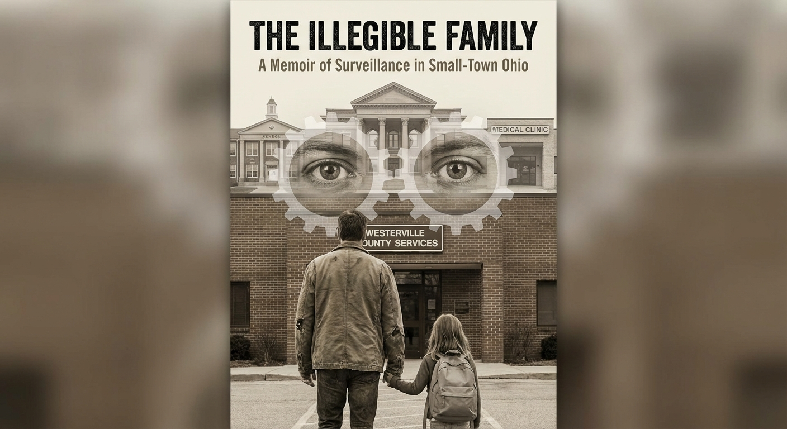

## High-Level Outline

## THE DRY CAPITAL

**Premise:** A single, secular adoptive father in Westerville, Ohio, faces a cascading investigation by child welfare services triggered by his daughter's intellectual curiosity and his own non-conformity to the town's historical moral architecture.

**Estimated Word Count:** 12000

---

### Characters

#### Daniel Kessler

**Role:** protagonist

**Description:** 41 years old, lean, software engineer with brown hair going gray. Wears flannel shirts and jeans. Intellectually precise and emotionally guarded with a dry, self-lacerating humor.

**Traits:** Analytical, Sardonic, Fiercely protective, Conflict-averse, Prone to 3 AM spirals of self-doubt

#### Lily Kessler

**Role:** catalyst

**Description:** Six years old, biracial, with a halo of curly dark hair. Unselfconsciously brilliant and relentlessly curious about science and the natural world.

**Traits:** Curious, Joyful, Blunt, Scientifically minded, Emotionally secure

#### Dr. Patricia Hendricks

**Role:** antagonist

**Description:** Late 50s pediatrician with a silver-blonde bob. Deeply embedded in the Westerville community and views spiritual nourishment as a clinical developmental milestone.

**Traits:** Authoritative, Certain, Community-embedded, Maternally judgmental, Incapable of seeing her own framework as a framework

#### Mrs. Gayle Calloway

**Role:** antagonist

**Description:** Mid-40s first-grade teacher at Emerson Elementary. Passive-aggressive and strategic, she reframes her judgments as 'concern' for the child.

**Traits:** Passive-aggressive, Documented, Righteous, Territorial, Institutional

#### Sandra Okafor-Williams

**Role:** supporting

**Description:** Early 30s Black caseworker for Franklin County Children Services. Professional, exhausted, and procedurally trapped between her empathy and the system's requirements.

**Traits:** Empathetic, Exhausted, Procedurally bound, Haunted, Intelligent

#### Judge Harold Wren

**Role:** supporting

**Description:** A baritone voice from the bench. An elder at Westerville Community Church who views family through a traditional, structured lens.

**Traits:** Authoritative, Unhurried, Paternalistic, Structurally biased, Invisible

---

### Settings

#### pediatric_office

**Description:** A single-story brick building with pastel walls, fish tanks, and framed prints of guardian angels in every exam room.

**Atmosphere:** Fluorescent, antiseptic, and deceptively cheerful.

**Significance:** The first node in the surveillance network where Lily's curiosity is read as a symptom of parental failure.

#### emerson_elementary

**Description:** A mid-century brick school building where the 'gratitude tree' in Room 107 blurs the line between civic and religious instruction.

**Atmosphere:** Bright, controlled, and surveilled.

**Significance:** The place where Lily's intellectual nonconformity is translated into official incident reports.

#### fccs_office

**Description:** A beige government building with drop ceilings and institutional mauve cubicles.

**Atmosphere:** Exhausted and bureaucratically tired.

**Significance:** The processing center where informal suspicion is converted into the formal language of the state.

#### daniels_kitchen

**Description:** A 1960s ranch house kitchen with a refrigerator covered in anatomical drawings and a scarred kitchen table.

**Atmosphere:** Intimate, insomniac, and amber-lit.

**Significance:** The only space not controlled by an institution; the site of Daniel's historical research and emotional processing.

#### family_court

**Description:** A wood-paneled hearing room with an elevated bench and a clock that is seven minutes fast.

**Atmosphere:** Formal, oppressive, and performative.

**Significance:** The site of the final judgment where Daniel must perform legibility for the state.

#### public_library_archives

**Description:** A small, wood-floored room containing temperance memorabilia and bound volumes of local history.

**Atmosphere:** Hushed, archival, and haunted.

**Significance:** Where Daniel discovers the historical temperance-era architecture of the system consuming his family.

#### the_sidewalk

**Description:** A six-block suburban walk lined with mature oaks, maples, and church signs.

**Atmosphere:** Beautiful, ordinary, and surveilled.

**Significance:** Bookends the story, representing the transition from naive normalcy to permanent awareness of surveillance.

---

### Act Structure

#### Act 1: THE WELL-CHILD VISIT

**Purpose:** Establish the protagonist's world and show the first moment the system notices their illegibility and begins to process it as pathology.

**Estimated Scenes:** 3

**Key Developments:**
- Introduction of Daniel and Lily's functional but 'weird' household.
- The pediatric screening where Lily's answers trigger Dr. Hendricks' suspicion.
- Daniel receives the formal referral letter from Children Services.
- Daniel begins his 3 AM research into the town's history.

#### Act 2: THE ARCHITECTURE OF CONCERN

**Purpose:** Escalate the conflict across multiple institutions and reveal the historical roots of the town's moral surveillance.

**Estimated Scenes:** 3

**Key Developments:**
- Mrs. Calloway manufactures a narrative of concern through school incident reports.
- Sandra conducts a home visit, highlighting the paradox of the 'procedurally bound' caseworker.
- Daniel excavates the history of the Anti-Saloon League in the library archives.
- A family court hearing is scheduled for a review of custodial fitness.

#### Act 3: THE HEARING AND THE WALK AFTER

**Purpose:** Bring the institutional machinery to its culmination and resolve with the family's survival within a state of permanent visibility.

**Estimated Scenes:** 3

**Key Developments:**
- Daniel prepares a defense that balances honesty with the need for institutional legibility.
- The court hearing where Daniel insists on his family's right to exist as they are.
- The judge orders 'continued monitoring' rather than removal or exoneration.
- A final walk to school where Daniel sees the town's architecture with permanent, altered awareness.

---

**Status:** ✅ Pass 1 Complete

## Outline

## THE DRY CAPITAL

**Premise:** A single, secular adoptive father in Westerville, Ohio, faces a cascading investigation by child welfare services triggered by his daughter's intellectual curiosity and his own non-conformity to the town's historical moral architecture.

**Estimated Word Count:** 12000

**Total Scenes:** 9

---

### Detailed Scene Breakdown

### Act 1: THE WELL-CHILD VISIT

**Purpose:** Establish the texture of Daniel and Lily's life together—its warmth, its intellectual richness, and its structural illegibility to the surrounding community. Introduce the town of Westerville as a physical and ideological landscape. Plant the seeds of what the system will later read as deficiency and dramatize the inciting incident where intellectual curiosity is pathologized.

#### Scene 1: The Walk and the Kitchen

- **Setting:** the_sidewalk, daniels_kitchen
- **Characters:** Daniel Kessler, Lily Kessler
- **Purpose:** Establish the texture of Daniel and Lily's life together—its warmth, its intellectual richness, its structural illegibility to the surrounding community. Introduce the town of Westerville as a physical and ideological landscape. Plant the seeds of what the system will later read as deficiency.
- **Emotional Arc:** Starts with intellectual warmth and connection during a morning routine, transitions to a subtle sense of being observed/judged by the community, and ends in a baseline of routine normalcy.
- **Est. Words:** 1500

**Key Events:**
  {
    "morning_conversation" : "Daniel and Lily discuss decomposition and the fate of a dead robin's bones during their walk.",
    "environment_setup" : "Description of the 1960s ranch house and Lily's scientific drawings on the refrigerator.",
    "community_context" : "The walk through Westerville, passing church signs and observing the neighbors' interrogative warmth.",
    "school_dropoff" : "Daniel drops Lily at Emerson Elementary and walks home alone, unaware of the impending visit."
  }

#### Scene 2: The Screening

- **Setting:** pediatric_office
- **Characters:** Daniel Kessler, Lily Kessler, Dr. Patricia Hendricks
- **Purpose:** The inciting incident. Show the precise mechanism by which a child's intellectual curiosity and a father's secular worldview are translated, through the lens of a community-embedded authority figure, into clinical concern. Dramatize the moment when the system's gaze locks onto the family.
- **Emotional Arc:** Begins as a routine medical appointment, shifts to intellectual curiosity, and descends into a cold, tectonic dread as Daniel realizes Lily's worldview is being pathologized.
- **Est. Words:** 2000

**Key Events:**
  {
    "waiting_room" : "Lily questions the consciousness of fish and the reality of a guardian angel painting.",
    "developmental_screening" : "Lily provides clinical, anatomical answers to standard questions about drawing and fears.",
    "psychosocial_interview" : "Dr. Hendricks questions Lily about church and death, leading to Lily's biological explanation of decomposition.",
    "the_confrontation" : "Dr. Hendricks meets privately with Daniel to express concern over Lily's 'meaning-making architecture' and documents a developmental concern."
  }

#### Scene 3: The Letter and the Archive

- **Setting:** daniels_kitchen, public_library_archives
- **Characters:** Daniel Kessler, Lily Kessler
- **Purpose:** Deliver the formal escalation—the referral letter from Franklin County Children Services—and show Daniel's first descent into the historical research that will become his parallel investigation. Establish the 3 AM insomnia pattern.
- **Emotional Arc:** A false sense of security is shattered by institutional intervention, leading to intense panic and nausea, which eventually transforms into a grim, intellectual awareness of historical patterns.
- **Est. Words:** 2000

**Key Events:**
  {
    "the_letter" : "Daniel receives a formal notice from Franklin County Children Services regarding a welfare report.",
    "parental_vigil" : "Daniel watches Lily sleep, cataloging her well-being as if preparing a legal case.",
    "late_night_research" : "Daniel investigates CPS rights and the history of Westerville's Anti-Saloon League.",
    "historical_discovery" : "Daniel finds a 1908 pamphlet that uses nearly identical language to Dr. Hendricks regarding 'spiritual architecture'.",
    "morning_resolution" : "Lily wakes up and asks if millipedes dream, regrounding the narrative in their relationship."
  }

---

### Act 2: THE ARCHITECTURE OF CONCERN

**Purpose:** The institutional net has tightened from three directions (medical, educational, and child services), a court date looms, and Daniel gains historical perspective on the town's moral surveillance apparatus, realizing his family's struggle is part of a century-old pattern of enforced conformity.

#### Scene 1: The Incident Report

- **Setting:** emerson_elementary
- **Characters:** Mrs. Gayle Calloway, Lily Kessler, Daniel Kessler
- **Purpose:** Show how institutional concern is manufactured through documentation, and how a child's intellectual nonconformity is translated into the bureaucratic language of risk.
- **Emotional Arc:** From the mundane rhythm of a first-grade classroom to the slow, sickening revelation that ordinary moments are being catalogued as evidence. The reader should feel the gap between Lily's joyful curiosity and the sinister document being constructed around it.
- **Est. Words:** 1500

**Key Events:**
  {
    "1" : "Lily expresses gratitude for decomposition during a classroom 'gratitude circle,' causing discomfort for Mrs. Calloway.",
    "2" : "Mrs. Calloway writes a clinical and biased 'Anecdotal Observation Note' framing Lily's curiosity as a lack of moral guidance.",
    "3" : "Calloway emails her compiled observations to the school counselor and CCs Sandra Okafor-Williams at Children Services.",
    "4" : "At pickup, Calloway observes Daniel and Lily, noting a lack of 'extended family or community support network' in her files."
  }

#### Scene 2: The Home Visit

- **Setting:** daniels_kitchen
- **Characters:** Daniel Kessler, Sandra Okafor-Williams, Lily Kessler
- **Purpose:** Stage the central paradox of the procedurally bound caseworker—Sandra sees clearly that this home is functional and loving, but the system requires her to process what she sees through a checklist that cannot account for what she sees.
- **Emotional Arc:** The scene should feel like an invasion conducted with politeness—the violence of being assessed in your own home by someone who means well but serves a machine that doesn't. Sandra's humanity makes it worse, not better, because it reveals that the system's harm doesn't require malice.
- **Est. Words:** 2000

**Key Events:**
  {
    "1" : "Daniel anxiously prepares for the home visit, viewing his own home through the critical eyes of the state.",
    "2" : "Sandra Okafor-Williams conducts a safety assessment, noting the absence of traditional community or spiritual engagement.",
    "3" : "Daniel answers Sandra's questions honestly, highlighting his commitment to taking Lily's questions seriously.",
    "4" : "Sandra informs Daniel that a family court hearing for a 'review of custodial fitness' has been scheduled, leaving Daniel in a state of shock."
  }

#### Scene 3: The Dry Capital

- **Setting:** public_library_archives
- **Characters:** Daniel Kessler
- **Purpose:** Daniel discovers the historical architecture beneath the present-day system, connecting the Anti-Saloon League's origins in Westerville to the moral surveillance apparatus now consuming his family.
- **Emotional Arc:** This scene transforms Daniel's experience from bewilderment and defensive anxiety into something harder and more dangerous: understanding. He now sees the system not as a series of unfortunate misunderstandings but as an architecture with foundations and load-bearing walls.
- **Est. Words:** 2500

**Key Events:**
  {
    "1" : "Daniel researches the history of the Anti-Saloon League at the Westerville Public Library archives.",
    "2" : "He discovers the historical machinery of moral surveillance and how it was used to justify intervention in 'unfit' homes.",
    "3" : "Daniel finds a 1908 photograph of the 'Committee for the Protection of the Home' and recognizes the same posture in modern figures like Mrs. Calloway.",
    "4" : "Returning home, Daniel begins drafting a framework for his legal defense, attempting to make his family's values legible to a system designed to exclude them."
  }

---

### Act 3: THE HEARING AND THE WALK AFTER

**Purpose:** To resolve the legal conflict with a verdict of 'continued monitoring' and illustrate Daniel's permanent shift in perspective regarding the town's systemic nature and his commitment to his daughter's individuality.

#### Scene 1: The Language of Legibility

- **Setting:** daniels_kitchen
- **Characters:** Daniel Kessler, Lily Kessler
- **Purpose:** To show the internal cost of conforming to the system and establish the emotional stakes before the hearing.
- **Emotional Arc:** Daniel moves from the brutal self-erasure of strategic preparation to a moment of quiet, tender parenting that reinforces his resolve.
- **Est. Words:** 1000

**Key Events:**
  {
    "preparation" : "Daniel rewrites his court statement into institutional language, removing his personal philosophy.",
    "historical_reflection" : "He compares temperance-era documents to his FCCS referral, noting the structural similarities but deciding not to use them in court.",
    "interaction" : "Lily wakes up and asks about the hearing; Daniel explains orbital mechanics to her as she falls asleep in his lap."
  }

#### Scene 2: The Clock That Is Seven Minutes Fast

- **Setting:** family_court
- **Characters:** Daniel Kessler, Sandra Okafor-Williams, Judge Harold Wren, Dr. Patricia Hendricks, Mrs. Gayle Calloway
- **Purpose:** The climax of the legal conflict where the system's bias is exposed and Daniel makes his stand for his family's identity.
- **Emotional Arc:** The scene begins with suffocating formality and tension, peaking when Daniel abandons his 'legible' script for a moment of dangerous, heartfelt honesty.
- **Est. Words:** 1500

**Key Events:**
  {
    "procedural_trap" : "Sandra presents her report, which is factually positive but linguistically concerning due to institutional requirements.",
    "testimony" : "Dr. Hendricks and Mrs. Calloway provide evidence of Lily's lack of 'spiritual integration' and 'atypical' behavior.",
    "the_stand" : "Daniel delivers his prepared statement but then breaks away to defend Lily's wholeness and his right to raise her as herself."
  }

#### Scene 3: The Walk After

- **Setting:** the_sidewalk
- **Characters:** Daniel Kessler, Lily Kessler, Sandra Okafor-Williams
- **Purpose:** To provide the thematic resolution of survival within visibility and illustrate Daniel's altered awareness of his environment.
- **Emotional Arc:** Quiet and luminous; Daniel experiences a sense of survival within visibility, accepting a world that is no longer innocent but still contains joy.
- **Est. Words:** 1200

**Key Events:**
  {
    "the_ruling" : "Judge Wren orders continued monitoring rather than closing the case.",
    "the_walk" : "Daniel walks Lily to school, seeing the town's architecture and signs as a visible system of surveillance and social control.",
    "conclusion" : "Daniel watches Lily enter school and walks home, aware of the ongoing scrutiny but finding resolution in their shared life."
  }

---

**Status:** ✅ Complete

#### Setting: pediatric_office

**Prompt:** 

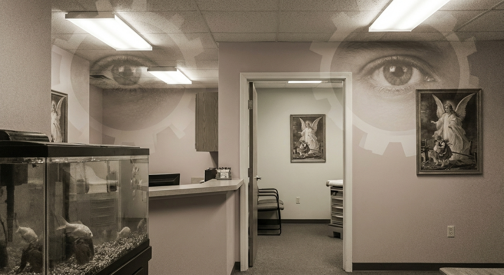

#### Setting: emerson_elementary

**Prompt:** 

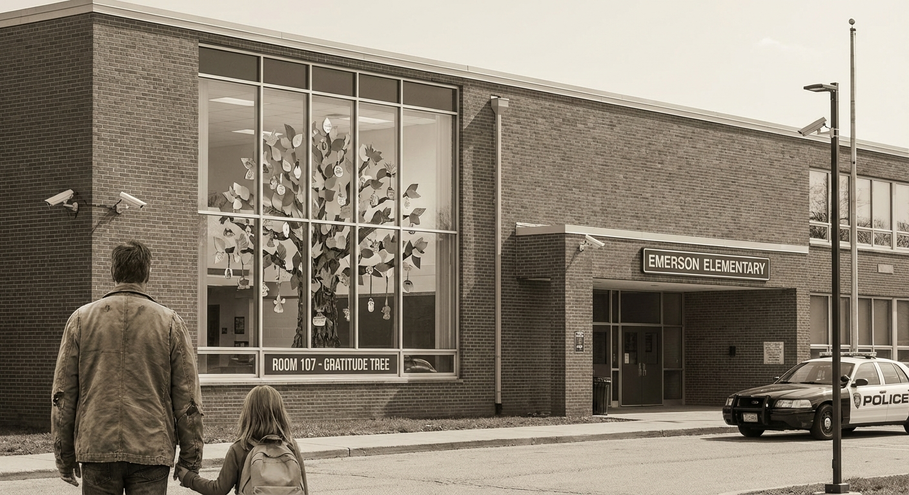

#### Setting: fccs_office

**Prompt:** 

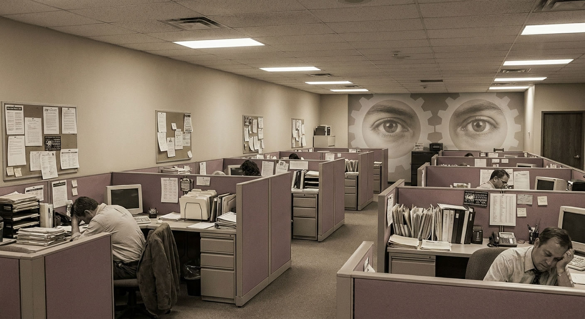

#### Setting: daniels_kitchen

**Prompt:** 

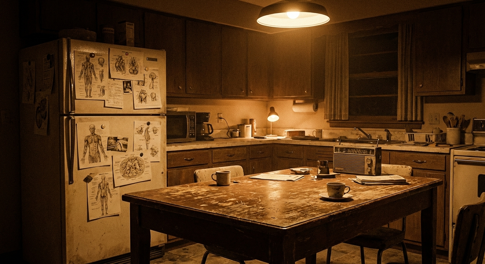

#### Setting: family_court

**Prompt:** 

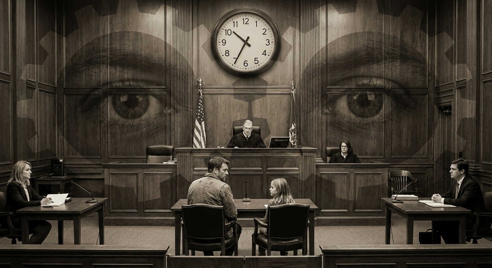

#### Setting: public_library_archives

**Prompt:** 

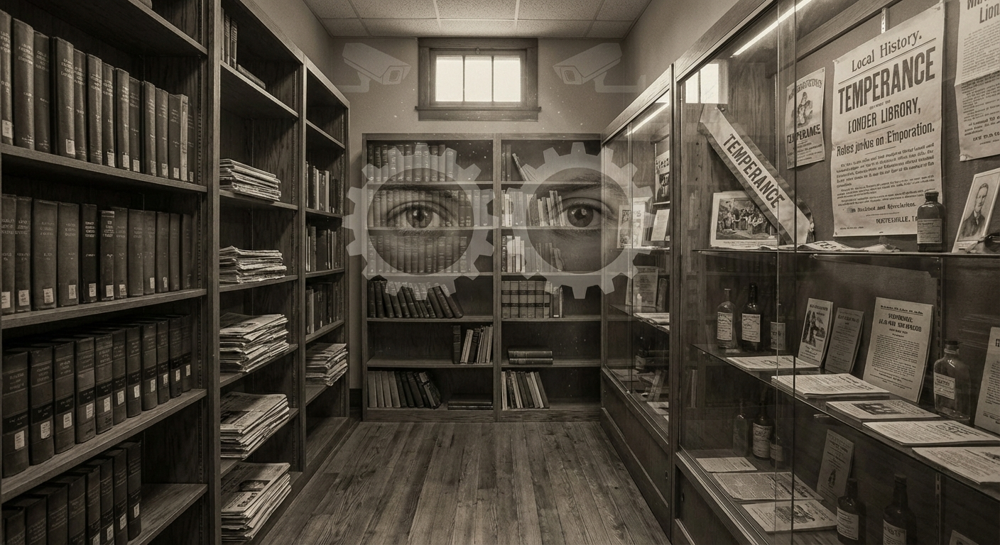

#### Setting: the_sidewalk

**Prompt:** 

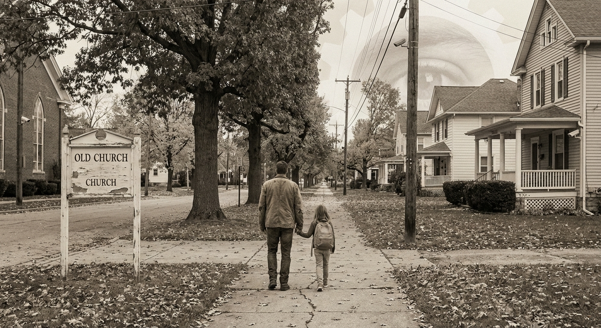

#### Character: Daniel Kessler

**Prompt:** 

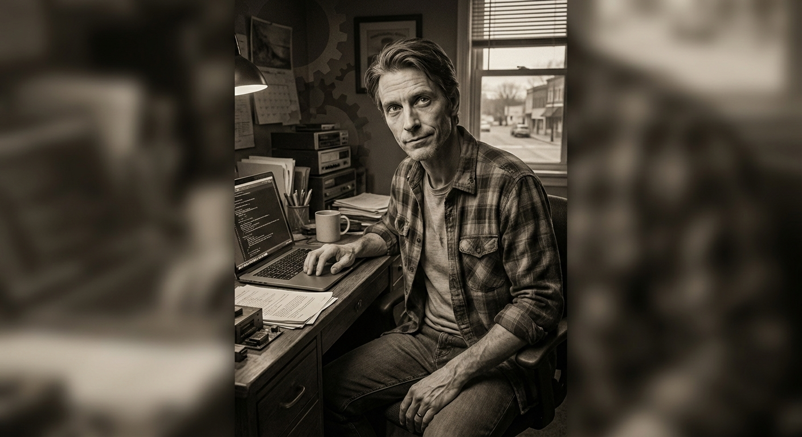

#### Character: Lily Kessler

**Prompt:** 

#### Character: Dr. Patricia Hendricks

**Prompt:** 

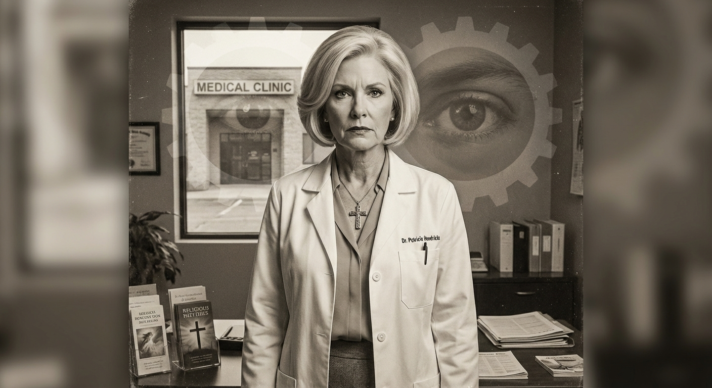

#### Character: Mrs. Gayle Calloway

**Prompt:** 

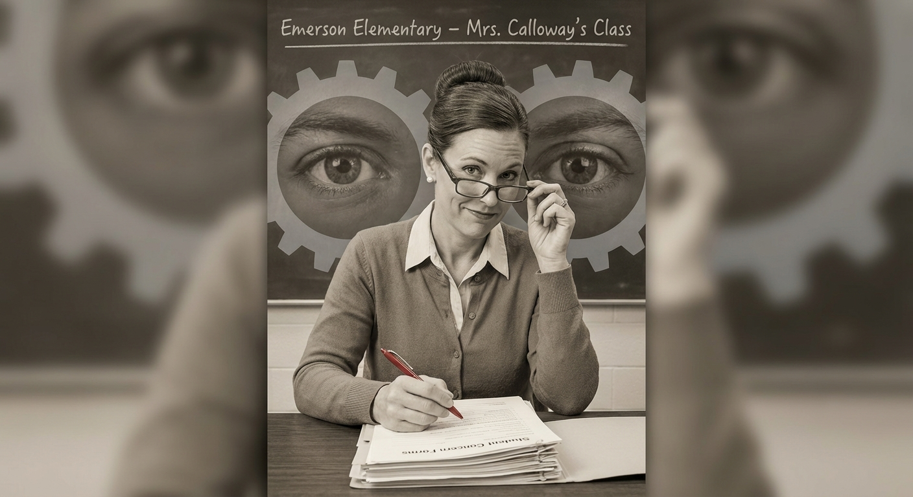

#### Character: Sandra Okafor-Williams

**Prompt:** 

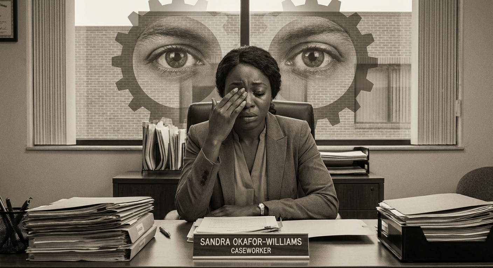

#### Character: Judge Harold Wren

**Prompt:** 

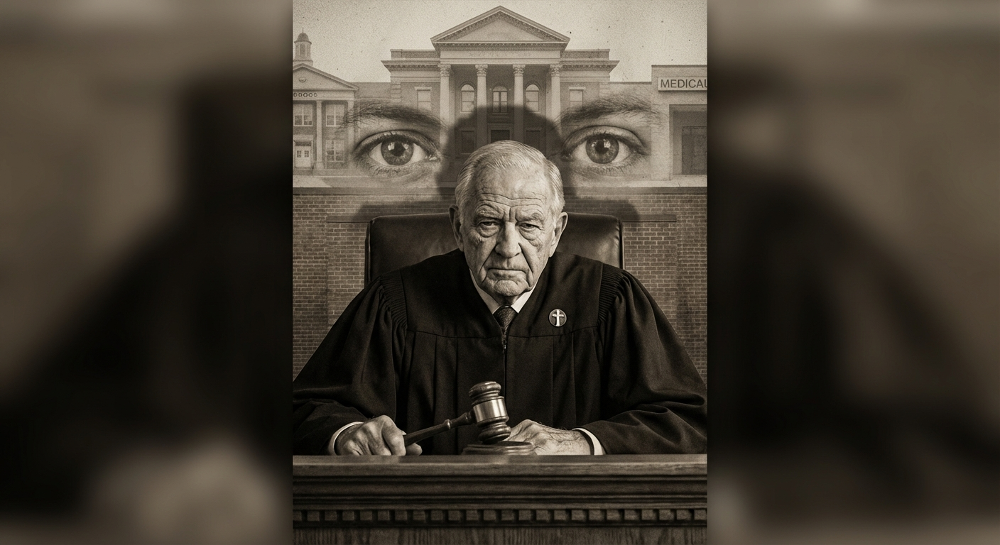

## ## The Walk and the Kitchen

**Act 1, Scene 1**

**Setting:** the_sidewalk, daniels_kitchen

**Characters:** Daniel Kessler, Lily Kessler

---

The robin had been dead for three days by the time Lily noticed the bones.

I know it was three days because I'd been stepping over it since Tuesday, performing that small suburban courtesy of pretending the natural world wasn't decomposing on my front walk. But Lily—seven years old, four feet of unrelenting empiricism—dropped to her knees on the concrete like she'd found the Rosetta Stone.

"The chest is open," she said.

"We're going to be late."

"Something ate the insides. But the bones are still connected. Why are the bones still connected?"

I shifted her backpack higher on my shoulder and looked down. She was right. The robin's breast had been hollowed out—ants, probably, or one of the feral cats Mrs. Diehl fed on her porch despite the HOA's quarterly passive-aggressive newsletter—but the skeleton remained largely articulate, ribs fanning from the keel like the frame of a tiny, ruined ship.

"Ligaments," I said. "Connective tissue. Takes longer to break down than muscle."

"How much longer?"

"Depends. Weeks. Months, if it stays dry."

She looked up at me with that expression I'd learned to recognize in the two years since the adoption finalized—the one that meant she was filing information into some internal architecture I couldn't access, cross-referencing it against everything she'd ever been told. Her eyes were the color of creek water, brown-green and serious.

"So the shape of something can last longer than the thing itself," she said.

She was seven. She was *seven*.

"Yeah," I said. "That's exactly right. Now get up. You've got sidewalk chalk on your knees and Ms. Reeves already thinks I'm raising you in a barn."

She stood and brushed herself off with the perfunctory indifference of a child who has never once cared about the state of her clothing, and we resumed our walk to Emerson Elementary, a half-mile route through the heart of Westerville, Ohio—the Dry Capital of the World, a town that banned the sale of alcohol in 1859 and has been performing sobriety, in every conceivable sense of the word, ever since.

I say this without malice. I say almost nothing without malice, but I'm trying.

Our house was a 1960s ranch on Huber Village Boulevard, brick-fronted, low-slung, the kind of house that communicated nothing except the decade of its construction. I'd bought it for the school district and the finished basement, which I'd converted into a study where I translated technical German for pharmaceutical companies while Lily did homework at the kitchen table above me, her pencil scratching through the ceiling like a mouse in the walls. The kitchen was the room a social worker would later photograph: the refrigerator door covered not in alphabet magnets or Sunday school crafts but in Lily's drawings of cross-sectioned earthworms, labeled in her careful printing. *Prostomium. Clitellum. Ventral nerve cord.* I'd bought her a secondhand copy of *Biology of the Invertebrates* at the Book Loft in Columbus, and she'd been working through it like scripture, which was ironic given that we had no scripture, which was—as I would come to understand—the actual problem.

But I'm getting ahead of myself. That morning, we walked.

Westerville in early October is the America they put on insurance brochures. The maples along State Street were turning the color of emergency, all that furious red and gold against white clapboard, and the air smelled like leaf mold and someone's dryer exhaust—warm cotton, fabricated comfort. We passed the public library, where Lily had a first-name relationship with every librarian and had once asked the reference desk for primary sources on the Johnstown Flood. We passed the Church of the Messiah, United Methodist, its sign reading GOD'S LOVE IS NOT SEASONAL in those black plastic letters that always look like ransom notes. We passed Hanby Park, named for Benjamin Hanby, who wrote "Darling Nelly Gray" in a house two blocks from mine—an abolitionist anthem about a slave who died of a broken heart, which Westerville had been dining out on for a century and a half as proof of its moral credentials.

The town had a relationship with righteousness the way some people have a relationship with an ex-spouse: technically over, practically inescapable, and the source of every interesting thing about them.

"Mr. Kessler! Good morning!"

Jan Ostrowski, stationed on her porch with a mug that said BLESSED BEYOND MEASURE, her smile the particular wattage of someone who has decided to be warm at you whether you want it or not. Retired school secretary, somewhere north of sixty. She watched our morning walks the way ornithologists watch migration patterns—with scientific interest thinly disguised as casual observation.

"Morning, Jan."

"And Miss Lily! Ready for school?"

"We found a dead bird," Lily said. "You could see the furcula."

"The—"

"Wishbone," I translated.

Jan's smile held, but I watched it go structural, the warmth retreating behind the engineering. "Well," she said. "Isn't that something."

We walked on. Lily's hand was in mine, her fingers small and dry and perpetually ink-stained. She was humming something tuneless and private. I loved her so completely it felt like a medical condition—chronic, located somewhere beneath the sternum, occasionally debilitating.

I had not expected this. I had expected responsibility, difficulty, the grim satisfaction of doing something decent after the divorce and the years of what my therapist generously called "isolation" and what I less generously called "being an asshole alone in a house." I had not expected that a child placed with me by Franklin County Children Services—a child who had spent her first five years in a series of homes that left her with a flinch reflex around raised voices and an encyclopedic knowledge of which gas stations had clean bathrooms—would become the most extraordinary person I had ever known. I had not expected to be so thoroughly, so helplessly, undone.

But here we were, walking past the Westerville Creamery and the Anti-Saloon League Museum, which was real, which actually existed—a museum dedicated to the organization that brought America Prohibition, headquartered right here in our little town, because Westerville didn't just participate in moral crusades. It exported them.

At Emerson Elementary, the drop-off line was a slow river of SUVs and minivans, and we were, as always, the pedestrians, arriving on foot like emissaries from a more sensible century. I knelt on the curb and zipped Lily's jacket to her chin.

"You have library today?"

"Tuesday is library."

"Right. Are you going to ask Mrs. Pratt for more invertebrate books?"

"I'm done with invertebrates." She said this with the finality of a researcher closing a chapter. "I want to know about bones now."

Of course she did. The robin had opened a door.

"We'll go to the library this weekend," I said. "The big one, in Columbus."

She nodded, satisfied, then did the thing she did every morning—pressed her forehead against mine for two seconds, a gesture she'd invented herself, something between a headbutt and a benediction. Then she turned and walked through the double doors without looking back, her backpack nearly as wide as she was, and I stood there on the sidewalk feeling the way I always felt at drop-off: bereft and ridiculous and grateful and terrified, all at once, in no particular order.

I walked home alone.

The streets were emptying, the school-rush energy dissipating into the ordinary quiet of a weekday morning. A sprinkler hissed over a lawn that didn't need it. Somewhere a dog barked twice and stopped, as if corrected. I passed the church signs and the tidy yards and the houses with their seasonal wreaths, and I thought about ligaments—how the connective tissue outlasts the flesh, how the shape of something persists after the living substance is gone. I thought about Westerville and its temperance architecture, its moral scaffolding still standing long after the conviction had been eaten away. I thought about how a town like this would look at a man like me—single, secular, childless by biology, a father only by the grace of the state—and see not the substance but the absence. The missing wife. The missing church. The missing context that would make me legible.

I unlocked the front door. The house was quiet in the way only a house emptied of a child can be quiet—not peaceful but held breath. On the refrigerator, Lily's earthworm regarded me with its diagrammed, eyeless face. *Ventral nerve cord.* I put the coffee on.

I did not know that in forty-five minutes, someone would knock on my door. I did not know that Lily's drawing of a cross-sectioned earthworm—labeled, accurate, made with love and a set of Prismacolor pencils I'd bought her for her birthday—would end up in a file. I did not know that the shape of my life, which I had built so carefully around this child, was about to be opened up and examined for what was missing inside.

The coffee maker gurgled. The house ticked and settled. Outside, Westerville went about its sober, shining business.

I had no idea.

---

**Word Count:** 1495

**Key Moments:**
- Lily's discovery of the dead robin and her observation that "the shape of something can last longer than the thing itself"—establishing her intellectual precociousness and the scene's central metaphor
- The encounter with neighbor Jan Ostrowski, whose warmth curdles at Lily's frank scientific enthusiasm—first signal of community surveillance
- Daniel's interior revelation of his love for Lily and his awareness of his own illegibility as a single, secular adoptive father in Westerville
- The description of Lily's refrigerator drawings (labeled invertebrate diagrams), which will later become evidence in a file
- The closing moment of dramatic irony: Daniel's unknowing calm before the knock that will change everything

**Character States:**
- **Daniel Kessler:** Emotionally settled in the warm routine of his morning, but carrying a low-frequency awareness of his outsider status. Physically alone in a quiet house, drinking coffee, in a state of ordinary vulnerability. He does not yet know what's coming.
- **Lily Kessler:** Intellectually energized by the dead robin, emotionally secure in her bond with Daniel, socially oblivious to (or unconcerned with) the discomfort her curiosity causes others. She has walked into school carrying a new obsession—bones—that will continue to develop.

**Status:** ✅ Complete

#### Act 1, Scene 1 Image

**Prompt:** The robin had been dead for three days by the time Lily noticed the bones.

I know it was three days because I'd been stepping over it since Tuesday, performing that small suburban courtesy of pretending the natural world wasn't decomposing on my front walk. But Lily—seven years old, four feet of unrelenting empiricism—dropped to her knees on the concrete like she'd found the Rosetta Stone.

"The chest is open," she said.

"We're going to be late."

"Something ate the insides. But the bones are still connected. Why are the bones still connected?"

I shifted her backpack higher on my shoulder and looked down. She was right. The robin's breast had been hollowed out—ants, probably, or one of the feral cats Mrs. Diehl fed on her porch despite the HOA's quarterly passive-aggressive newsletter—but the skeleton remained largely articulate, ribs fanning from the keel like the frame of a tiny, ruined ship.

"Ligaments," I said. "Connective tissue. Takes longer to break down than muscle."

"How much longer?"

"Depends. Weeks. Months, if it stays dry."

She looked up at me with that expression I'd learned to recognize in the two years since the adoption finalized—the one that meant she was filing information into some internal architecture I couldn't access, cross-referencing it against everything she'd ever been told. Her eyes were the color of creek water, brown-green and serious.

"So the shape of something can last longer than the thing itself," she said.

She was seven. She was *seven*.

"Yeah," I said. "That's exactly right. Now get up. You've got sidewalk chalk on your knees and Ms. Reeves already thinks I'm raising you in a barn."

She stood and brushed herself off with the perfunctory indifference of a child who has never once cared about the state of her clothing, and we resumed our walk to Emerson Elementary, a half-mile route through the heart of Westerville, Ohio—the Dry Capital of the World, a town that banned the sale of alcohol in 1859 and has been performing sobriety, in every conceivable sense of the word, ever since.

I say this without malice. I say almost nothing without malice, but I'm trying.

Our house was a 1960s ranch on Huber Village Boulevard, brick-fronted, low-slung, the kind of house that communicated nothing except the decade of its construction. I'd bought it for the school district and the finished basement, which I'd converted into a study where I translated technical German for pharmaceutical companies while Lily did homework at the kitchen table above me, her pencil scratching through the ceiling like a mouse in the walls. The kitchen was the room a social worker would later photograph: the refrigerator door covered not in alphabet magnets or Sunday school crafts but in Lily's drawings of cross-sectioned earthworms, labeled in her careful printing. *Prostomium. Clitellum. Ventral nerve cord.* I'd bought her a secondhand copy of *Biology of the Invertebrates* at the Book Loft in Columbus, and she'd been working through it like scripture, which was ironic given that we had no scripture, which was—as I would come to understand—the actual problem.

But I'm getting ahead of myself. That morning, we walked.

Westerville in early October is the America they put on insurance brochures. The maples along State Street were turning the color of emergency, all that furious red and gold against white clapboard, and the air smelled like leaf mold and someone's dryer exhaust—warm cotton, fabricated comfort. We passed the public library, where Lily had a first-name relationship with every librarian and had once asked the reference desk for primary sources on the Johnstown Flood. We passed the Church of the Messiah, United Methodist, its sign reading GOD'S LOVE IS NOT SEASONAL in those black plastic letters that always look like ransom notes. We passed Hanby Park, named for Benjamin Hanby, who wrote "Darling Nelly Gray" in a house two blocks from mine—an abolitionist anthem about a slave who died of a broken heart, which Westerville had been dining out on for a century and a half as proof of its moral credentials.

The town had a relationship with righteousness the way some people have a relationship with an ex-spouse: technically over, practically inescapable, and the source of every interesting thing about them.

"Mr. Kessler! Good morning!"

Jan Ostrowski, stationed on her porch with a mug that said BLESSED BEYOND MEASURE, her smile the particular wattage of someone who has decided to be warm at you whether you want it or not. Retired school secretary, somewhere north of sixty. She watched our morning walks the way ornithologists watch migration patterns—with scientific interest thinly disguised as casual observation.

"Morning, Jan."

"And Miss Lily! Ready for school?"

"We found a dead bird," Lily said. "You could see the furcula."

"The—"

"Wishbone," I translated.

Jan's smile held, but I watched it go structural, the warmth retreating behind the engineering. "Well," she said. "Isn't that something."

We walked on. Lily's hand was in mine, her fingers small and dry and perpetually ink-stained. She was humming something tuneless and private. I loved her so completely it felt like a medical condition—chronic, located somewhere beneath the sternum, occasionally debilitating.

I had not expected this. I had expected responsibility, difficulty, the grim satisfaction of doing something decent after the divorce and the years of what my therapist generously called "isolation" and what I less generously called "being an asshole alone in a house." I had not expected that a child placed with me by Franklin County Children Services—a child who had spent her first five years in a series of homes that left her with a flinch reflex around raised voices and an encyclopedic knowledge of which gas stations had clean bathrooms—would become the most extraordinary person I had ever known. I had not expected to be so thoroughly, so helplessly, undone.

But here we were, walking past the Westerville Creamery and the Anti-Saloon League Museum, which was real, which actually existed—a museum dedicated to the organization that brought America Prohibition, headquartered right here in our little town, because Westerville didn't just participate in moral crusades. It exported them.

At Emerson Elementary, the drop-off line was a slow river of SUVs and minivans, and we were, as always, the pedestrians, arriving on foot like emissaries from a more sensible century. I knelt on the curb and zipped Lily's jacket to her chin.

"You have library today?"

"Tuesday is library."

"Right. Are you going to ask Mrs. Pratt for more invertebrate books?"

"I'm done with invertebrates." She said this with the finality of a researcher closing a chapter. "I want to know about bones now."

Of course she did. The robin had opened a door.

"We'll go to the library this weekend," I said. "The big one, in Columbus."

She nodded, satisfied, then did the thing she did every morning—pressed her forehead against mine for two seconds, a gesture she'd invented herself, something between a headbutt and a benediction. Then she turned and walked through the double doors without looking back, her backpack nearly as wide as she was, and I stood there on the sidewalk feeling the way I always felt at drop-off: bereft and ridiculous and grateful and terrified, all at once, in no particular order.

I walked home alone.

The streets were emptying, the school-rush energy dissipating into the ordinary quiet of a weekday morning. A sprinkler hissed over a lawn that didn't need it. Somewhere a dog barked twice and stopped, as if corrected. I passed the church signs and the tidy yards and the houses with their seasonal wreaths, and I thought about ligaments—how the connective tissue outlasts the flesh, how the shape of something persists after the living substance is gone. I thought about Westerville and its temperance architecture, its moral scaffolding still standing long after the conviction had been eaten away. I thought about how a town like this would look at a man like me—single, secular, childless by biology, a father only by the grace of the state—and see not the substance but the absence. The missing wife. The missing church. The missing context that would make me legible.

I unlocked the front door. The house was quiet in the way only a house emptied of a child can be quiet—not peaceful but held breath. On the refrigerator, Lily's earthworm regarded me with its diagrammed, eyeless face. *Ventral nerve cord.* I put the coffee on.

I did not know that in forty-five minutes, someone would knock on my door. I did not know that Lily's drawing of a cross-sectioned earthworm—labeled, accurate, made with love and a set of Prismacolor pencils I'd bought her for her birthday—would end up in a file. I did not know that the shape of my life, which I had built so carefully around this child, was about to be opened up and examined for what was missing inside.

The coffee maker gurgled. The house ticked and settled. Outside, Westerville went about its sober, shining business.

I had no idea.

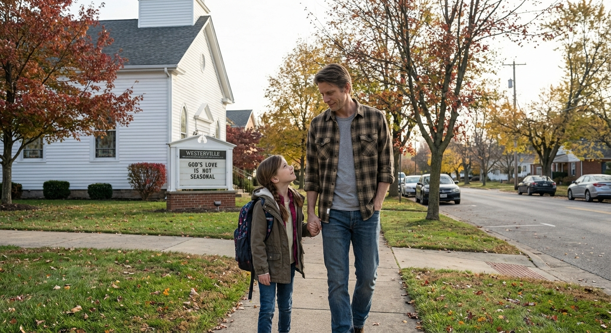

## ## The Screening

**Act 1, Scene 2**

**Setting:** pediatric_office

**Characters:** Daniel Kessler, Lily Kessler, Dr. Patricia Hendricks

---

Dr. Patricia Hendricks's pediatric office occupied the ground floor of a converted Victorian on South State Street, three blocks from the old Anti-Saloon League headquarters, which was now a Montessori school. I have always appreciated this kind of irony. Westerville doesn't.

The waiting room was painted the color of institutional optimism—a yellow so aggressive it seemed designed to convince you that everything was fine, that children were resilient, that the system worked. A fish tank hummed in the corner, stocked with the same theological argument you find in every pediatric office in America: look, children, at the beauty of creation. Neon tetras. A single bloated angelfish. A plastic castle sinking into blue gravel.

Lily pressed her face to the glass.

"Do you think they know they're in a box?"

"Probably not the way you mean it," I said.

"But they have a nervous system. They can feel stress. There was a study—I think it was in *Nature*—where they injected bee venom into the lips of rainbow trout and the trout rocked back and forth like they were in pain." She turned to me. Her glasses had fogged from the warmth of the tank. "So they know *something*. They just can't narrate it."

"That's a good distinction."

"It's not a distinction, Dad. It's a tragedy."

A woman across the room—mid-forties, fleece vest, the particular Westerville haircut that communicates both approachability and moral certainty—looked up from her phone. She had a boy of about seven on her lap, slack-jawed and content, watching a cartoon in which a dog drove a fire truck. I envied him. I envied his mother. I envied the simplicity of their transaction with the world.

Lily drifted to the painting on the opposite wall. A Thomas Kinkade print—of course—and beside it a smaller framed image of a guardian angel shepherding two children across a rickety bridge over a chasm. The angel was enormous, translucent, sexless in the way of all angels, its wings spread like a golden canopy over the oblivious children.

"That's not how bridges work," Lily said. "If the bridge is that degraded, the structural load of three figures—even if one is incorporeal—"

"Lily."

"And if the angel is already there, why not just fix the bridge?"

The fleece-vest woman was watching us now with an expression I had learned to catalog: a tightening around the eyes, a slight parting of the lips, the face of someone composing a story about you in real time.

"Kessler?" The nurse appeared in the doorway. "Lily Kessler?"

---

The screening was standard. Lily was six, and Dr. Hendricks's practice conducted them at every well-child visit. I had no reason to question it. I had no reason to question anything. That was the last morning I could say that.

The nurse—Tanya, young, smelling of antibacterial soap and vanilla—took Lily's vitals and handed her a blank sheet of paper and a cup of crayons.

"Can you draw me a person, sweetie?"

Lily regarded the crayons with the expression of a sommelier presented with a box of Franzia. She picked up the black one and drew a figure in profile—detailed, startlingly so—with a skeletal structure lightly indicated beneath the skin, a trick from an anatomy book I'd checked out of the library. The same library where, three weeks later, a woman I'd never met would tell a caseworker she'd seen my daughter reading material "not appropriate for her age."

"That's very good," Tanya said carefully. "Can you tell me about your person?"

"She's a woman. About thirty. I drew the zygomatic bone here because I've been studying skulls. Did you know the zygomatic bone is what gives your face its shape? Without it, your cheeks would just—" She made a deflating gesture with her hands.

Tanya wrote something on her clipboard.

"And what's your person feeling?"

"I don't know. I didn't draw her brain."

More writing.

"Lily, can you tell me what you're afraid of?"

Lily considered this with more seriousness than the question was designed to accommodate.

"Prion diseases. Because you can't kill a prion. It's not alive, so you can't kill it. It's just a protein that's folded wrong, and it makes all the other proteins fold wrong too, and then your brain gets holes in it like a sponge." She paused. "The heat death of the universe, too. But that's a long time from now, so it's more philosophical than practical."

Tanya's pen had stopped moving.

I should have intervened. I can see that now with the crystalline vision of retrospect, which is just another word for regret. I should have said, *She's also afraid of the dark sometimes, and loud hand dryers in public restrooms, and she sleeps with a stuffed axolotl named Professor Gills.* I should have translated her into something legible. But I didn't, because I was proud of her, because her mind was the most extraordinary thing I had ever encountered, and because I did not yet understand that in this office, in this town, her mind was not a marvel. It was a symptom.

---

Dr. Hendricks entered with the briskness of a woman who had been briefed. Late fifties, silver-haired, handsome in a way that suggested former athleticism and current authority. White coat over a blouse with small blue flowers, a cross on a thin gold chain resting in the notch of her clavicle. She had been Lily's pediatrician since the adoption was finalized. She had been kind, competent, thorough.

She examined Lily with practiced efficiency—ears, throat, reflexes, the gentle palpation of the abdomen—then sat on her rolling stool and clasped her hands over one knee.

"Lily, I want to ask you some questions. Just fun questions. There are no wrong answers."

There are always wrong answers. That's the first lie they tell you.

"Do you go to church, Lily?"

Lily looked at me. I nodded—a nod that meant *tell the truth*, the only instruction I had ever given her about how to move through the world, and which I would come to understand was the most dangerous thing I could have taught her.

"No."

"What do you do on Sunday mornings?"

"We go to the farmers' market. Then sometimes the natural history museum if there's a new exhibit. Last week we went to the park and I found a pellet from a barn owl and we dissected it at home. There were three vole skulls inside."

Dr. Hendricks smiled. It was a careful smile—the kind you construct rather than release.

"Lily, do you know what happens when someone dies?"

The room changed. I felt it—a barometric shift, as if the walls had leaned in. Lily did not feel it. She was six, and brilliant, and she trusted adults, because I had not yet taught her that some questions are traps.

"Their heart stops and their brain stops getting oxygen, so the neurons die. Then the bacteria in your gut start breaking down your tissues because your immune system isn't keeping them in check anymore. It's called autolysis." She paused. "It's actually a really important ecological process. You give all your nutrients back to the soil. There are body farms where they study it. I want to visit one when I'm older."

Dr. Hendricks looked at me. It was a look I will carry for the rest of my life—not hostile, not cruel, but *concerned*, which is worse, because concern is the weapon of people who believe they are helping.

"Lily, sweetheart, could you sit in the waiting room with Tanya for a minute? I want to talk to your dad."

---

The door closed. Dr. Hendricks sat behind her desk and opened Lily's file, and I watched her arrange her face into the expression of professional compassion that I would come to recognize as the mask the system wears when it is about to consume you.

"Daniel, I want to talk about Lily's psychosocial development. She's clearly very bright. Remarkably so. But I have some concerns about her—" she paused, selecting the word with surgical precision—"meaning-making architecture."

I let the phrase hang. *Meaning-making architecture.* As if my daughter were a building missing a load-bearing wall.

"What does that mean, specifically?"

"Children Lily's age are developing frameworks for understanding death, loss, the larger questions. They need narrative structures—stories, beliefs, community rituals—to process these concepts in age-appropriate ways. What I'm hearing from Lily is a very clinical, very adult framework without the emotional scaffolding to support it."

"She's not distressed by any of this, Patricia. She's *interested*."

"That's actually part of what concerns me. The absence of visible distress in the face of material that would typically produce anxiety—"

"So if she were afraid of death, that would be normal, but because she's curious about it, that's pathological?"

Dr. Hendricks removed her glasses. "I'm not pathologizing your daughter. I'm noting a pattern that can indicate a gap in emotional processing. The skeletal drawing. The fixation on decomposition—"

"It's not a fixation. She found a dead bird last week. She's processing it the way she processes everything—by learning about it."

"And the absence of any spiritual or communal framework—"

"Is a parenting choice. My parenting choice."

The room went quiet. Through the wall, I could hear Lily's voice explaining something to Tanya—the word *mandible* floated through the door like a small, perfect grenade.

"I'm going to recommend a developmental-behavioral evaluation," Dr. Hendricks said. "And I'd like to refer you to Dr. Carla Meyers—she's wonderful with gifted children."

"A referral for what, exactly?"

"A comprehensive assessment. Social-emotional development, attachment patterns, adaptive functioning." She wrote as she spoke, and each word she committed to paper was a brick in a wall I could not yet see the shape of. "It's nothing to be alarmed about. Just due diligence."

*Due diligence.* The language of audits and liability. The language of a system that has decided to look at you and needs to justify the looking.

I stood. "Is there anything else?"

"Just one thing." She looked up. "Lily mentioned the owl pellet dissection. She said you do that kind of thing at home regularly?"

"We do science at home. Yes."

She nodded and wrote something I could not see. I would not see it for three weeks, when a caseworker named Sandra Ojeda would sit across from me at my own kitchen table and open a folder and show me the document that had started everything, and there, in Dr. Hendricks's careful handwriting, I would read the words composed in this room, on this morning, while my daughter sat thirty feet away explaining the structure of a vole's jaw to a woman who did not understand what she was hearing:

*Father appears to lack awareness of age-appropriate developmental needs. Child demonstrates significant gaps in social-emotional framework. Recommend further evaluation. Home environment may warrant additional assessment.*

But I didn't know that yet. I only knew that the air had curdled, that Dr. Hendricks was no longer looking at me the way a doctor looks at a parent but the way a sentry looks at a border, and that my daughter had done nothing but tell the truth about the world as she understood it, and that this, in Westerville, Ohio, was the original sin.

I collected Lily from the waiting room. She was drawing on the back of a vaccination pamphlet—the angelfish from the tank, its internal organs visible through the skin in ghostly cross-section, each one labeled in her careful, tiny handwriting.

"Ready?" I said.

"Did you know angelfish can recognize human faces? They did a study. So the fish in the box knows we were here. It'll remember us."

We walked out into the October sunlight. The maples along South State Street were going red, the oaks bronze, and the air smelled like cold and woodsmoke and the particular sweetness of decay that autumn brings—the world composting itself, making room for what comes next. Lily held my hand. Her grip was warm and certain.

Behind us, in the quiet office, Dr. Hendricks picked up her phone.

---

**Word Count:** 1999

**Key Moments:**
- Lily's questioning of the fish tank consciousness and the guardian angel painting in the waiting room, establishing her pattern of interrogating received narratives while a watching mother begins to judge
- Lily's anatomically detailed drawing and her clinical answers about fear (prion diseases, heat death of the universe) during the developmental screening, which the nurse documents with visible concern
- Lily's biological explanation of death and decomposition—delivered with innocent enthusiasm—becoming the fulcrum on which Dr. Hendricks's concern pivots
- The private confrontation where Dr. Hendricks introduces the phrase 'meaning-making architecture' and Daniel realizes his daughter's worldview is being clinically pathologized
- The final image: Dr. Hendricks picking up her phone as Daniel and Lily walk away, the system now in motion

**Character States:**
- **Daniel Kessler:** Outwardly composed but internally experiencing the first tremors of a dread he cannot yet fully articulate. He has recognized the threat but not its magnitude. He is furious, frightened, and beginning to understand that the rules of engagement have changed—that truth-telling and intellectual freedom, the values he has built his parenting around, are now liabilities. Physically walking away from the office holding Lily's hand, carrying the weight of what he doesn't yet know is in that file.
- **Lily Kessler:** Entirely unaware that anything has gone wrong. Emotionally buoyant, intellectually engaged, secure in her father's presence. She has been herself—completely, unselfconsciously herself—and does not yet live in a world where that is dangerous.
- **Dr. Patricia Hendricks:** Settled into the certainty of her concern, which she experiences as professional responsibility rather than cultural bias. She has documented, referred, and is now escalating. She believes she is protecting a child. She is picking up the phone.

**Status:** ✅ Complete

#### Act 1, Scene 2 Image

**Prompt:** 

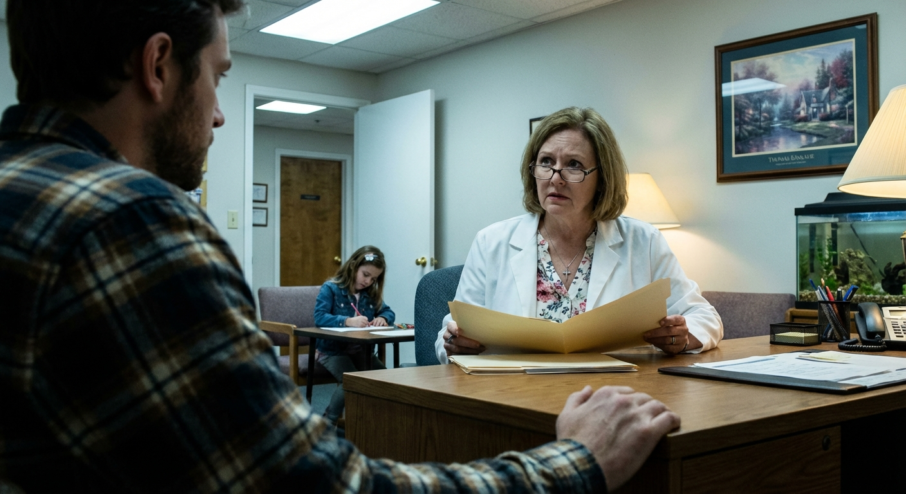

## ## The Letter and the Archive

**Act 1, Scene 3**

**Setting:** daniels_kitchen, public_library_archives

**Characters:** Daniel Kessler, Lily Kessler

---

Act 1, Scene 3: The Letter and the Archive

The letter arrived on a Thursday, which felt right. Not a Monday, with its blunt institutional efficiency. Not a Friday, which would have granted the mercy of weekend distraction. Thursday—the day that exists only to prove the week isn't over yet, the day perfectly calibrated for the delivery of dread.

I found it between a Kroger circular and a water bill. White envelope, Franklin County seal embossed in the upper left corner. FRANKLIN COUNTY CHILDREN SERVICES. My name typed in the address window with the particular font government agencies use—something between Courier and contempt. I stood at the end of the driveway holding it while the October wind stripped yellow leaves from the sugar maple and a school bus ground through its gears on Schrock Road and the world continued its ordinary operations around a small, white detonation.

I carried it into the kitchen. Set it on the counter next to Lily's cereal bowl—still bearing the archaeological residue of that morning's Cheerios, a ring of milk drying to a faint crust—and stared at it. The refrigerator hummed its one note. Lily's drawings watched me from behind their magnets: the millipede with its labeled legs, the cross-section of a robin's skull attempted from memory, the family portrait in which I was a tall rectangle with glasses and she was a smaller rectangle with what she'd described as "accurate hair." Our household, rendered in crayon. *Evidence,* I thought, and then hated myself for thinking it.

The language inside was careful the way language is careful when designed by attorneys to be both devastating and deniable. *This letter is to inform you that Franklin County Children Services has received a report regarding the welfare of a minor child in your care.* The minor child had a case number now. Lily—my Lily, who that morning had asked whether sound travels differently through fog and then answered her own question before I could finish pouring coffee—was Reference Number 2024-CF-11847. *A caseworker will contact you within five business days to schedule an initial home visit.*

Five business days. The phrase sat in my stomach like a swallowed coin. Five business days during which someone in an office on East Main Street would be assembling a file, reading whatever Dr. Hendricks had written, forming judgments about a child they had never met and a father they had already, in some essential way, convicted. I tried to imagine the report. What words had she chosen? What had she made Lily sound like? I kept circling back to the same sick thought: that somewhere in a manila folder, my daughter had been translated into a symptom.

I read the letter three times. Then I sat down on the kitchen floor—not dramatically, not in collapse, but because the chairs seemed too far away and the floor was right there, solid and uncomplicated. The linoleum was cool through my jeans. From this angle I could see under the refrigerator: a dust bunny, a dried pea, one of Lily's colored pencils rolled into exile. The underside of a life. The parts you don't clean because no one is looking.

But someone was looking now.

---

At one-fifteen I gave up performing sleep and went to Lily's room.

She slept the way she always slept: on her stomach, one arm flung off the bed, fingers curled loosely around nothing, face turned toward the crescent-moon nightlight she still needed but would never admit to needing. It cast her room in pale amber—the bookshelf crowded with field guides and a battered *Charlotte's Web* she kept not because she reread it but out of loyalty to a former self, the terrarium where isopods lived their quiet lives in coconut fiber, the periodic table poster I'd given her for her sixth birthday because she'd asked for it by name. The room smelled the way children's rooms smell at night: warm skin, clean cotton, the faintly mineral scent of sleep.

I stood in her doorway and cataloged her the way you catalog things you're afraid of losing—with desperate, granular attention. The rise and fall of her breathing. The slight wheeze on the exhale her pediatrician said was nothing, just the architecture of small airways. The way her mouth hung slightly open, her face slack and unguarded in a way it never was during the day, when she was busy being precise about the world. Her pajamas were clean. Her sheets were clean. Her room was warm and her belly was full and her father was standing six feet away, vibrating with love and terror in equal measure, and none of it—none of this visible, tangible, overwhelming evidence of care—would necessarily matter to the person with the clipboard who was coming.

I didn't know the rubric. I didn't know the scoring system, the particular taxonomy of adequate parenting that Franklin County employed to sort the fit from the unfit. I knew only that my daughter was asleep and safe, and that somewhere in a database she was a number attached to a concern authored by a woman who believed a seven-year-old's understanding of decomposition constituted a spiritual emergency.

I watched Lily sleep for forty minutes. I counted her breaths for a while, the way I had when she was an infant and counting was the only prayer I knew. Then I went downstairs and opened my laptop.

---

The research began practically. Ohio Revised Code 2151.421—mandatory reporting statutes, the threshold for investigation, the procedural steps that would unfold whether I was ready or not. I read legal aid websites, parent advocacy forums, threads where other parents described their investigations in language that oscillated between clinical detachment and barely contained panic. I learned I had the right to an attorney. I learned I had the right to refuse entry to my home, though exercising that right could be interpreted as evidence of something to hide. I learned that the criteria for screening reports in or out were, in practice, as subjective as a Rorschach test administered by someone who already knew what they wanted to see.

But fear burns hot and fast and leaves you empty. What lasts—what gets you through the 3 AM hours when the house is silent and the machinery of the state is grinding somewhere in the dark—is anger. And anger, for me, has always been routed through understanding. I don't punch walls. I read.

So at 2:47 AM, having exhausted the practical research, I followed a link from a Westerville historical society page into the archives of the Anti-Saloon League.

Everyone in Westerville knew the broad strokes, or at least the version on the welcome signs and brewery menus: *The Dry Capital of the World.* The temperance movement's fortress. The Anti-Saloon League headquartered in a brick building on South State Street—the same street where Lily and I walked to school, where the maples were going red, where a moral crusade so successful it amended the Constitution had once operated its nerve center. I'd driven past the building a thousand times. I'd never once thought of it as relevant to my life.

But I hadn't read the primary sources. The Westerville Public Library had digitized portions of its local history collection, and at three in the morning, in the blue light of my laptop with the house ticking around me, I began. Pamphlets. Newsletters. *The American Issue*, printed right here in town, its masthead bearing the motto *National Prohibition the Dominant Issue.*

I found it at 3:22 AM. A pamphlet from 1908, published by the League's Department of Moral Education: *The Architecture of the Christian Home: A Guide for the Preservation of Youth.*

*The child who is raised without spiritual architecture is a child exposed to the elements of moral decay. It is not sufficient that the body be fed and the mind be schooled; the soul must be furnished with the fixtures of faith, lest the empty rooms of the spirit become habitation for influences contrary to the welfare of the community and the nation.*

Spiritual architecture. The empty rooms of the spirit.

I sat in my kitchen in 2024 and read words written in 1908 and felt something shift beneath me—not the linoleum but something geological, tectonic. Dr. Hendricks had used the phrase *meaning-making architecture.* She had spoken of *spiritual development* and *existential scaffolding.* She had looked at my daughter's brilliant, unsentimental mind and seen an empty room that needed furnishing.

The pamphlet continued. *The home in which the father neglects this sacred duty—whether through ignorance, indifference, or the more dangerous condition of active philosophical opposition to the moral order—is a home in which the child is placed at risk. Such neglect, though it leave no mark upon the body, constitutes an injury to the developing character no less real than physical privation.*

No mark upon the body. An injury no less real.

I read for another hour, following the threads deeper. The League's campaigns not just against alcohol but against the people who tolerated it—immigrants, Catholics, freethinkers, anyone whose interior life didn't conform to the approved blueprint. How the language of child welfare had been weaponized a century ago on these same streets, by people who believed absolutely in their own righteousness, who would have been genuinely bewildered by the suggestion that they were doing harm. Moral surveillance dressed as community concern. The conviction that a child's soul was public property, subject to inspection.

At 4:15 AM, I closed the laptop. The kitchen was dark except for the light over the stove, its small yellow circle on the counter. Somewhere in the walls the furnace clicked on, and warm air moved through the vents with a sound like a long exhalation. I sat in the Dry Capital of the World and understood something I hadn't understood before: that the infrastructure was still here. Not the League, not the pamphlets, not the brick building on South State—but the deep grammar of a town built on the conviction that other people's souls were a public concern. The grammar had survived. It had merely updated its vocabulary.

*Meaning-making architecture.* Christ.

---

I woke to the sound of feet on stairs—Lily's particular rhythm, quick and uneven because she always skipped the second-to-last step. I was on the couch, neck bent at an angle that would punish me for days, the laptop open on my chest displaying a digitized page from *The American Issue,* March 1908.

"Dad." She stood in the doorway in her moon-and-stars pajamas, hair a dark chaos, eyes still soft with sleep. She was holding a library book about arthropods the way other children hold stuffed animals—pressed against her sternum, both arms wrapped around it.

"Hey, bug."

"Do you think millipedes dream?"

The question landed like a small, perfect thing—a seed, a stone, a gift I hadn't earned. I looked at my daughter. I looked at the case number letter on the kitchen counter, visible through the doorway. I looked at the pamphlet on my screen, its century-old certainties glowing faintly in the morning light.

"I don't know. What do you think?"

She considered this with her full seriousness—chin tilted, eyes narrowed, the expression she wore when she was genuinely working something out rather than performing thought. Then she crossed the room, sat down next to me, her small body warm against my side, and opened the book to a dog-eared page.

"I think probably not, because dreaming needs a certain kind of brain structure, like a cortex, and millipedes have ganglia instead. But—" She looked up at me, and her eyes were wide and dark and absolutely certain of their uncertainty. "We don't totally know what dreaming *is*, right? We know where it happens in our brains, but not *why.* So maybe there's a kind of dreaming that happens in ganglia that we just can't measure yet."

"That's a genuinely good point."

"I know," she said—not arrogance, just calm acknowledgment of a fact, the way she might note that it was raining. Then: "Why were you sleeping on the couch?"

"Reading late. Fell asleep."

"What were you reading about?"

I looked at the screen. The language of salvation and control, a century old and still warm to the touch.

"Local history," I said.

"Boring," she said, with the gentle condescension of someone who had better things to read, and leaned into me, and began reading aloud about the respiratory systems of diplopods—how they breathe through spiracles along their bodies, how every segment takes in its own air, how they carry no lungs but are never without breath. Outside, the October morning assembled itself in pieces: gray light thickening at the windows, cold air pressing against the glass, a cardinal singing its two-note song from the maple. The furnace hummed beneath us.

In five business days, someone would come to this house and evaluate whether this—this warmth, this curiosity, this girl reading to her father about how millipedes breathe—constituted an adequate life. They would bring their forms and their rubrics and their particular grammar of concern, and they would look at these rooms and decide what they saw.

I put my arm around my daughter. She kept reading. I let her voice fill the empty rooms.

---

**Word Count:** 2200

**Key Moments:**
- The arrival of the formal CPS referral letter, which reduces Lily to a case number (Reference Number 2024-CF-11847) and triggers Daniel's visceral panic—experienced not as dramatic collapse but as a quiet descent to the kitchen floor
- Daniel's midnight vigil at Lily's doorway, cataloging the evidence of her well-being with forensic desperation—clean fingernails, full belly, warm room—while understanding that none of it may matter against the narrative being constructed
- The discovery of the 1908 Anti-Saloon League pamphlet using nearly identical language to Dr. Hendricks ("spiritual architecture," injury without physical marks), revealing the deep historical grammar of moral surveillance embedded in Westerville itself
- Lily's morning question about whether millipedes dream, which regrounds the narrative in the living, breathing reality of their relationship—and in the intellectual freedom that is simultaneously what makes their household beautiful and what has made it a target

**Character States:**
- **Daniel Kessler:** Transformed overnight from a man experiencing dread into a man armed with a thesis. The panic hasn't subsided—it has been alchemized into a cold, historically informed fury. He now sees the pattern: the town's moral architecture isn't relic but infrastructure, and he and Lily are caught inside it. Physically exhausted (couch sleep, wrecked neck), emotionally oscillating between tenderness for Lily and a grim intellectual clarity about what they're facing. He is holding his daughter and counting down five business days.
- **Lily Kessler:** Entirely unaware of the letter, the case number, the investigation. She has woken into the same world she fell asleep in—one where her father is present, her books are waiting, and the question of whether millipedes dream is the most urgent matter at hand. She is warm, secure, and reading aloud. She does not yet know that her way of being in the world has been filed as evidence.

**Status:** ✅ Complete

#### Act 1, Scene 3 Image

**Prompt:** 

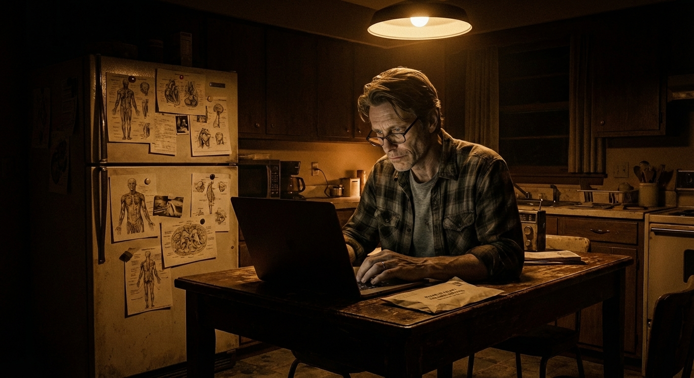

## ## The Incident Report

**Act 2, Scene 1**

**Setting:** emerson_elementary

**Characters:** Mrs. Gayle Calloway, Lily Kessler, Daniel Kessler

---

I wasn't there for it. That's the thing I keep returning to—the way the machinery operates in rooms you haven't entered, on days you thought were ordinary. I have reconstructed what follows from the incident report itself, from Lily's cheerful account at dinner, and from the particular silence of Mrs. Gayle Calloway when I later asked her, directly, what she had seen that so alarmed her. She smiled at me the way people smile at a dog they suspect might bite. She said she was just doing her job.

So let me do mine.

---

Every Tuesday and Thursday morning, Mrs. Calloway's first-grade class at Emerson Elementary begins with what she calls Gratitude Circle. The children sit cross-legged on a rug printed with a map of the United States—Lily has told me she always sits on Lake Superior because it's the deepest—and they go around sharing one thing they're grateful for. The pedagogical intent, as described in the Emerson Elementary parent handbook (page 14, which I have now committed to memory), is to "cultivate a positive classroom community rooted in thankfulness and shared values."

Shared values. Hold that phrase in your mouth. Feel the shape of it.

On this particular Thursday, the gratitude offerings proceeded along their usual axis. Aiden was grateful for his new puppy. Mackenzie was grateful for her grandmother's visit. A boy named Rowan was grateful for God, which Mrs. Calloway received with a nod so warm it could have incubated eggs. Then the circle reached the girl sitting on Lake Superior.

"I'm grateful for decomposition," Lily said.

I can see it. I can see her sitting there with her legs crossed and her hands resting on her knees, that particular stillness she adopts when she's about to explain something she finds genuinely wonderful. She told me about it at dinner with the same enthusiasm she brings to everything—the recounting of a gift she'd offered the room and the room had refused to open.

Mrs. Calloway asked her to explain what she meant.

"When things die, they decompose," Lily said. "Bacteria and fungi break them down into nutrients, and the nutrients go back into the soil, and then new things can grow. So nothing is really wasted. I think that's something to be grateful for."

She was six. She was sitting on a lake. She was telling the truth.

According to Lily, Mrs. Calloway said, "That's very... scientific, Lily," and moved on to the next child. According to the document I would later obtain through a records request—Anecdotal Observation Note, Form EE-207, dated that same Thursday, filed at 11:47 a.m. during what I can only assume was Mrs. Calloway's planning period—what actually happened was this:

*Student L.K. again demonstrated a preoccupation with death and biological decay during a structured social-emotional activity. When peers shared age-appropriate expressions of gratitude (family, pets, faith), L.K. described the process of organic decomposition in clinical detail, showing no emotional discomfort with the subject matter. This is consistent with previous observations (see notes dated 9/12, 9/26, 10/3) in which L.K. has displayed an unusual affect when discussing topics related to mortality. L.K. does not appear to have access to age-appropriate moral or spiritual frameworks for processing these concepts. Of note: L.K. is the only child in the class who has never referenced family beyond her father, and has never mentioned church, prayer, or faith-based community involvement.*

I have read this paragraph more times than I've read anything in my life. More than Gibbon. More than my own dissertation. I have parsed it the way I parse primary sources—for bias, for omission, for the ghost architecture of the argument being constructed beneath the prose. Let me walk you through it.

*Preoccupation.* She mentioned it once. In a circle designed to elicit personal sharing. She shared.

*Clinical detail.* She used the words bacteria and fungi. She is six and reads at a fourth-grade level and I am sorry—no, I am not sorry—that she knows what fungi are.

*No emotional discomfort.* This is the one that makes my hands shake. The absence of distress is itself entered as evidence. She was not upset about decomposition, and her failure to be upset is the problem. A child who is *comfortable* with the biological facts of existence is, in Mrs. Calloway's framework, a child who has been failed.

*Does not appear to have access to age-appropriate moral or spiritual frameworks.* There it is. The sentence Dr. Hendricks had been circling. The sentence the Anti-Saloon League pamphlet from 1908 had already written in different ink. The child lacks the architecture. The child is exposed. The child is, by the mere fact of her clarity, at risk.

And the final note, the quiet knife slid between ribs: *L.K. has never mentioned church, prayer, or faith-based community involvement.* As though the absence of God in a six-year-old's conversation is a clinical finding. As though silence about prayer is a symptom to be charted.

---

At 12:03 p.m., Mrs. Calloway sent an email. I know this because it appeared in the case file I eventually obtained, redacted in places but not redacted enough. The subject line read: *Follow-up: L. Kessler—Compiled Observations.*

The email was addressed to Beth Trammel, the school counselor. CC'd—and this is where the ground shifts, where the ordinary Thursday becomes something else entirely—was Sandra Okafor-Williams, Franklin County Children Services, whose email address Mrs. Calloway apparently kept at the ready the way you might save your dentist's number. Not malice. Preparedness.

The body of the email was three paragraphs of professional concern. Words like *pattern* and *cumulative* and *in my professional experience.* A mention of the home environment—single father, no extended family observed at school events, no emergency contacts beyond the father himself. A note that Lily had once corrected Mrs. Calloway's explanation of seasons by invoking axial tilt, which was filed not under "bright kid" but under *difficulty accepting authority and established classroom narratives.*

She was building a case. Not with malice—I believe that, or I try to believe it. She was building it with the calm, institutional certainty of someone trained to see certain shapes in the fog and name them danger. A child who talks about death without flinching. A father who never comes to the Fall Faith Breakfast. An emergency contact list with a single name on it. In Westerville, Ohio, where the architecture of moral surveillance is not relic but living infrastructure, these things compose a silhouette. And Mrs. Calloway was tracing its outline with a steady, practiced hand.

---

At 3:15, I pulled into the pickup line. Lily came out of the building with her backpack riding low—she'd stuffed her library books in the bottom again, bending the spines in ways that pain me—and her face had that particular illumination it gets when she's been saving something to tell me all day. She climbed into the back seat and before the door was fully closed she said, "Did you know that turkey vultures can smell carrion from a mile away? Mrs. Calloway didn't know that."

"Not everyone keeps up with vulture research," I said.

"They should," she said, with the moral seriousness of the very young.

I pulled forward. In the rearview mirror I could see Mrs. Calloway standing at the curb with her clipboard, watching us. Not waving. Watching. She had a pen in her hand, and as I turned onto Main Street I saw her look down and write something.

I didn't know yet what she'd already sent. I didn't know about Form EE-207 or the email to Sandra Okafor-Williams or the compiled observations stretching back to September, a quiet dossier assembled during planning periods while the children were at recess and the hallways smelled of industrial soap and milk cartons. I didn't know that my daughter's gratitude had been entered into evidence, or that the absence of God in our household had been noted with the same clinical gravity as a bruise.

What I knew was this: my daughter was in the back seat telling me about vultures, and a woman with a clipboard was writing something down, and the five business days were still counting somewhere in a system I couldn't see, and the light on Main Street was the pale thin gold of late October in a town that has always known exactly what it considers decent.

Lily asked if vultures ever got sad about eating dead things.

I said I didn't think so. I said that was the beautiful part—that they had no need for grief about the work that kept the world clean.

In the rearview mirror, Mrs. Calloway had gone back inside. But the clipboard was still open somewhere. The document was still growing. In the building behind us, a file with my daughter's initials was thickening like a callus, and every bright, curious, fearless thing about her was being translated into the language of concern, and I was driving the speed limit through the dry capital of America, and I did not yet understand how much of her they had already written down.

---

**Word Count:** 1508

**Key Moments:**
- Lily's expression of gratitude for decomposition during the classroom circle—a moment of genuine intellectual wonder received as a symptom of deficiency
- Mrs. Calloway's Anecdotal Observation Note (Form EE-207), which systematically translates Lily's curiosity, comfort with science, and absence of religious language into the bureaucratic vocabulary of risk
- The email to the school counselor CC'ing Sandra Okafor-Williams at Children Services, revealing that the institutional machinery has multiple entry points and that Mrs. Calloway had the CPS contact ready
- The pickup line observation: Calloway watching and writing as Daniel and Lily drive away, the surveillance now ambient and ongoing
- Daniel's retrospective narration revealing the gap between what he knew in the moment (his daughter talking about vultures) and what was already in motion behind institutional walls

**Character States:**
- **Mrs. Gayle Calloway:** Operating from a place of institutional certainty, experiencing her documentation as diligence rather than persecution. She has now formally connected the school's observations to the CPS referral pipeline. She is calm, thorough, and convinced she is fulfilling a duty. She does not see herself as an antagonist.
- **Lily Kessler:** Joyful, unselfconscious, intellectually voracious. She shared something she found beautiful and moved on to vultures. She has no awareness that her words are being transcribed into a threat profile. She is secure, talkative, and sitting on the back seat the way she sits on Lake Superior—claiming her spot in the world.
- **Daniel Kessler:** Narrating from a future vantage point where he has seen the documents, his voice carrying the layered fury of retrospective knowledge. In the scene's present tense, he is a father in a pickup line who notices a woman with a clipboard and feels something he can't yet name. By the narration's close, he is a man who understands that the ordinary days were never ordinary—that the file was growing while he drove the speed limit and his daughter talked about birds.

**Status:** ✅ Complete

#### Act 2, Scene 1 Image

**Prompt:** 

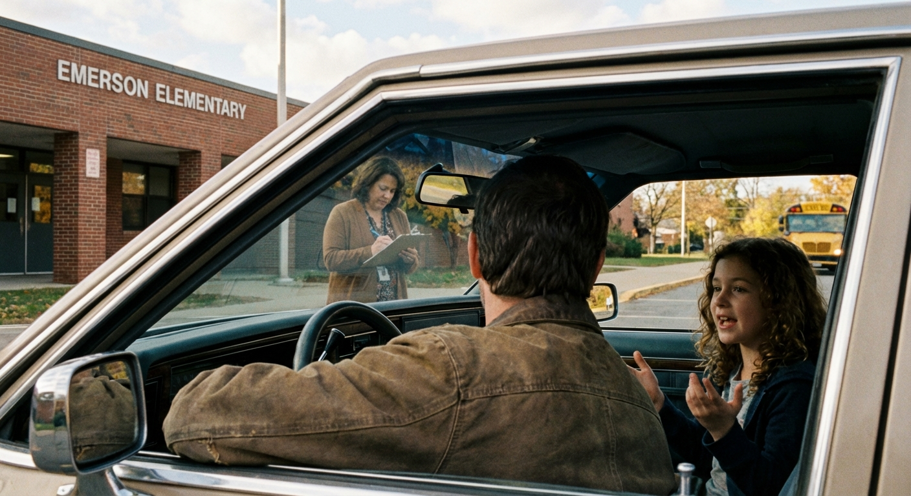

## ## The Home Visit

**Act 2, Scene 2**

**Setting:** daniels_kitchen

**Characters:** Daniel Kessler, Sandra Okafor-Williams, Lily Kessler

---

I cleaned the house the way a man cleans when the state is coming to look at it, which is to say I cleaned it the way you'd clean a crime scene—not to remove evidence of wrongdoing, but to remove evidence of living. I wiped the counters twice. I swept under the radiator where Lily's hair ties collected like small, colorful fossils. I considered, with genuine anguish, whether to hide the copy of *The Anatomy Coloring Book* she'd left open on the coffee table to a full-page illustration of the human digestive tract, colored with meticulous accuracy except for the appendix, which she'd made bright purple because, she said, "it deserves to be noticed since nobody knows what it does."

I left it. Then I moved it to her room. Then I brought it back and set it on the coffee table at a casual angle, as though it had simply landed there the way books land in homes where people read. I was staging my own house. I was art-directing my fatherhood for an audience of one bureaucrat, and knowing this was absurd did absolutely nothing to stop me adjusting the angle of the book.

The kitchen was the theater of operations. I'd read enough to know that caseworkers begin in kitchens. They open refrigerators. They note expiration dates. They are trained to see the kitchen as a diagnostic organ of the household—what it contains, what it lacks, what it says about the organism it feeds. So I had stocked ours with a precision that bordered on theater: fresh fruit in a bowl, milk that wouldn't expire for nine days, Tuesday's chicken tikka masala in a labeled container because labeling leftovers is apparently what fit parents do. I had never labeled leftovers in my life. Lily and I operated on the smell-and-taste system, which had served us without incident for six years, but I understood now that our kitchen was no longer a kitchen. It was Exhibit A.

I checked the smoke detectors. Both worked. I checked them again. I checked the lock on the basement door, the temperature of the hot water, the expiration date on the fire extinguisher. I stood in the hallway and tried to see our home the way Sandra Okafor-Williams would see it: the books everywhere, the absence of crosses, the framed print of the Hubble Deep Field that Lily had chosen for the living room wall because she wanted to see "all the galaxies that don't know about us." I saw it through the eyes of a checklist, and the checklist had no box for wonder.

Lily was at school. I had timed this deliberately. The letter said the initial assessment could include interviews with the child, but I'd called the caseworker's office and requested—begged, in the measured tones of a man trying not to sound like he was begging—that the first visit be with me alone. I did not want my daughter to sit in her own kitchen and be assessed. I did not want her to learn, at seven, that her home was a place that required inspection.

Sandra Okafor-Williams arrived at 1:47 p.m., thirteen minutes early. She drove a silver Hyundai Elantra with a county parking sticker on the windshield. I watched her from the living room window—another thing I'd read you shouldn't do, because it signals anxiety, which signals something to hide—and I watched her sit in the car for a full minute, writing on a clipboard before she'd even set foot on my property. She was already documenting. The assessment had begun in my driveway.

I opened the door before she knocked, which was another mistake, probably.

"Mr. Kessler? Sandra Okafor-Williams, Franklin County Children Services." Her handshake was firm and brief, professional in the way that communicates *I do this forty times a week*. She was tall, mid-forties, with close-cropped natural hair and reading glasses pushed up on her forehead. Navy blazer, gray blouse, a leather portfolio scuffed at the corners from years of use. She looked like a person who was good at her job. This was not comforting.

"Please, come in."

She stepped inside and her eyes moved—left, right, up—in a sweep so practiced it looked casual. She was reading my house the way a doctor reads a body: systematically, from the extremities inward. I saw her clock the shoes by the door, paired neatly because I had paired them neatly forty minutes ago. I saw her clock the Hubble print. I saw her not react to it, which was its own kind of data.

"Thank you for accommodating the visit. I know this can feel intrusive."

"It does feel intrusive," I said, and immediately wished I'd said something more diplomatic. But Sandra only nodded, as though my honesty were just another data point to be filed.

"Can I offer you coffee? Water?"

"Water would be fine."

I poured from the Brita pitcher I'd filled fresh that morning, because even the water was now a performance. She sat at the kitchen table—where Lily and I ate breakfast, where she did her homework, where she'd once spent an entire Saturday constructing a scale model of a termite mound from brown sugar and flour paste—and opened her portfolio and uncapped a pen. The click of the cap was very loud.

"I'll be conducting a safety assessment of the home, asking about Lily's daily routine, medical care, social and emotional development. I'll also need to do a walkthrough. Standard procedure for any referral that reaches our office."

"Standard procedure," I repeated.

"Yes." She met my eyes. There was something in her expression—not sympathy exactly, but recognition. The look of a woman who understood the weight of what she was doing and did it anyway, because the alternative was not doing it, and the one time you don't is the time a child is actually in danger. I understood this. I hated understanding it.

She began with the checklist. I could see the form through the back of the page—a grid of boxes, a taxonomy of adequacy. She asked about Lily's pediatrician (Dr. Amara Osei, all vaccinations current). She asked about diet (omnivorous, adventurous, a documented preference for roasted broccoli I'd have found suspicious in any other child). Emergency contacts. Discipline.

"I don't hit her. I've never hit her. When she's upset, we talk about why. When I'm upset, I tell her I need a minute, and I take one, and then we talk."

Sandra wrote this down. *Father reports verbal conflict resolution. No physical discipline observed or reported.* A box checked. A life reduced to its most auditable components.

"And Lily's social connections? Friendships, extracurriculars?"

"She has close friends at school—Maya Chen, Oliver Pratt. She did soccer last fall, didn't love it. She's in the library's junior naturalist program on Saturdays." I paused. "She's not isolated, if that's what the question is really asking."

"The question is asking what I asked," Sandra said, not unkindly. "What about community support structures? Extended family, faith community, neighborhood networks?"

There it was. The question that wasn't a question.

"My parents are deceased. My sister is in Michigan. We don't attend church." I let the sentence sit in the kitchen air. "We're not religious. Lily knows about religion—we've read about Christianity, Islam, Hinduism, Buddhism, Greek mythology. She's interested in all of it the way she's interested in everything. But we don't practice."

Sandra's pen moved. "And how would you describe Lily's understanding of topics like death, the body, the natural world? The referral mentions concerns about age-appropriateness."

"Lily is seven and curious about how the world works. She asks about death because death is real and she's smart enough to notice it. She asks about bodies because she has one. I answer honestly, at a level she can understand, because I believe that's what parenting is." I was speaking too fast. I made myself slow down. "She's not disturbed. She's not traumatized. She's a kid who wants to know things, and I'm a father who doesn't think curiosity is a symptom."

Sandra looked at me, and for a moment the portfolio and the grid of boxes seemed to recede, and she was just a woman sitting in another person's kitchen, hearing something she recognized as true. I saw it—the almost-imperceptible softening around her eyes that said *I see this. I see that your daughter is fine and your home is clean and you love her in the specific, exhausting way that love actually looks when it's not performed for an audience.*

Then she looked back down at the form.

"I appreciate your candor. I do need to complete the walkthrough."

It took eleven minutes. I counted. She looked at Lily's room—the bed made with hospital corners I'd learned from YouTube at six that morning, the bookshelf organized according to Lily's own system that prioritized subject over author and placed all insect books on the most accessible shelf, the terrarium on the windowsill where she was raising painted lady caterpillars ordered with her birthday money. Sandra looked at the caterpillars for a long time. One was suspended from a twig, half-cocooned, caught in the slow private work of becoming. She didn't write anything down about them. I wanted to believe this meant something.

She checked the bathroom, the basement, the backyard. She noted the fence, the gate latch, the absence of a pool. She noted everything and revealed nothing, and by the time we returned to the kitchen I had the disorienting sensation of having been thoroughly seen and not seen at all—my home cataloged in its physical dimensions while its actual substance passed through the grid like water through a sieve.

"Mr. Kessler, I want to be straightforward with you." She closed the portfolio. Her hands rested on top of it, fingers laced. "Based on my assessment today, I don't observe any immediate safety concerns in this home."

The relief hit my sternum like a fist.

"However."

The word killed every molecule of oxygen in the room.

"The nature of the referral, combined with the school's documentation, has triggered a procedural review. A family court hearing has been scheduled to formally assess custodial fitness. This is not a removal proceeding—I want to be very clear about that. But the court will appoint a guardian ad litem for Lily, and you'll want to secure legal representation."

I stared at her. The kitchen was very quiet. I could hear the refrigerator humming its idiot hum—the refrigerator I had stocked like a man preparing for inspection, which is exactly what I had been doing, and it hadn't mattered. The labeled leftovers, the fresh fruit, the smoke detectors, the hospital corners. The system had found my home adequate and was taking me to court anyway.

"When?" My voice sounded like it belonged to someone standing much farther away.

"Three weeks. You'll receive formal notice by mail." She paused. "I want you to understand—this process exists to protect children. I know that's difficult to hear right now."

"It's not difficult to hear. It's difficult to survive."

Sandra stood. She tucked the portfolio under her arm. At the door she turned back, and I saw it again—that flicker, that human thing moving behind the professional architecture of her face. She opened her mouth as if to say something that wasn't on any form. Then she closed it.

"You'll receive the notice within five business days."

She walked to her silver Hyundai and sat in it for another minute, writing. I stood in my doorway and watched her document my home from my driveway, and I thought about the 1908 pamphlet in my office, and the word *fitness*, and how it had been used for over a century to describe not the presence of love but the absence of deviation. Then I closed the door and sat at the kitchen table where my daughter did her homework, and I put my head in my hands, and I stayed like that until it was time to pick her up from school, where she would climb into the car and tell me something extraordinary about the world, not knowing that the world had scheduled a hearing to decide whether I deserved to hear it.

---

**Word Count:** 2032

**Key Moments:**
- Daniel's anxious staging of his own home—labeling leftovers, adjusting the angle of Lily's anatomy book, checking smoke detectors twice—revealing how the state's gaze transforms a living space into evidence
- Sandra's systematic assessment conducted with professionalism and flickers of genuine human recognition, embodying the scene's central paradox: her competence and decency make the system's indifference worse, not better
- Daniel's unflinching honesty about their secular household and his philosophy of parenting ("I believe taking a child's questions seriously is the most basic form of respect you can offer them"), which is simultaneously his strongest defense and the very thing the checklist cannot value
- Sandra's acknowledgment that she sees no safety concerns, immediately followed by the devastating "however"—the announcement of a family court hearing for custodial fitness review, revealing that passing the inspection doesn't stop the machine
- The final image of Daniel at the kitchen table with his head in his hands, waiting to pick up a daughter who doesn't know a hearing has been scheduled to determine whether he deserves to keep her

**Character States:**
- **Daniel Kessler:** Shattered in a new way. The cold historical fury from the previous scene has been punctured by something worse: the discovery that being adequate isn't enough, that the system's machinery operates independent of its own findings. He is experiencing the specific despair of a man who did everything right and learned that rightness was never the metric. He now faces a court date, the need for a lawyer, and the task of picking up his daughter from school with a normal face. He is running out of ways to alchemize his fear.
- **Sandra Okafor-Williams:** Departed carrying the weight of professional dissonance. She saw a functional, loving home and filed paperwork that will subject it to further scrutiny. She almost said something human at the door and didn't. She is not the villain, and she knows she is not the hero. She is the instrument, and she is aware of being the instrument, and this awareness changes nothing about what the instrument does.
- **Lily Kessler:** Absent from the scene entirely—at school, unknowing, raising caterpillars, being seven. Her absence is the scene's loudest presence: everything that happened in this kitchen happened because of her and without her, about her and around her, and she will come home to a father who has been hollowed out and will pretend he hasn't been.

**Status:** ✅ Complete

#### Act 2, Scene 2 Image

**Prompt:** 

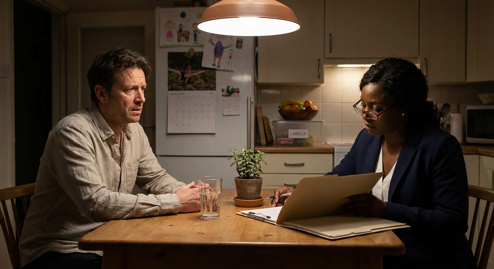

## ## The Dry Capital

**Act 2, Scene 3**

**Setting:** public_library_archives

**Characters:** Daniel Kessler

---

Act 2, Scene 3: The Dry Capital

I went to the library the way a man goes to the doctor after finding a lump—not because he believes in the cure, but because not knowing has become its own malignancy.

The Westerville Public Library sits on State Street in red brick and clean lines. I'd been there a hundred times with Lily—for story hour at four, for the summer reading program at five, for the day at six when she discovered bridge engineering in the 500s and I found her on the floor between the shelves, tracing a suspension cable diagram with her finger. She looked up and said, "Did you know the cables hold the road up by *pulling* it? That's the opposite of what you'd think." I knelt beside her and said, "Show me," because that was the thing about Lily—she made you want to see what she was seeing.

But I'd never been to the archives. I went on a Thursday morning, three days after Sandra Okafor-Williams told me my home was safe and my family was not, and two days after a family law attorney named Ruth Petersen said, with practiced calm, "Mr. Kessler, the good news is stable employment, no record, clean home. The bad news is that none of those things are what this hearing is actually about."

I was holding a cold coffee mug. Through the window, Lily's terrarium supplies covered the back porch—jars of soil, a spray bottle, a magnifying glass.

"What is the hearing actually about?"

A professional pause. Considered.

"Narrative," she said.

So I went looking for the original one.

---

The archives were in the basement, down linoleum stairs worn to a shine. The air changed as I descended—cooler, closer, carrying the mustiness of paper negotiating with decay. A woman named Dolores maintained the collection. Reading glasses on a beaded chain, cardigan the color of moss. She made me sign in with a pencil—not a pen, she was specific, tapping the cup of sharpened pencils with one finger—and told me the microfilm reader was "temperamental but not broken, like most things worth keeping."

I told her I was researching the Anti-Saloon League.

"Well," she said, adjusting her glasses, the beaded chain swaying, "you've come to the right town."

She said it the way a guide at Gettysburg might say *you've come to the right field*—pride that was also, if you listened, an elegy.

Westerville, Ohio. The Dry Capital of the World. I'd known this when I moved here, the way you know your house sits on a floodplain. You file it under local color. You don't consider that the architecture of a place's convictions might outlast the convictions themselves, the way a cathedral remains a cathedral after the congregation stops believing. The stones don't care what you worship. The stones just stand.

The Anti-Saloon League was founded here in 1893, in the back of a church still standing on Main Street. Founded by men who believed alcohol was not a vice but a contagion—a moral pathogen entering the home through the father, destroying the family from within. They built a national movement from a town of four thousand, not through violence but through something more durable: paperwork. Resolutions. Committees. The patient conversion of moral certainty into institutional procedure.

What I didn't know—what Dolores's basement taught me over four hours and two microfilm reels—was how intimately the League had concerned itself with the interior lives of families.

---

The Committee for the Protection of the Home, established 1905. Its letterhead featured an engraving of a house with a picket fence—the Platonic ideal of domesticity, in ink faded to the brown of old blood. Its methods, per meeting minutes written in a hand so precise it looked typeset: home visits. Neighbor interviews. Assessments of reading material. Evaluations of church attendance and "general moral bearing."

I read the minutes from March 14, 1907. A family on Knox Street. Children observed "playing unsupervised on the Sabbath." Father known to "keep no Bible visible in the home." The Committee resolved to "make inquiry" and "refer the matter to the appropriate charitable authority should the home environment prove deficient."

*Deficient.* The word sat on the page like a fossil. I could feel it in my mouth—the same word Sandra Okafor-Williams had circled around without landing on. The same word living in the blank spaces of Form EE-207.

I found a pamphlet from 1909: "The Unfit Home: A Guide for Christian Visitors." Sixteen pages, paper thin enough to see my fingers through. It included a checklist. Presence of alcohol, yes—but also "moral atmosphere." "Character of reading material available to children." "Religious instruction provided." A section for "Observations and Concerns" with blank lines—as many as the visitor might need, which is to say: the form assumed there would be concerns, the way a net assumes there will be fish. A final section offering three options: "No Further Action Required," "Continued Monitoring Advised," and "Referral to Appropriate Authority."

Three options. The same three, give or take a century of euphemism, that Sandra Okafor-Williams had described in my kitchen.

Dolores came down the stairs and asked if I needed water.

"You look like you've seen a ghost," she said.

"Several," I said.

She brought water in a thin paper cup and lingered at the table's edge, hand resting on the empty chair across from me.

"Most people who come down here are graduate students," she said carefully. "Or journalists doing anniversary pieces."

"I'm a father," I said, which was not an explanation but was the only one I had.

She looked at me over her reading glasses. Then she nodded slowly, as if I'd said something that made a different kind of sense.

"The second box has the photographs," she said quietly. "And the home visit records."

---

The photograph: a group portrait on the old town hall steps—the building that now houses a real estate office and a yoga studio, because time is not without humor. Twelve men, four women, two rows. The caption read: *Committee for the Protection of the Home, Westerville, Ohio, 1908.*

It was the women I couldn't stop looking at. The women who carried the checklists into other people's kitchens and noted the absence of Bibles and the presence of unsupervised play.

A woman in the front row, second from left. High-collared blouse, brooch at her throat. Her head tilted slightly forward, already leaning toward the next home she would visit. Her mouth set in a line that was not quite a frown and not quite a smile—the expression of a woman who had never doubted that her attention was a gift.

She looked like Gayle Calloway. Not genetically—architecturally. A posture, a tilt, a way of holding the face that said *I am watching because I care, and my caring gives me the right to watch.*

The checklist from 1909 asked about religious instruction and moral atmosphere. Form EE-207 asked about "emotional baseline" and "home environment indicators." The vocabulary had been updated the way you update a kitchen—new countertops, same plumbing.

I photographed everything. The checklist, the minutes, a letter from 1911 in which the Committee's chairwoman wrote that "several homes in our district have been brought into alignment with the standards of moral fitness that our community requires."

*Brought into alignment. Moral fitness. Our community requires.*

I said the words aloud. They tasted like the air in that room—old and close and faintly sweet with decay.

---

That night, after Lily was asleep—she'd spent the evening building a terrarium for a snail she'd found on the front step and named Copernicus, because she was seven and the world was still a place where you could name a snail after an astronomer and no one would write it down on a form—I sat at the kitchen table with a legal pad and began to draft.

Not a legal brief. A translation. A way of making my family legible to a system whose alphabet did not include us.

I wrote:

*My daughter is seven. She is curious about death because she is curious about everything, because curiosity does not observe the boundaries we set for it. She does not attend church because I do not believe in God, and I have chosen not to perform a belief I do not hold to make my family palatable to a community that considers belief a prerequisite for decency.*

*She knows what decomposition is. She also knows photosynthesis, mitosis, the water cycle, and the names of nine species of vulture. She knows these things because I answer her questions honestly, which I understand is not the same as answering them correctly, in the estimation of the people who referred us to this court.*

*I am a single father. I adopted my daughter at fourteen months. She weighed nineteen pounds and had an ear infection and grabbed my index finger in the social worker's office and did not let go. I have loved her in the specific, daily, unglamorous way that love operates when it is not being performed for an audience. I have shown up. Every day. Without fail.*

*What I have not done is make her normal. I have raised a child who is strange and brilliant and alive, and I am being asked to defend this as if it were a crime.*

I put the pen down. The kitchen was quiet. What I'd written was not strategy. It was the sound a man makes when he finally understands the shape of the thing consuming him—not a monster but a machine, built by earnest people in the back of a church a century ago, maintained by earnest people in fluorescent offices today, its gears oiled with concern, its output measured in families brought into alignment.

I drew a single line through the last paragraphs—deliberate, so the words stayed legible beneath the cancellation. Ruth would tell me they were too angry. She'd be right. The system didn't reward understanding. It rewarded legibility. And legibility meant: *I am like you. Look at my home. Look at my child. See how like you we are.*

I'd write the clean version in the morning, with coffee and a steadier hand and the corrosive discipline of a man translating himself into a language he does not speak. But I wanted the real version to exist somewhere—even on a legal pad in a kitchen in Westerville, Ohio, where a century ago they'd built a machine to save the American home and the machine was still running, and it had never once stopped to ask whether the homes it was saving wanted to be saved.

Upstairs, Copernicus moved across the glass of his terrarium with the unhurried confidence of a creature that existed entirely outside the jurisdiction of anyone's concern.

I envied him with my whole heart.

Then I turned off the light and went to check on my daughter, who was sleeping on her side with one hand curled under her chin and the other resting on a book about volcanoes, and who was, by every measure that mattered and none that would be applied to her, absolutely fine.

---

**Word Count:** 1855

**Key Moments:**
- Daniel's discovery of the 1909 pamphlet "The Unfit Home: A Guide for Christian Visitors" and its checklist, which mirrors the modern forms being used against his family—revealing the system's continuity beneath its updated vocabulary
- The 1908 photograph of the Committee for the Protection of the Home, in which Daniel recognizes Mrs. Calloway's posture and expression in a woman dead for decades, crystallizing his understanding that the threat is architectural, not personal
- Daniel's late-night drafting session at the kitchen table, where he writes an honest account of his family's values and then crosses out the most truthful paragraph because he understands the system rewards legibility, not honesty
- The recurring motif of the checklist—1909 and present day—as the mechanism by which moral anxiety becomes bureaucratic procedure, and investigation becomes its own evidence of risk

**Character States:**
- **Daniel Kessler:** Transformed. His bewilderment and defensive anxiety have hardened into something more dangerous and more lonely: comprehension. He now sees the system as an inherited architecture rather than a series of mistakes, which gives him intellectual clarity but deepens his emotional isolation. He is caught between two imperatives—the need to be honest and the need to be legible—and he knows they are mutually exclusive. He is angry, precise, and beginning to understand that understanding may not save him. He has a legal pad with a crossed-out paragraph that contains the truest thing he's ever written, and he will not be able to use it.
- **Lily Kessler:** Asleep upstairs, unaware, having named a snail Copernicus. She remains the story's moral center precisely because she is absent from its machinery. Her terrarium—a small, contained world she built with care—stands in quiet contrast to the institutional architecture her father has spent the day excavating.

**Status:** ✅ Complete

#### Act 2, Scene 3 Image

**Prompt:** 

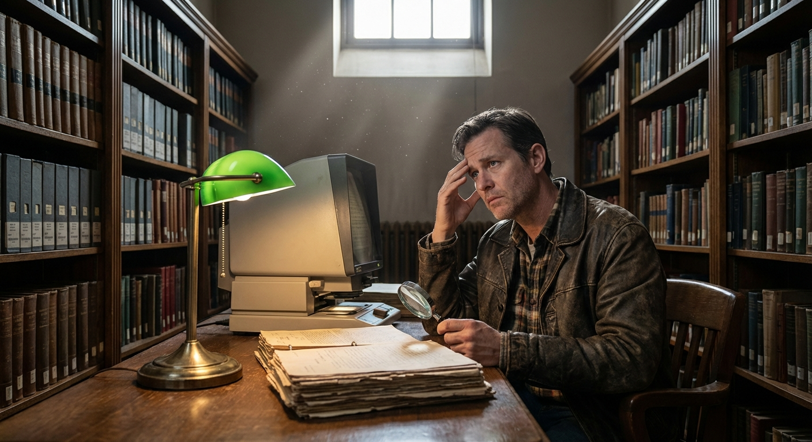

## ## The Language of Legibility

**Act 3, Scene 1**

**Setting:** daniels_kitchen

**Characters:** Daniel Kessler, Lily Kessler

---

# The Language of Legibility

---

The hearing was in eleven hours and I was on my fourth draft.

The first three were stacked at the corner of the kitchen table like sedimentary layers of a man learning to lie. Draft one had been honest. Draft two had been honest but strategic. Draft three had been strategic but readable. Draft four was what the system wanted: a document scrubbed of everything that made it mine.

*I maintain a structured and nurturing home environment. My daughter receives consistent emotional support, age-appropriate boundaries, and encouragement in her educational development. I am committed to working collaboratively with all agencies involved in ensuring her wellbeing.*

I read it back and felt the particular nausea of hearing your own voice replaced by someone else's vocabulary. The sentence was true the way a mannequin is anatomically correct—every part accounted for, none of them warm.

The kitchen smelled like midnight coffee and the charred ghost of toast I'd forgotten under the broiler. Outside, Westerville was doing what Westerville does at two in the morning: being immaculate and silent and absolutely certain of itself. A streetlight threw its orange conviction through the window above the sink. Somewhere a dog barked twice and stopped, as though it too had been reminded of the noise ordinance.

I picked up the 1909 pamphlet. I'd been carrying it room to room for two days like a talisman, or maybe like evidence at a crime scene still technically in progress. *The Unfit Home: A Guide for Christian Visitors.* Page fourteen: "The assessor must determine whether the moral atmosphere of the dwelling is conducive to the formation of upright character. Particular attention should be paid to the presence or absence of devotional materials, the regularity of household routine, and the temperament of the custodial figure."

My FCCS referral, page two: "The investigator will assess the overall home environment, including but not limited to: evidence of consistent routine, age-appropriate educational materials, and the emotional responsiveness of the primary caregiver."

Three nights ago I'd typed both passages side by side, highlighted the structural parallels, and written a paragraph about the inheritance of moral surveillance in small American towns that was—I'll say without false modesty—the best thing I'd ever composed. It argued that the system investigating me was not evaluating my fitness but performing a ritual whose liturgy predated my daughter's birth by a century.

It was also completely unusable.

I knew this the way you know a bridge is out—not because someone told you, but because you can see the gap from where you stand. A family court magistrate in Franklin County does not want to hear that she is the institutional descendant of temperance-era home visitors. She wants *structured and nurturing.* She wants *age-appropriate boundaries.* She wants the mannequin. She wants legibility.

So I crossed out the paragraph. Again. A single line through each sentence, and I felt each one like a suture being pulled from skin that hadn't finished healing.

I was reaching for the coffee when I heard the stairs creak in the rhythm that meant Lily—left foot, pause, right foot, the hesitation on the fourth step where the wood groans like something remembering its life as a tree. She appeared in the doorway in her constellation pajamas, holding the stuffed octopus she'd named Dr. Tentacles in a moment of taxonomic precision I had found, at the time, unbearably charming.

"Dad?"

"Hey, bug. It's late."

"I know what time it is. I checked." She rubbed one eye with the heel of her hand. "Is tomorrow the thing?"

I had explained the hearing in the only terms I could manage: some people wanted to make sure our family was doing okay, and there was a meeting where I'd talk to them, and it was boring and nothing she needed to worry about. She had accepted this with the polite skepticism of a child who understands she is being managed but loves you enough to let it pass.

"Tomorrow's the thing," I said.

She padded across the linoleum and climbed into my lap with the unselfconscious authority of someone who has never once been denied one. Dr. Tentacles wedged between us. She smelled like sleep and the lavender detergent I'd switched to because she said the old kind made her pillowcase "smell like a hospital for shirts."

"Are you nervous?"

"A little."

"You'll be good at it. You're good at talking."

"Thank you, Lily."

"You're welcome." She settled against my chest. Then, with the non sequitur gravity only available to a seven-year-old at two in the morning: "Dad, why doesn't the moon fall down?"

And there it was. Not this specific question, but this *kind* of question, asked by this kind of child, answered by this kind of father. The engine of our trouble. The whole gorgeous machinery of her curiosity, which someone had looked at and seen not wonder but risk.

"It is falling," I said. "All the time. But it's also moving sideways so fast that the ground curves away beneath it at the same rate it drops. So it keeps falling and keeps missing. That's what an orbit is."

"Falling and missing," she repeated. Her voice was already thickening toward sleep.

"Falling and missing. Forever."

"That's beautiful, Dad."

"Yeah. It really is."

She was out in under a minute. I sat with her weight against me and Dr. Tentacles pressing one plush arm into my sternum and the four drafts fanned across the table and the pamphlet and the crossed-out paragraph and the hearing in ten hours and forty-one minutes, and I thought: *This. They are asking me to prove that this is enough. They are asking me to translate this into a language that has no word for this.*

I held my daughter. I did not move. The streetlight kept its vigil. The coffee went cold and I let it.

Draft four would do. It would have to.

But I would know what I'd cut from it, and why, and I would carry that knowledge into the courtroom like a stone in my chest—smooth, heavy, and entirely my own.

---

**Word Count:** 1018

**Key Moments:**
- Daniel's systematic self-erasure across four drafts, each one stripping more of his authentic voice to produce institutionally 'legible' language, culminating in prose that is technically true and spiritually dead
- His side-by-side comparison of the 1909 temperance pamphlet and his FCCS referral—a devastating argument he recognizes he cannot use, because the system does not reward being understood, only being compliant
- Lily's appearance in the kitchen doorway, shifting the scene from intellectual anguish to embodied tenderness, her question about the moon echoing the very curiosity that triggered the investigation
- Daniel's explanation of orbital mechanics—'falling and missing, forever'—which becomes an unintentional metaphor for his own situation: perpetually falling, perpetually trying to miss the ground
- The final image of Daniel holding his sleeping daughter amid the wreckage of his drafts, understanding that what he must prove and what he knows are separated by a language that doesn't exist

**Character States:**
- **Daniel Kessler:** Resolved but hollowed. He has completed the strategic work of self-translation and knows the cost: the truest version of himself will not appear in that courtroom. He carries the crossed-out paragraph like contraband, a private record of who he actually is.
- **Lily Kessler:** Asleep, trusting, unaware of the full stakes but perceptive enough to sense her father's anxiety and offer him the only comfort she has—her presence, her questions, her belief that he'll be good at talking.

**Status:** ✅ Complete

#### Act 3, Scene 1 Image

**Prompt:** 

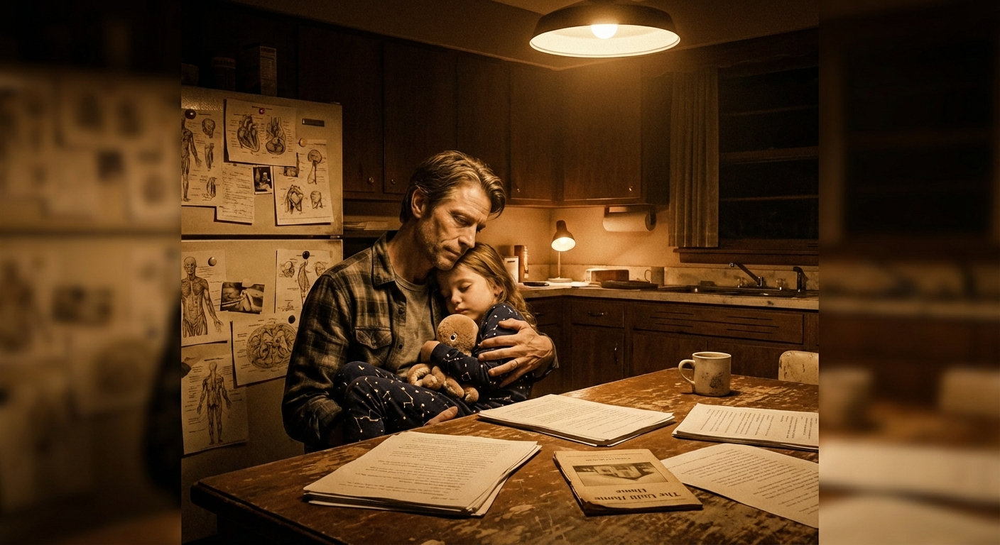

## ## The Clock That Is Seven Minutes Fast

**Act 3, Scene 2**

**Setting:** family_court

**Characters:** Daniel Kessler, Sandra Okafor-Williams, Judge Harold Wren, Dr. Patricia Hendricks, Mrs. Gayle Calloway

---

The clock on the wall of Courtroom B in the Franklin County Family Court was seven minutes fast. I noticed this immediately because noticing useless things is what I do when I'm trying not to die of fear. The clock read 9:37 when my phone read 9:30, and I thought: *Even the time here is wrong, and no one has corrected it, and cases have been decided under this wrong time for months or years, and everyone in this room has silently agreed that the wrong time is the official time, because the institution said so.*

This felt like a metaphor. I did not want any more metaphors. I wanted a glass of water and a different life.

The courtroom was smaller than I'd expected—not the mahogany theater of television but a carpeted rectangle that smelled of recycled air and old paper, lit by fluorescents that gave everyone the complexion of someone recovering from a minor illness. No windows. The American flag in the corner had a crease in it, as though recently unfolded from a box, which it probably had been. The state flag beside it hung with the resigned posture of a thing that knows no one is looking at it.

Judge Harold Wren presided from a raised desk that wasn't quite a bench—more like a teacher's station in a community college seminar room. Thin-faced, mid-sixties, reading glasses on a chain, with the manner of a man who had heard every possible human arrangement and found most of them tedious. He was reviewing papers when I sat down. He did not look up.

Sandra Okafor-Williams sat at a table to my left, her report in a manila folder, her posture the careful architecture of someone who has built a career on being unimpeachable. Navy blazer. Small gold studs. Everything about her said: *I am a professional. I am objective. I am not your enemy.* The terrible thing was that all of this was true, and none of it would save me.

My attorney, a Legal Aid lawyer named Beth Pryor who had spent eleven minutes with me before the hearing, sat beside me smelling faintly of cough drops. She'd told me to be calm, be brief, and under no circumstances to editorialize. I'd said I understood. I had lied.

Draft four was in my jacket pocket. The stone in my chest had not gotten lighter.

---

Sandra presented first. I'll say this for her: she was meticulous. She described my home as "clean, well-organized, and age-appropriate." She noted Lily's "extensive collection of books and educational materials." She confirmed that Lily was "well-nourished, articulate, and showed no signs of abuse or neglect." She used the phrase "the child appears bonded to the father," and I wanted to scream at the word *appears*—at the epistemological cowardice of it—but I sat still because Beth Pryor's hand was on my forearm like a clamp.

Then Sandra arrived at the section I'd been dreading, where the form required her to assess "spiritual and moral development" and "community integration." Her voice shifted—not dramatically, a quarter-tone, the way a cellist adjusts before a difficult passage.

"The home does not incorporate religious practice or affiliation. The father identifies as secular. The child has not been enrolled in any faith-based programming. While this does not constitute a deficiency per se, the assessor notes that the child's moral framework is primarily derived from parental instruction and independent reading rather than community-based structures."

*Per se.* Two words that meant: *I am telling you this is fine while giving you the language to decide it isn't.*

Sandra closed the folder. She did not look at me.

---

Dr. Patricia Hendricks took the chair next to the judge's desk—because this was not a criminal trial, just the quiet administrative dismantling of a family. She was the school psychologist who'd evaluated Lily after Mrs. Calloway's referral. Kind eyes, sensible flats, a PhD, and she was about to say things that would make me want to overturn the table.

"Lily is an exceptionally bright child," she began, and I thought: *Here comes the 'but.' The bright child who is bright in the wrong direction.*

"However, she demonstrates some atypical social patterns. She engages with adults more readily than peers. Her interests are advanced for her age group, which can create isolation. During our session she asked whether I thought consciousness was 'an emergent property or a fundamental feature of the universe.'" Dr. Hendricks paused. "She's seven."

A small sound from the gallery. I couldn't tell if it was admiration or concern. In this room, they were the same thing.

"In your professional opinion," the county attorney asked, "does Lily show adequate social-emotional development?"

"She shows *unusual* social-emotional development. She's empathetic, curious, verbally sophisticated. But she lacks certain peer-normative reference points—shared cultural touchstones, community rituals, the social scaffolding that typically comes from—" She hesitated. "Church involvement, sports leagues, that sort of thing."

*That sort of thing.* The sort of thing that is optional everywhere except in a courtroom in a county that banned alcohol in 1859 and never really stopped banning things.

---

Mrs. Gayle Calloway walked to the chair with the unhurried certainty of a woman who has never once doubted she is helping. She wore a cardigan with small embroidered flowers. She smiled at the judge. She did not smile at me.

"I've been teaching second grade for twenty-two years," she said, "and I care deeply about every child in my classroom."

I believed her. That was the worst part. She cared the way a 1909 Committee for the Protection of the Home had cared—with absolute conviction and a checklist.

"Lily is a sweet girl. But she's... disconnected. The other children talk about Sunday school, vacation Bible camp, and Lily has nothing to contribute. She told a classmate that people invented God because they were afraid of the dark." A pause to let this land. "She's *seven*."

The same age. The same fact. Wielded in opposite directions.

"I didn't file the referral to be punitive. I filed it because a child without spiritual grounding is a child without a foundation. And I worry about what happens to that child when things get hard."

I wrote on my legal pad: *Things are hard right now, Gayle. Right now, in this room, because of you.* Beth Pryor glanced at it and pressed my arm again.

---

Then it was my turn.

I stood. I unfolded draft four. I read it. It was fine—legible, processable. It described my parenting philosophy in terms the court could absorb: "evidence-based," "developmentally appropriate," "values of empathy, critical thinking, and civic responsibility." It mentioned Lily's reading level (fourth grade), her science fair project (erosion patterns in local creek beds), her friendship with the neighbor's daughter. It was the version of my life that fit on the form. True the way a passport photo is true—technically accurate, spiritually void.

I finished. Judge Wren made a note. The fluorescents hummed.

Then I did the thing Beth Pryor had told me not to do.

"Your Honor, may I—" I looked at Beth. She was already shaking her head. "I need to say one more thing."

Judge Wren looked up. His glasses caught the light. "Briefly, Mr. Kessler."

I set draft four down. I didn't take out the crossed-out paragraph. I didn't need to. I'd memorized it the way you memorize a prayer, if you are the kind of person who prays, which I am not, which is why we are all here.

"My daughter named a snail Copernicus. She did this because I told her that Copernicus moved the sun to the center of the solar system and everyone was afraid, and she said, 'But he was right, so why were they afraid?' And I said, 'Because being right doesn't stop people from being afraid.' She thought about this for a very long time. She's seven."

The room was quiet.

"Lily doesn't lack a foundation. She has one. It's just not the one you're looking for. She knows that things die and don't come back, and she finds that sad but not terrifying. She knows the universe is large and doesn't care about her specifically, and she finds that *interesting*. She asks questions that don't have answers and she's okay with that. She is the most whole person I have ever met, and she is seven years old, and I did not come here to prove she is enough. She *is* enough. I came here to ask why I have to prove it."

Silence. The clock that was seven minutes fast ticked audibly.

Beth Pryor closed her eyes.

Judge Wren removed his glasses, cleaned them with a cloth from his breast pocket, and replaced them. He looked at me for what felt like a geological age.

"Thank you, Mr. Kessler. I'll take a brief recess."

He rose. The creased flag did not move. The fluorescents continued their indifferent hum. And I stood there in that windowless room, having said the truest thing I'd ever said in the worst possible place to say it, and I did not know—genuinely did not know—whether I had just saved my daughter or lost her.

---

**Word Count:** 1527

**Key Moments:**
- Sandra's report is factually exonerating but institutionally poisoned by the phrase 'per se' and the required assessment of 'spiritual and moral development,' demonstrating how bureaucratic language can damn through faint praise
- Dr. Hendricks and Mrs. Calloway both use Lily's age—'She's seven'—as evidence, but in diametrically opposite directions: one marking her brilliance as abnormality, the other marking her honesty as spiritual deficiency
- Daniel reads his sanitized draft four and then breaks script to deliver an unplanned defense of Lily's wholeness, using the Copernicus snail as his central image
- Daniel's final question—'I came here to ask why I have to prove it'—directly challenges the court's authority to adjudicate his daughter's sufficiency
- The recess leaves the outcome entirely unresolved, the seven-minutes-fast clock ticking over a silence that could break in either direction

**Character States:**
- **Daniel Kessler:** Exposed, trembling, uncertain. He has done the thing he knew he shouldn't—spoken honestly in a room designed for legibility—and he feels both liberated and terrified.
- **Sandra Okafor-Williams:** Professionally composed but visibly uncomfortable. She delivered her report as required and knows its implications. She did not look at Daniel afterward.
- **Judge Harold Wren:** Unreadable. His recess could mean anything—deliberation, irritation, or genuine reconsideration. His cleaning of his glasses was the only human gesture in an otherwise procedural performance.
- **Dr. Patricia Hendricks:** Uneasy. Her testimony was clinically accurate but she heard how it sounded in this room, in this context, and she is not entirely sure she said what she meant.
- **Mrs. Gayle Calloway:** Serene, convinced. She believes she has done the right thing. She will continue to believe this regardless of the outcome.

**Status:** ✅ Complete

#### Act 3, Scene 2 Image

**Prompt:** 

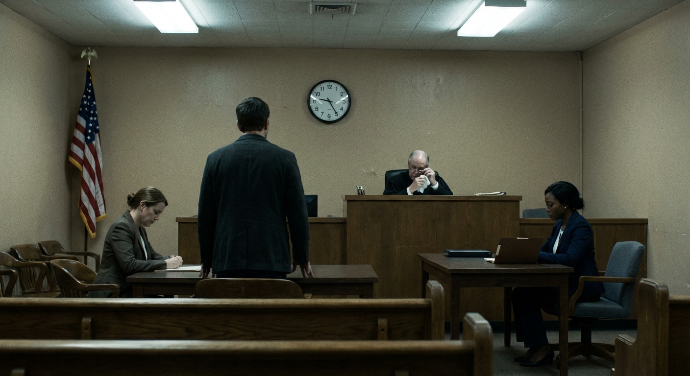

## ## The Walk After

**Act 3, Scene 3**

**Setting:** the_sidewalk

**Characters:** Daniel Kessler, Lily Kessler, Sandra Okafor-Williams

---

Act 3, Scene 3: The Walk After

The ruling came at 10:47 a.m. by the clock that was seven minutes fast, which means it came at 10:40 in the time zone where the rest of the world conducts its business, which means it came on a Tuesday in October in a windowless room in a building that smells like floor wax and institutional regret, which means it came in Westerville, Ohio—a town that once outlawed alcohol with such theological conviction it earned the nickname "The Dry Capital of the World"—which means it came in exactly the place you'd expect a man to be found not guilty and punished anyway.

Judge Wren read from a prepared statement. He had written it during the recess, or he had written it before the recess and the recess was theater, or he had written it in 1909 and it had been waiting in a drawer for someone like me.

"The court finds no evidence of neglect, abuse, or imminent danger to the minor child."

A breath. Mine. The first honest one in weeks.

"However, given the concerns raised regarding the child's social and developmental environment, the court orders continued monitoring by Franklin County Children Services for a period of six months, with quarterly home visits and a follow-up assessment."

Sandra, at the caseworker's table, wrote something in her file without looking up. She had known. She had probably known before any of us walked into this room, because she understands the grammar of this system the way I understand the grammar of English—not as a set of rules but as a living architecture of implication, where what is *not* said bears more weight than what is.

I had been found innocent and sentenced to visibility.

---

I picked Lily up from the emergency sitter—Margaret Chen, two streets over, who had asked no questions and provided goldfish crackers—and we walked to school. She was late. I had a note from the court, which is a sentence I never imagined writing and which I will now carry folded in my wallet like a scar.

"Did you do good at talking?" Lily asked.

"I did okay at talking."

"Did the judge like the snail?"

"I think the judge had complicated feelings about the snail."

She considered this with the gravity it deserved. "Snails are complicated," she said.

We turned onto Main Street, and I saw it. Not noticed—I had always noticed it, the way you notice weather or the color of your own walls. I *saw* it, the way you see something after a doctor names what's been growing quietly inside you. The architecture of Westerville resolved into legibility, and I could not make it stop.

The Anti-Saloon League headquarters, now a respectable office building, its brick facade scrubbed of history but not of purpose. The churches—four within six blocks, their steeples triangulating downtown like cell towers, broadcasting on a frequency I had never been equipped to receive. The historical plaques narrating the town's moral crusade in the passive voice: *Westerville was known as...* *The temperance movement found a home in...* As if prohibition were weather that had simply settled here, rather than a deliberate apparatus of surveillance built by people who believed, with genuine conviction, that they were saving their neighbors from themselves.

I saw the lawns. Trimmed to a uniform height not enforced by ordinance but enforced. I saw the flags—not just American flags but the specific way they were hung, centered, pressed, a semaphore of belonging. I saw the school pickup line where I would stand that afternoon and understood it as a site of assessment, every parent's car and coat and conversation a data point in an ongoing, decentralized evaluation that had no judge, no recess, no ruling, and no appeal.

"Dad, you're walking weird."

"How am I walking weird?"

"Slow. Like you're reading the houses."

She was exactly right. I was reading the whole town, and it was reading me back, and the difference was that now I knew it.

---

Sandra caught up with us half a block from Emerson Elementary. She'd changed into a quilted jacket and flats, which meant she had planned this, which meant she had known the ruling before it was read, which meant everything I suspected about the theater of that courtroom was both true and beside the point.

"Mr. Kessler."

"Ms. Okafor-Williams."

Lily looked up with the uncomplicated interest she reserved for adults not yet sorted into categories. "Are you my dad's friend?"

Sandra's composure—which I had watched survive cross-examination, bureaucratic euphemism, and the specific cruelty of the phrase *spiritual and moral development*—flickered. A tremor at the corner of her mouth that could have been a smile or its suppression.

"I'm someone who works with your dad," she said.

"On what?"

"On making sure you're okay."

Lily frowned. "I'm okay," she said, with the bewildered certainty of someone who has never once considered the alternative.

Sandra looked at me. I looked at Sandra. Between us passed something that was not friendship and not enmity but a mutual recognition of the absurd: that this radiant, snail-naming, moon-questioning, entirely sufficient child had been rendered into a case file, and that we were both, in our different capacities, trapped inside it.

"The first home visit will be in three weeks," Sandra said. "I'll call to schedule."

"I'll make sure the bookshelves are presentable."

"The bookshelves were never the problem, Mr. Kessler."

She turned and walked toward her car, and I understood that Sandra Okafor-Williams was not my enemy. She was a woman doing a job inside a system designed before she was born, in a town that had perfected the machinery of moral scrutiny a full century before it had a children's services department to formalize it. She was intelligence pressed into the shape of a function. I could not afford to forget that. I could not afford to forget that she knew it too.

---

At the entrance to Emerson Elementary, Lily turned. The school rose behind her—red brick, white trim, the flag hanging limp in the windless morning. Through the glass doors I could see the hallway where Mrs. Calloway's classroom waited, where the Copernicus report still hung on the wall or had been quietly taken down, where my daughter would sit in a small chair and be brilliant and strange and seven years old in a town that did not know what to do with any of those things.

"Dad?"

"Yeah, bug."

"The moon doesn't know it's falling, right? It just thinks it's going."

I knelt. The concrete was cold through my jeans. A school bus idled at the curb, exhaling diesel and patience.

"That's exactly right," I said.

She hugged me—fast, fierce, the full-body commitment of a child who has not yet learned to modulate her affection—and then she was through the doors, her backpack bobbing down the hallway like a small boat entering a harbor I could not follow her into.

I stood. I walked home. The town watched. I let it.

The leaves were turning, and they were beautiful, and they were falling, and they did not know it, and neither, for a few unguarded steps, did I.

---

**Word Count:** 1196

**Key Moments:**
- Judge Wren's ruling: exoneration paired with continued surveillance—found innocent and sentenced to visibility
- Daniel's perceptual shift on Main Street, where Westerville's architecture resolves into a legible system of social control, connecting the town's temperance history to the present investigation
- Sandra's unplanned encounter outside the school, where Lily's simple "I'm okay" exposes the absurdity of the entire proceeding, and Sandra and Daniel share a moment of mutual recognition
- Lily's final observation about the moon not knowing it's falling, completing the orbital metaphor from Act 3 Scene 1
- Daniel's walk home—watched, aware, and choosing to let the town see him, finding a fragile peace in visibility rather than resistance

**Character States:**
- **Daniel Kessler:** Altered but intact. He has survived the system without being destroyed by it, but he can no longer unsee what he now sees—the town as apparatus, the scrutiny as permanent. He finds resolution not in victory but in the decision to keep walking, visible, within a world that will continue to watch. The final image of falling leaves suggests a grace he can access only in unguarded moments.
- **Lily Kessler:** Unbroken, radiant, unaware of how close the ground came. She enters school carrying the same curiosity that started everything, which is both the danger and the entire point.
- **Sandra Okafor-Williams:** Professionally resolved but personally unsettled. Her near-smile and her acknowledgment that "the bookshelves were never the problem" reveal a woman who sees the system's absurdity clearly but remains bound by its grammar. She will return in three weeks. She will be fair. She will also be the system.

**Status:** ✅ Complete

#### Act 3, Scene 3 Image

**Prompt:** 

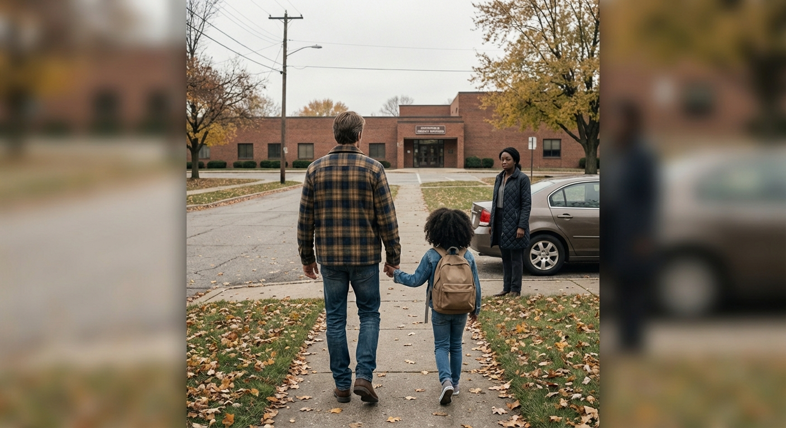

## Final Statistics

- Total Scenes: 9
- Total Word Count: 14830
- Time: 3027.8s

